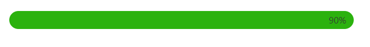

# Animation in Blazor ProgressBar Component

The Progress Bar component supports animation, which can be enabled by setting the [Enable](https://help.syncfusion.com/cr/blazor/Syncfusion.Blazor.ProgressBar.ProgressBarAnimation.html#Syncfusion_Blazor_ProgressBar_ProgressBarAnimation_Enable) property to **true** in [ProgressBarAnimation](https://help.syncfusion.com/cr/blazor/Syncfusion.Blazor.ProgressBar.ProgressBarAnimation.html). Control the animation speed and delay using the [Duration](https://help.syncfusion.com/cr/blazor/Syncfusion.Blazor.ProgressBar.ProgressBarAnimation.html#Syncfusion_Blazor_ProgressBar_ProgressBarAnimation_Duration) and [Delay](https://help.syncfusion.com/cr/blazor/Syncfusion.Blazor.ProgressBar.ProgressBarAnimation.html#Syncfusion_Blazor_ProgressBar_ProgressBarAnimation_Delay) properties, specified in milliseconds.

```cshtml

@using Syncfusion.Blazor.ProgressBar

<SfProgressBar Type="ProgressType.Linear" Value="90" Height="60" Width="90%" TrackColor="#FFFFFF"
               ShowProgressValue="true" ProgressColor="#2BB20E" TrackThickness="24" CornerRadius="CornerType.Round"
               ProgressThickness="24" Minimum="0" Maximum="100">
    <ProgressBarAnimation Enable="true" Duration="2000" Delay="0"></ProgressBarAnimation>
</SfProgressBar>

```


