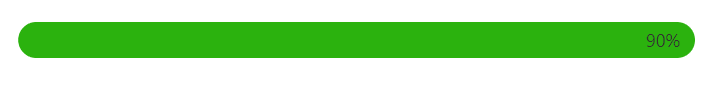

# Blazor ProgressBar Animation

The Blazor ProgressBar animates the transition from the initial `Value` to the target `Value` when the value changes. Animation applies to both [ProgressType.Linear](https://help.syncfusion.com/cr/blazor/Syncfusion.Blazor.ProgressBar.ProgressType.html) and [ProgressType.Circular](https://help.syncfusion.com/cr/blazor/Syncfusion.Blazor.ProgressBar.ProgressType.html) ProgressBars. Configure animation through the [ProgressBarAnimation](https://help.syncfusion.com/cr/blazor/Syncfusion.Blazor.ProgressBar.ProgressBarAnimation.html) child component. The [Enable](https://help.syncfusion.com/cr/blazor/Syncfusion.Blazor.ProgressBar.ProgressBarAnimation.html#Syncfusion_Blazor_ProgressBar_ProgressBarAnimation_Enable) property defaults to `true`, so the animation runs without explicit configuration. To disable it, set `Enable="false"`.

| Property | Type | Default | Description |
|----------|------|---------|-------------|
| `Enable` | `bool` | `true` | Specifies whether the ProgressBar animates value changes. |
| `Duration` | `int` | `1000` | Sets the duration of the animation in milliseconds. |
| `Delay` | `int` | `0` | Sets the start delay of the animation in milliseconds. |

## Configure animation

Use the [Duration](https://help.syncfusion.com/cr/blazor/Syncfusion.Blazor.ProgressBar.ProgressBarAnimation.html#Syncfusion_Blazor_ProgressBar_ProgressBarAnimation_Duration) and [Delay](https://help.syncfusion.com/cr/blazor/Syncfusion.Blazor.ProgressBar.ProgressBarAnimation.html#Syncfusion_Blazor_ProgressBar_ProgressBarAnimation_Delay) properties to control how long the animation runs and when it starts.

The following example configures a 2-second animation on a Linear ProgressBar.

```cshtml
@using Syncfusion.Blazor.ProgressBar

<SfProgressBar Type="ProgressType.Linear" Value="90" Height="60" Width="90%" TrackColor="#FFFFFF"
               ShowProgressValue="true" ProgressColor="#2BB20E" TrackThickness="24" CornerRadius="CornerType.Round"
               ProgressThickness="24" Minimum="0" Maximum="100">
    <ProgressBarAnimation Enable="true" Duration="2000" Delay="0"></ProgressBarAnimation>
</SfProgressBar>
```



## Circular ProgressBar animation

Animation also applies to a Circular ProgressBar. The following example runs a 1.5-second animation with no start delay.

```cshtml
@using Syncfusion.Blazor.ProgressBar

<SfProgressBar Type="ProgressType.Circular" Value="80" Height="160" Width="160" Minimum="0" Maximum="100"
               TrackColor="#FFFFFF" ProgressColor="#E3165B" TrackThickness="24" ProgressThickness="24">
    <ProgressBarAnimation Duration="1500" Delay="0"></ProgressBarAnimation>
</SfProgressBar>
```


## See also

* [Getting Started with Blazor ProgressBar](getting-started.md)
* [ProgressBar Events](events.md)
* [ProgressBar Customization](customization.md)
