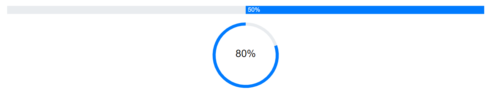

# Customization in Blazor ProgressBar Component

## Segments

Divide a progress bar into multiple segments by using the [SegmentCount](https://help.syncfusion.com/cr/blazor/Syncfusion.Blazor.ProgressBar.SfProgressBar.html#Syncfusion_Blazor_ProgressBar_SfProgressBar_SegmentCount) property to visualize the progress for multiple sequential tasks, and the [EnableProgressSegments](https://help.syncfusion.com/cr/blazor/Syncfusion.Blazor.ProgressBar.SfProgressBar.html#Syncfusion_Blazor_ProgressBar_SfProgressBar_EnableProgressSegments) property to divide the progress  into multiple segments without the track. Meanwhile, the [SegmentColor](https://help.syncfusion.com/cr/blazor/Syncfusion.Blazor.ProgressBar.SfProgressBar.html#Syncfusion_Blazor_ProgressBar_SfProgressBar_SegmentColor) property represents the color of each segment.

```cshtml
@using Syncfusion.Blazor.ProgressBar

<SfProgressBar Type="ProgressType.Circular" Value="100" Height="180" SegmentCount="8" SegmentColor='new string[] { "#00bdaf", "#2f7ecc", "#e9648e", "#fbb78a" }' Minimum="0" Maximum="100" TrackColor="#696969">
</SfProgressBar>

<SfProgressBar Type="ProgressType.Circular" EnableProgressSegments="true" Value="100" Height="180" SegmentColor='new string[] { "#00bdaf", "#2f7ecc", "#e9648e", "#fbb78a" }' SegmentCount="8" Minimum="0" Maximum="100" TrackColor="#696969">
</SfProgressBar>
```


## Thickness

The thickness of the track can be customized using the [TrackThickness](https://help.syncfusion.com/cr/blazor/Syncfusion.Blazor.ProgressBar.SfProgressBar.html#Syncfusion_Blazor_ProgressBar_SfProgressBar_TrackThickness) property, and the progress using the [ProgressThickness](https://help.syncfusion.com/cr/blazor/Syncfusion.Blazor.ProgressBar.SfProgressBar.html#Syncfusion_Blazor_ProgressBar_SfProgressBar_ProgressThickness) property to render the progress bar with different sizes.

```cshtml
 @using Syncfusion.Blazor.ProgressBar

<SfProgressBar Type="ProgressType.Linear" Value="100" Height="60" Width="90%" TrackThickness="24" ProgressThickness="24" ShowProgressValue="true" Minimum="0" Maximum="100">
</SfProgressBar>
```


## Radius

The radius of the progress bar can be customized using the [Radius](https://help.syncfusion.com/cr/blazor/Syncfusion.Blazor.ProgressBar.SfProgressBar.html#Syncfusion_Blazor_ProgressBar_SfProgressBar_Radius) property, and the progress edges can be customized using the [CornerRadius](https://help.syncfusion.com/cr/blazor/Syncfusion.Blazor.ProgressBar.SfProgressBar.html#Syncfusion_Blazor_ProgressBar_SfProgressBar_CornerRadius) property.

```cshtml
@using Syncfusion.Blazor.ProgressBar

<SfProgressBar Type="ProgressType.Circular" Value="60" Height="160px" Width="160px" EnableRtl="false" TrackColor="#FFD939" Radius="80%" InnerRadius="190%" ProgressColor="white" TrackThickness="80" ProgressThickness="10" CornerRadius="CornerType.Round" Minimum="0" Maximum="100">
</SfProgressBar>
```


## Inner Radius

The inner radius of the progress bar can be customized using the [InnerRadius](https://help.syncfusion.com/cr/blazor/Syncfusion.Blazor.ProgressBar.SfProgressBar.html#Syncfusion_Blazor_ProgressBar_SfProgressBar_InnerRadius) property.

```cshtml
@using Syncfusion.Blazor.ProgressBar

<SfProgressBar Type="ProgressType.Circular" Value="60" Height="160px" Width="160px" EnableRtl="false"
                TrackColor="#FFD939" Radius="80%" InnerRadius="80%" ProgressColor="white" TrackThickness="80" ProgressThickness="10" CornerRadius="CornerType.Round" Minimum="0" Maximum="100">
</SfProgressBar>
```


## Progress Color and Track Color

The color of progress and track can be customized using the [ProgressColor](https://help.syncfusion.com/cr/blazor/Syncfusion.Blazor.ProgressBar.SfProgressBar.html#Syncfusion_Blazor_ProgressBar_SfProgressBar_ProgressColor) and the [TrackColor](https://help.syncfusion.com/cr/blazor/Syncfusion.Blazor.ProgressBar.SfProgressBar.html#Syncfusion_Blazor_ProgressBar_SfProgressBar_TrackColor) properties respectively.

```cshtml
@using Syncfusion.Blazor.ProgressBar

<SfProgressBar Type="ProgressType.Linear" Value="50" Height="60" Width="90%" TrackColor="#F8C7D8"
        ShowProgressValue="true" InnerRadius="190%" ProgressColor="#E3165B" TrackThickness="24" CornerRadius="CornerType.Round"
        ProgressThickness="24" Minimum="0" Maximum="100">
</SfProgressBar>
```


## Range Colors

Enhance the readability of progress by visualising a multiple ranges with different colors, that are mapped to each range. Colors can be mapped to specific ranges using the [ProgressBarRangeColors](https://help.syncfusion.com/cr/blazor/Syncfusion.Blazor.ProgressBar.ProgressBarRangeColors.html), which holds a collection of the [ProgressBarRangeColor](https://help.syncfusion.com/cr/blazor/Syncfusion.Blazor.ProgressBar.ProgressBarRangeColor.html) type.

The [Color](https://help.syncfusion.com/cr/blazor/Syncfusion.Blazor.ProgressBar.ProgressBarRangeColor.html#Syncfusion_Blazor_ProgressBar_ProgressBarRangeColor_Color) property represents color to the specified range. The [Start](https://help.syncfusion.com/cr/blazor/Syncfusion.Blazor.ProgressBar.ProgressBarRangeColor.html#Syncfusion_Blazor_ProgressBar_ProgressBarRangeColor_Start) and the [End](https://help.syncfusion.com/cr/blazor/Syncfusion.Blazor.ProgressBar.ProgressBarRangeColor.html#Syncfusion_Blazor_ProgressBar_ProgressBarRangeColor_End) properties represents start and end range of the color. The [IsGradient](https://help.syncfusion.com/cr/blazor/Syncfusion.Blazor.ProgressBar.SfProgressBar.html#Syncfusion_Blazor_ProgressBar_SfProgressBar_IsGradient) property represents whether the gradient effect is applied to the color.

```cshtml
@using Syncfusion.Blazor.ProgressBar

<SfProgressBar Value="100" IsGradient="true">
    <ProgressBarRangeColors>
        <ProgressBarRangeColor Start="0" End="25" Color="#00bdaf"></ProgressBarRangeColor>
        <ProgressBarRangeColor Start="25" End="50" Color="#2f7ecc"></ProgressBarRangeColor>
        <ProgressBarRangeColor Start="50" End="75" Color="#e9648e"></ProgressBarRangeColor>
        <ProgressBarRangeColor Start="75" End="100" Color="#fbb78a"></ProgressBarRangeColor>
    </ProgressBarRangeColors>
</SfProgressBar>
```


## RTL

The progress bar supports right-to-left (RTL) rendering, which can be enabled by setting the [EnableRtl](https://help.syncfusion.com/cr/blazor/Syncfusion.Blazor.ProgressBar.SfProgressBar.html#Syncfusion_Blazor_ProgressBar_SfProgressBar_EnableRtl) property to **true**.

```cshtml
@using Syncfusion.Blazor.ProgressBar

<SfProgressBar EnableRtl="true" Value="50" Type="ProgressType.Linear">
</SfProgressBar>

<SfProgressBar EnableRtl="true" Value="80" Type="ProgressType.Circular">
</SfProgressBar>
```


