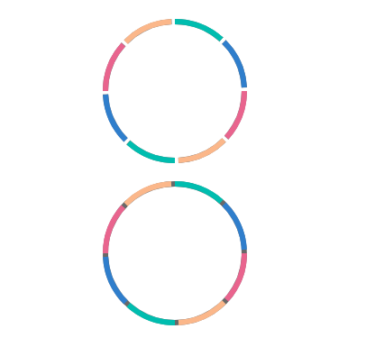
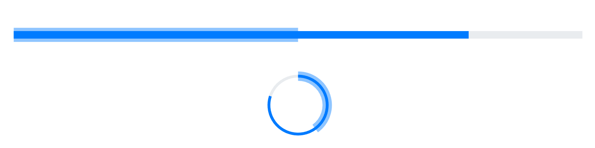
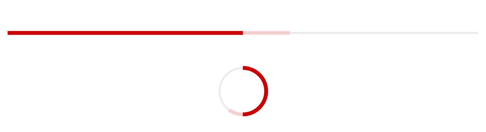

# Customization in Blazor ProgressBar Component

## Segments

Divide a progress bar into multiple segments by using the [SegmentCount](https://help.syncfusion.com/cr/blazor/Syncfusion.Blazor.ProgressBar.SfProgressBar.html#Syncfusion_Blazor_ProgressBar_SfProgressBar_SegmentCount) property to visualize the progress for multiple sequential tasks, and the [EnableProgressSegments](https://help.syncfusion.com/cr/blazor/Syncfusion.Blazor.ProgressBar.SfProgressBar.html#Syncfusion_Blazor_ProgressBar_SfProgressBar_EnableProgressSegments) property to divide the progress  into multiple segments without the track. Meanwhile, the [SegmentColor](https://help.syncfusion.com/cr/blazor/Syncfusion.Blazor.ProgressBar.SfProgressBar.html#Syncfusion_Blazor_ProgressBar_SfProgressBar_SegmentColor) property represents the color of each segment.

```cshtml
@using Syncfusion.Blazor.ProgressBar

<SfProgressBar Type="ProgressType.Circular" Value="100" Height="180" SegmentCount="8" SegmentColor='new string[] { "#00bdaf", "#2f7ecc", "#e9648e", "#fbb78a" }' Minimum="0" Maximum="100" TrackColor="#696969">
</SfProgressBar>

<SfProgressBar Type="ProgressType.Circular" EnableProgressSegments="true" Value="100" Height="180" SegmentColor='new string[] { "#00bdaf", "#2f7ecc", "#e9648e", "#fbb78a" }' SegmentCount="8" Minimum="0" Maximum="100" TrackColor="#696969">
</SfProgressBar>
```



## Thickness

You can customize the thickness of the track using the [TrackThickness](https://help.syncfusion.com/cr/blazor/Syncfusion.Blazor.ProgressBar.SfProgressBar.html#Syncfusion_Blazor_ProgressBar_SfProgressBar_TrackThickness), progress using the [ProgressThickness](https://help.syncfusion.com/cr/blazor/Syncfusion.Blazor.ProgressBar.SfProgressBar.html#Syncfusion_Blazor_ProgressBar_SfProgressBar_ProgressThickness) and secondary progress using the [SecondaryProgressThickness](https://help.syncfusion.com/cr/blazor/Syncfusion.Blazor.ProgressBar.SfProgressBar.html#Syncfusion_Blazor_ProgressBar_SfProgressBar_SecondaryProgressThickness) to render the progress bar with different appearances.  

```cshtml
 @using Syncfusion.Blazor.ProgressBar

<SfProgressBar Type="ProgressType.Linear" Value="100" Height="60" Width="90%" TrackThickness="24" ProgressThickness="24" ShowProgressValue="true" Minimum="0" Maximum="100">
</SfProgressBar>
```


```cshtml
@using Syncfusion.Blazor.ProgressBar

<SfProgressBar  Type="ProgressType.Linear" Value="80" Minimum="0" Maximum="100" SecondaryProgress="50" SecondaryProgressThickness="30" >
</SfProgressBar>

<SfProgressBar  Type="ProgressType.Circular" Value="80" Minimum="0" Maximum="100" SecondaryProgress="40" SecondaryProgressThickness="20">
</SfProgressBar>
```



## Radius

The radius of the progress bar can be customized using the [Radius](https://help.syncfusion.com/cr/blazor/Syncfusion.Blazor.ProgressBar.SfProgressBar.html#Syncfusion_Blazor_ProgressBar_SfProgressBar_Radius) property, and the progress edges can be customized using the [CornerRadius](https://help.syncfusion.com/cr/blazor/Syncfusion.Blazor.ProgressBar.SfProgressBar.html#Syncfusion_Blazor_ProgressBar_SfProgressBar_CornerRadius) property.

```cshtml
@using Syncfusion.Blazor.ProgressBar

<SfProgressBar Type="ProgressType.Circular" Value="60" Height="160px" Width="160px" EnableRtl="false" TrackColor="#FFD939" Radius="80%" InnerRadius="190%" ProgressColor="white" TrackThickness="80" ProgressThickness="10" CornerRadius="CornerType.Round" Minimum="0" Maximum="100">
</SfProgressBar>
```


## Inner Radius

The inner radius of the progress bar can be customized using the [InnerRadius](https://help.syncfusion.com/cr/blazor/Syncfusion.Blazor.ProgressBar.SfProgressBar.html#Syncfusion_Blazor_ProgressBar_SfProgressBar_InnerRadius) property.

```cshtml
@using Syncfusion.Blazor.ProgressBar

<SfProgressBar Type="ProgressType.Circular" Value="60" Height="160px" Width="160px" EnableRtl="false"
                TrackColor="#FFD939" Radius="80%" InnerRadius="80%" ProgressColor="white" TrackThickness="80" ProgressThickness="10" CornerRadius="CornerType.Round" Minimum="0" Maximum="100">
</SfProgressBar>
```


## Progress Color and Track Color

We can customize the color of the progress, secondary progress, and track using [ProgressColor](https://help.syncfusion.com/cr/blazor/Syncfusion.Blazor.ProgressBar.SfProgressBar.html#Syncfusion_Blazor_ProgressBar_SfProgressBar_ProgressColor), [SecondaryProgressColor](https://help.syncfusion.com/cr/blazor/Syncfusion.Blazor.ProgressBar.SfProgressBar.html#Syncfusion_Blazor_ProgressBar_SfProgressBar_SecondaryProgressColor) and [TrackColor](https://help.syncfusion.com/cr/blazor/Syncfusion.Blazor.ProgressBar.SfProgressBar.html#Syncfusion_Blazor_ProgressBar_SfProgressBar_TrackColor) properties. 

```cshtml
@using Syncfusion.Blazor.ProgressBar

<SfProgressBar Type="ProgressType.Linear" Value="50" Height="60" Width="90%" TrackColor="#F8C7D8"
        ShowProgressValue="true" InnerRadius="190%" ProgressColor="#E3165B" TrackThickness="24" CornerRadius="CornerType.Round"
        ProgressThickness="24" Minimum="0" Maximum="100">
</SfProgressBar>
```


```cshtml
@using Syncfusion.Blazor.ProgressBar

<SfProgressBar  Type="ProgressType.Linear" ProgressColor="#cc0202" Value="50" ProgressThickness="10" TrackThickness="10" Minimum="0" Maximum="100" SecondaryProgress="60"  SecondaryProgressThickness="10" SecondaryProgressColor="#faa7a7" >
</SfProgressBar>

<SfProgressBar  Type=" ProgressType.Circular"  ProgressColor="#cc0202" Value="50" ProgressThickness="10" TrackThickness="10" Minimum="0" Maximum="100" SecondaryProgress="60" SecondaryProgressThickness="10" SecondaryProgressColor= "#faa7a7" >
</SfProgressBar>
```



## Range Colors

Enhance the readability of progress by visualizing a multiple ranges with different colors, that are mapped to each range. Colors can be mapped to specific ranges using the [ProgressBarRangeColors](https://help.syncfusion.com/cr/blazor/Syncfusion.Blazor.ProgressBar.ProgressBarRangeColors.html), which holds a collection of the [ProgressBarRangeColor](https://help.syncfusion.com/cr/blazor/Syncfusion.Blazor.ProgressBar.ProgressBarRangeColor.html) type.

The [Color](https://help.syncfusion.com/cr/blazor/Syncfusion.Blazor.ProgressBar.ProgressBarRangeColor.html#Syncfusion_Blazor_ProgressBar_ProgressBarRangeColor_Color) property represents color to the specified range. The [Start](https://help.syncfusion.com/cr/blazor/Syncfusion.Blazor.ProgressBar.ProgressBarRangeColor.html#Syncfusion_Blazor_ProgressBar_ProgressBarRangeColor_Start) and the [End](https://help.syncfusion.com/cr/blazor/Syncfusion.Blazor.ProgressBar.ProgressBarRangeColor.html#Syncfusion_Blazor_ProgressBar_ProgressBarRangeColor_End) properties represents start and end range of the color. The [IsGradient](https://help.syncfusion.com/cr/blazor/Syncfusion.Blazor.ProgressBar.SfProgressBar.html#Syncfusion_Blazor_ProgressBar_SfProgressBar_IsGradient) property represents whether the gradient effect is applied to the color.

```cshtml
@using Syncfusion.Blazor.ProgressBar

<SfProgressBar Value="100" IsGradient="true">
    <ProgressBarRangeColors>
        <ProgressBarRangeColor Start="0" End="25" Color="#00bdaf"></ProgressBarRangeColor>
        <ProgressBarRangeColor Start="25" End="50" Color="#2f7ecc"></ProgressBarRangeColor>
        <ProgressBarRangeColor Start="50" End="75" Color="#e9648e"></ProgressBarRangeColor>
        <ProgressBarRangeColor Start="75" End="100" Color="#fbb78a"></ProgressBarRangeColor>
    </ProgressBarRangeColors>
</SfProgressBar>
```


## RTL

The progress bar supports right-to-left (RTL) rendering, which can be enabled by setting the [EnableRtl](https://help.syncfusion.com/cr/blazor/Syncfusion.Blazor.ProgressBar.SfProgressBar.html#Syncfusion_Blazor_ProgressBar_SfProgressBar_EnableRtl) property to **true**.

```cshtml
@using Syncfusion.Blazor.ProgressBar

<SfProgressBar EnableRtl="true" Value="50" Type="ProgressType.Linear">
</SfProgressBar>

<SfProgressBar EnableRtl="true" Value="80" Type="ProgressType.Circular">
</SfProgressBar>
```


## Progress Bar Visibility 

The progress bar visibility can be changed by using the [Visible](https://help.syncfusion.com/cr/blazor/Syncfusion.Blazor.ProgressBar.SfProgressBar.html#Syncfusion_Blazor_ProgressBar_SfProgressBar_Visible) property.

```cshtml
@using Syncfusion.Blazor.ProgressBar
 <SfProgressBar Type="ProgressType.Linear" Value="100" Height="60" Minimum="0" Maximum="100" Visible="@visible">
    <ProgressBarAnimation  Enable="true"></ProgressBarAnimation>
    <ProgressBarEvents AnimationComplete="@AnimationHandler"></ProgressBarEvents>
</SfProgressBar>
<div>
    <p align="center" style="color:#2e2ef1; font-size: larger ">
        @uploadStatus
    </p>
</div>
    
@code{
    private string uploadStatus { get; set; } = null;
    private bool visible { get; set; } = true;
    public void AnimationHandler(ProgressValueEventArgs args)
    { 
        if (args.Value == 100)
        {
            visible = false;
            uploadStatus = "UPLOAD SUCCESS...";
        }
    }
}
```


## Progress Bar Margin

The spacing between the progress bar and its container can be adjusted using the [ProgressBarMargin](https://help.syncfusion.com/cr/blazor/Syncfusion.Blazor.ProgressBar.ProgressBarMargin.html) property. By default, the [Left](https://help.syncfusion.com/cr/blazor/Syncfusion.Blazor.ProgressBar.ProgressBarMargin.html#Syncfusion_Blazor_ProgressBar_ProgressBarMargin_Left), [Right](https://help.syncfusion.com/cr/blazor/Syncfusion.Blazor.ProgressBar.ProgressBarMargin.html#Syncfusion_Blazor_ProgressBar_ProgressBarMargin_Right), [Top](https://help.syncfusion.com/cr/blazor/Syncfusion.Blazor.ProgressBar.ProgressBarMargin.html#Syncfusion_Blazor_ProgressBar_ProgressBarMargin_Top), and [Bottom](https://help.syncfusion.com/cr/blazor/Syncfusion.Blazor.ProgressBar.ProgressBarMargin.html#Syncfusion_Blazor_ProgressBar_ProgressBarMargin_Bottom) margins are set to 10px, ensuring uniform spacing around the progress bar. These values can be modified as needed to increase or decrease the spacing, allowing for precise layout customization.

```cshtml
@using Syncfusion.Blazor.ProgressBar
<SfProgressBar Type="ProgressType.Circular" Height="150px" Width="150px" 
       Value="80" Minimum="0" Maximum="100" TrackThickness="20" ProgressThickness="20">
    <ProgressBarMargin Left="0" Right="0" Bottom="0" Top="0">
    </ProgressBarMargin>
</SfProgressBar>
```


