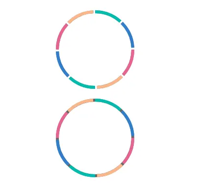
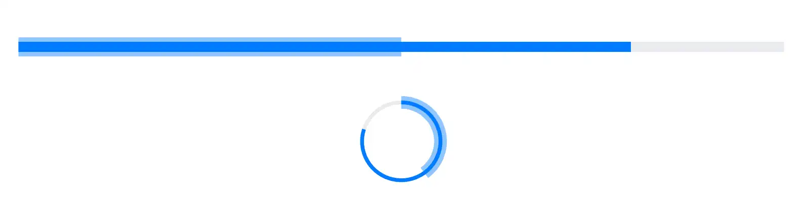
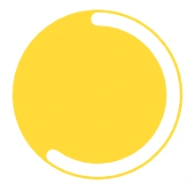
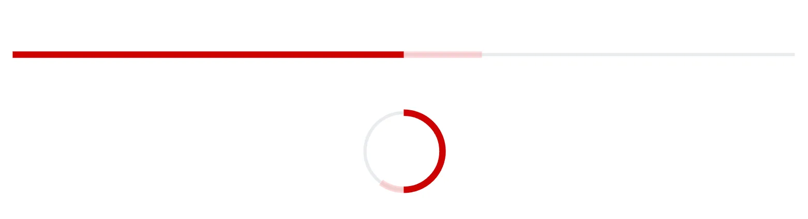
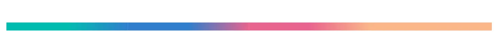
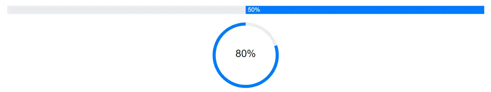

# Blazor ProgressBar Customization

This section covers the appearance and behavior options available on the [Blazor ProgressBar](https://help.syncfusion.com/cr/blazor/Syncfusion.Blazor.ProgressBar.SfProgressBar.html) component for segments, thickness, radius, colors, range colors, RTL, visibility, and margins. For animation and event customization, see [Animation](animation.md) and [Events](events.md).

## Segments

Divide the progress bar into multiple segments using the [SegmentCount](https://help.syncfusion.com/cr/blazor/Syncfusion.Blazor.ProgressBar.SfProgressBar.html#Syncfusion_Blazor_ProgressBar_SfProgressBar_SegmentCount) property. The [EnableProgressSegments](https://help.syncfusion.com/cr/blazor/Syncfusion.Blazor.ProgressBar.SfProgressBar.html#Syncfusion_Blazor_ProgressBar_SfProgressBar_EnableProgressSegments) property, when set to `true`, limits the segmentation to the filled progress while the track remains whole. Use the [SegmentColor](https://help.syncfusion.com/cr/blazor/Syncfusion.Blazor.ProgressBar.SfProgressBar.html#Syncfusion_Blazor_ProgressBar_SfProgressBar_SegmentColor) property to assign colors to each segment. If `SegmentColor` has fewer entries than `SegmentCount`, the colors repeat in sequence. `SegmentCount` applies to both `ProgressType.Linear` and `ProgressType.Circular`.

```cshtml
@using Syncfusion.Blazor.ProgressBar

<SfProgressBar Type="ProgressType.Circular" Value="100" Height="180" SegmentCount="8" SegmentColor='new string[] { "#00bdaf", "#2f7ecc", "#e9648e", "#fbb78a" }' Minimum="0" Maximum="100" TrackColor="#696969">
</SfProgressBar>

<SfProgressBar Type="ProgressType.Circular" EnableProgressSegments="true" Value="100" Height="180" SegmentColor='new string[] { "#00bdaf", "#2f7ecc", "#e9648e", "#fbb78a" }' SegmentCount="8" Minimum="0" Maximum="100" TrackColor="#696969">
</SfProgressBar>
```



## Thickness

Customize the track thickness using the [TrackThickness](https://help.syncfusion.com/cr/blazor/Syncfusion.Blazor.ProgressBar.SfProgressBar.html#Syncfusion_Blazor_ProgressBar_SfProgressBar_TrackThickness) property and the primary progress thickness using the [ProgressThickness](https://help.syncfusion.com/cr/blazor/Syncfusion.Blazor.ProgressBar.SfProgressBar.html#Syncfusion_Blazor_ProgressBar_SfProgressBar_ProgressThickness) property. Both properties accept numeric values measured in pixels.

### Primary and track thickness

```cshtml
@using Syncfusion.Blazor.ProgressBar

<SfProgressBar Type="ProgressType.Linear" Value="100" Height="60" Width="90%" TrackThickness="24" ProgressThickness="24" ShowProgressValue="true" Minimum="0" Maximum="100">
</SfProgressBar>
```


### Secondary progress thickness

Use the [SecondaryProgressThickness](https://help.syncfusion.com/cr/blazor/Syncfusion.Blazor.ProgressBar.SfProgressBar.html#Syncfusion_Blazor_ProgressBar_SfProgressBar_SecondaryProgressThickness) property to customize the thickness of the secondary progress indicator. It controls the buffer line in a linear progress bar and the secondary arc in a circular progress bar.

```cshtml
@using Syncfusion.Blazor.ProgressBar

<SfProgressBar Type="ProgressType.Linear" Value="80" Minimum="0" Maximum="100" SecondaryProgress="50" SecondaryProgressThickness="30">
</SfProgressBar>

<SfProgressBar Type="ProgressType.Circular" Value="80" Minimum="0" Maximum="100" SecondaryProgress="40" SecondaryProgressThickness="20">
</SfProgressBar>
```



## Radius and Corner Radius

Customize the outer radius of a circular progress bar using the [Radius](https://help.syncfusion.com/cr/blazor/Syncfusion.Blazor.ProgressBar.SfProgressBar.html#Syncfusion_Blazor_ProgressBar_SfProgressBar_Radius) property. Use the [CornerRadius](https://help.syncfusion.com/cr/blazor/Syncfusion.Blazor.ProgressBar.SfProgressBar.html#Syncfusion_Blazor_ProgressBar_SfProgressBar_CornerRadius) property with `CornerType.Round` or `CornerType.Flat` to round or square the progress edges.

The `Radius` property accepts a percentage value relative to the available circular progress bar area. Use the `Radius` and `InnerRadius` properties together to control the size and thickness of the circular ring.

```cshtml
@using Syncfusion.Blazor.ProgressBar

<SfProgressBar Type="ProgressType.Circular" Value="60" Height="160px" Width="160px" EnableRtl="false" TrackColor="#FFD939" Radius="80%" InnerRadius="0%" ProgressColor="white" TrackThickness="80" ProgressThickness="10" CornerRadius="CornerType.Round" Minimum="0" Maximum="100">
</SfProgressBar>
```



## Inner Radius

Customize the inner radius of a circular progress bar using the [InnerRadius](https://help.syncfusion.com/cr/blazor/Syncfusion.Blazor.ProgressBar.SfProgressBar.html#Syncfusion_Blazor_ProgressBar_SfProgressBar_InnerRadius) property. The `InnerRadius` accepts a percentage value (typically `0%` to `100%`) that sets the inner boundary of the circular ring, allowing you to produce hollow rings when combined with a thick track.

```cshtml
@using Syncfusion.Blazor.ProgressBar

<SfProgressBar Type="ProgressType.Circular" Value="60" Height="160px" Width="160px" EnableRtl="false" TrackColor="#FFD939" Radius="80%" InnerRadius="80%" ProgressColor="white" TrackThickness="80" ProgressThickness="10" CornerRadius="CornerType.Round" Minimum="0" Maximum="100">
</SfProgressBar>
```


## Progress, Secondary Progress, and Track Colors

Customize the primary progress, secondary progress, and track colors using the [ProgressColor](https://help.syncfusion.com/cr/blazor/Syncfusion.Blazor.ProgressBar.SfProgressBar.html#Syncfusion_Blazor_ProgressBar_SfProgressBar_ProgressColor), [SecondaryProgressColor](https://help.syncfusion.com/cr/blazor/Syncfusion.Blazor.ProgressBar.SfProgressBar.html#Syncfusion_Blazor_ProgressBar_SfProgressBar_SecondaryProgressColor), and [TrackColor](https://help.syncfusion.com/cr/blazor/Syncfusion.Blazor.ProgressBar.SfProgressBar.html#Syncfusion_Blazor_ProgressBar_SfProgressBar_TrackColor) properties. All color properties accept standard CSS color values such as named colors, hex codes, RGB, or RGBA strings.

### Progress and track colors

```cshtml
@using Syncfusion.Blazor.ProgressBar

<SfProgressBar Type="ProgressType.Linear" Value="50" Height="60" Width="90%" TrackColor="#F8C7D8"
        ShowProgressValue="true" InnerRadius="190%" ProgressColor="#E3165B" TrackThickness="24" CornerRadius="CornerType.Round"
        ProgressThickness="24" Minimum="0" Maximum="100">
</SfProgressBar>
```


### Secondary progress color

```cshtml
@using Syncfusion.Blazor.ProgressBar

<SfProgressBar Type="ProgressType.Linear" ProgressColor="#cc0202" Value="50" ProgressThickness="10" TrackThickness="10" Minimum="0" Maximum="100" SecondaryProgress="60" SecondaryProgressThickness="10" SecondaryProgressColor="#faa7a7">
</SfProgressBar>

<SfProgressBar Type="ProgressType.Circular" ProgressColor="#cc0202" Value="50" ProgressThickness="10" TrackThickness="10" Minimum="0" Maximum="100" SecondaryProgress="60" SecondaryProgressThickness="10" SecondaryProgressColor="#faa7a7">
</SfProgressBar>
```



## Range Colors

Enhance progress readability by mapping different colors to multiple ranges. The [ProgressBarRangeColors](https://help.syncfusion.com/cr/blazor/Syncfusion.Blazor.ProgressBar.ProgressBarRangeColors.html) component contains a collection of [ProgressBarRangeColor](https://help.syncfusion.com/cr/blazor/Syncfusion.Blazor.ProgressBar.ProgressBarRangeColor.html) elements.

The [Color](https://help.syncfusion.com/cr/blazor/Syncfusion.Blazor.ProgressBar.ProgressBarRangeColor.html#Syncfusion_Blazor_ProgressBar_ProgressBarRangeColor_Color) property specifies the color for a range. The [Start](https://help.syncfusion.com/cr/blazor/Syncfusion.Blazor.ProgressBar.ProgressBarRangeColor.html#Syncfusion_Blazor_ProgressBar_ProgressBarRangeColor_Start) and [End](https://help.syncfusion.com/cr/blazor/Syncfusion.Blazor.ProgressBar.ProgressBarRangeColor.html#Syncfusion_Blazor_ProgressBar_ProgressBarRangeColor_End) properties specify its start and end values. The [IsGradient](https://help.syncfusion.com/cr/blazor/Syncfusion.Blazor.ProgressBar.SfProgressBar.html#Syncfusion_Blazor_ProgressBar_SfProgressBar_IsGradient) property specifies whether a gradient effect is applied between range colors.

```cshtml
@using Syncfusion.Blazor.ProgressBar

<SfProgressBar Value="100" IsGradient="true">
    <ProgressBarRangeColors>
        <ProgressBarRangeColor Start="0" End="25" Color="#00bdaf" />
        <ProgressBarRangeColor Start="25" End="50" Color="#2f7ecc" />
        <ProgressBarRangeColor Start="50" End="75" Color="#e9648e" />
        <ProgressBarRangeColor Start="75" End="100" Color="#fbb78a" />
    </ProgressBarRangeColors>
</SfProgressBar>
```



## Right-to-left

The progress bar supports right-to-left (RTL) rendering. Set the [EnableRtl](https://help.syncfusion.com/cr/blazor/Syncfusion.Blazor.ProgressBar.SfProgressBar.html#Syncfusion_Blazor_ProgressBar_SfProgressBar_EnableRtl) property to `true` to enable it.

```cshtml
@using Syncfusion.Blazor.ProgressBar

<SfProgressBar EnableRtl="true" Value="50" Type="ProgressType.Linear">
</SfProgressBar>

<SfProgressBar EnableRtl="true" Value="80" Type="ProgressType.Circular">
</SfProgressBar>
```



## Visibility

Control progress bar visibility using the [Visible](https://help.syncfusion.com/cr/blazor/Syncfusion.Blazor.ProgressBar.SfProgressBar.html#Syncfusion_Blazor_ProgressBar_SfProgressBar_Visible) property. The following example handles the `AnimationComplete` event of [ProgressBarEvents](events.md) and hides the progress bar once its value reaches the maximum.

```cshtml
@using Syncfusion.Blazor.ProgressBar

<SfProgressBar Type="ProgressType.Linear" Value="100" Height="60" Minimum="0" Maximum="100" Visible="@visible">
    <ProgressBarAnimation Enable="true"></ProgressBarAnimation>
    <ProgressBarEvents AnimationComplete="@AnimationHandler"></ProgressBarEvents>
</SfProgressBar>
<div>
    <p align="center" style="color:#2e2ef1; font-size:larger">
        @uploadStatus
    </p>
</div>

@code {
    private string uploadStatus { get; set; }
    private bool visible { get; set; } = true;
    public void AnimationHandler(ProgressValueEventArgs args)
    {
        if (args.Value == 100)
        {
            visible = false;
            uploadStatus = "UPLOAD SUCCESS...";
        }
    }
}
```


## Margin

Adjust the spacing between the progress bar and its container using the [ProgressBarMargin](https://help.syncfusion.com/cr/blazor/Syncfusion.Blazor.ProgressBar.ProgressBarMargin.html) component. Its [Left](https://help.syncfusion.com/cr/blazor/Syncfusion.Blazor.ProgressBar.ProgressBarMargin.html#Syncfusion_Blazor_ProgressBar_ProgressBarMargin_Left), [Right](https://help.syncfusion.com/cr/blazor/Syncfusion.Blazor.ProgressBar.ProgressBarMargin.html#Syncfusion_Blazor_ProgressBar_ProgressBarMargin_Right), [Top](https://help.syncfusion.com/cr/blazor/Syncfusion.Blazor.ProgressBar.ProgressBarMargin.html#Syncfusion_Blazor_ProgressBar_ProgressBarMargin_Top), and [Bottom](https://help.syncfusion.com/cr/blazor/Syncfusion.Blazor.ProgressBar.ProgressBarMargin.html#Syncfusion_Blazor_ProgressBar_ProgressBarMargin_Bottom) properties accept numeric values that represent pixel spacing. Setting all four properties to `0` removes the default margin.

```cshtml
@using Syncfusion.Blazor.ProgressBar

<SfProgressBar Type="ProgressType.Circular" Height="150px" Width="150px" Value="80" Minimum="0" Maximum="100" TrackThickness="20" ProgressThickness="20">
    <ProgressBarMargin Left="0" Right="0" Bottom="0" Top="0">
    </ProgressBarMargin>
</SfProgressBar>
```


## See also

* [Getting Started with Blazor ProgressBar](getting-started.md)
* [Blazor ProgressBar Range](range.md)
* [Blazor ProgressBar States](states.md)
* [Blazor ProgressBar Style and Appearance](style-appearance.md)
