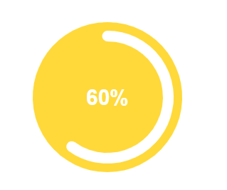

# Annotations and Label in Blazor ProgressBar Component

## Annotations

Annotations allow you to add text, shapes, or images to the track area of the Progress Bar. Add annotations using the [ProgressBarAnnotations](https://help.syncfusion.com/cr/blazor/Syncfusion.Blazor.ProgressBar.ProgressBarAnnotations.html) collection, and specify elements to display in the track area with the `ContentTemplate` property of [ProgressBarAnnotation](https://help.syncfusion.com/cr/blazor/Syncfusion.Blazor.ProgressBar.ProgressBarAnnotation.html).

```cshtml

@using Syncfusion.Blazor.ProgressBar

<SfProgressBar Type="ProgressType.Circular" Value="60" Height="160px" Width="160px" EnableRtl="false"
               TrackColor="#FFD939" Radius="100%" InnerRadius="190%" ProgressColor="white" TrackThickness="80"
               ProgressThickness="10" CornerRadius="CornerType.Round" Minimum="0" Maximum="100">
    <ProgressBarAnnotations>
        <ProgressBarAnnotation>
            <ContentTemplate>
                <div style="font-size:20px;font-weight:bold;color:#ffffff;fill:#ffffff">
                    <span>
                        60%
                    </span>
                </div>
            </ContentTemplate>
        </ProgressBarAnnotation>
    </ProgressBarAnnotations>
</SfProgressBar>

```



## Label

When the [ShowProgressValue](https://help.syncfusion.com/cr/blazor/Syncfusion.Blazor.ProgressBar.SfProgressBar.html#Syncfusion_Blazor_ProgressBar_SfProgressBar_ShowProgressValue) property is set to **true**, the progress text is displayed in percentage format by default. You can customize the label format using the [Text](https://help.syncfusion.com/cr/blazor/Syncfusion.Blazor.ProgressBar.TextRenderEventArgs.html#Syncfusion_Blazor_ProgressBar_TextRenderEventArgs_Text) argument in the [TextRender](https://help.syncfusion.com/cr/blazor/Syncfusion.Blazor.ProgressBar.ProgressBarEvents.html#Syncfusion_Blazor_ProgressBar_ProgressBarEvents_TextRender) event.

```cshtml

@using Syncfusion.Blazor.ProgressBar

<SfProgressBar Type="ProgressType.Linear" Value="50" Height="60" Width="90%" TrackColor="#F8C7D8"
               ShowProgressValue="true" ProgressColor="#E3165B" TrackThickness="24" CornerRadius="CornerType.Round"
               ProgressThickness="24" Minimum="0" Maximum="100">
    <ProgressBarEvents TextRender="TextHandler"></ProgressBarEvents>
</SfProgressBar>

@code {
    public void TextHandler(TextRenderEventArgs args)
    {
        args.Text = "..."; // Here you can customize the text format.
    }
}

```


