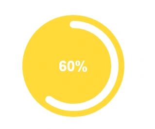

# Annotations and Label in Blazor ProgressBar Component

## Annotations

Annotations in the Blazor ProgressBar component are used to enhance the visual representation of progress by adding custom text, shapes, or images directly inside the track area. This feature is especially useful when you want more control over how information is displayed, instead of relying only on the default progress value rendering.
You can define annotations by using the [ProgressBarAnnotations](https://help.syncfusion.com/cr/blazor/Syncfusion.Blazor.ProgressBar.ProgressBarAnnotations.html) collection. Inside this collection, multiple [ProgressBarAnnotation](https://help.syncfusion.com/cr/blazor/Syncfusion.Blazor.ProgressBar.ProgressBarAnnotation.html) elements can be added. Each annotation allows you to specify custom UI content using the `ContentTemplate` property. This template supports standard HTML elements, enabling you to design rich and interactive content within the ProgressBar.
Annotations are commonly used in scenarios such as dashboards, analytics displays, or status indicators where additional context or styling is required. For example, instead of just showing a numeric value, you may want to include icons, labels, or formatted text along with the progress percentage.

```cshtml
@using Syncfusion.Blazor.ProgressBar

<SfProgressBar Type="ProgressType.Circular" Value="60" Height="160px" Width="160px" EnableRtl="false"
               TrackColor="#FFD939" Radius="100%" InnerRadius="190%" ProgressColor="white" TrackThickness="80"
               ProgressThickness="10" CornerRadius="CornerType.Round" Minimum="0" Maximum="100">
    <ProgressBarAnnotations>
        <ProgressBarAnnotation>
            <ContentTemplate>
                <div style="font-size:20px;font-weight:bold;color:#ffffff;fill:#ffffff">
                    <span>
                        60%
                    </span>
                </div>
            </ContentTemplate>
        </ProgressBarAnnotation>
    </ProgressBarAnnotations>
</SfProgressBar>
```



In this example, a circular ProgressBar is created with a value of 60. The annotation is placed in the center of the progress bar using a content template. The text "60%" is displayed with custom styling such as font size, weight, and color. You can further enhance this by dynamically binding the value or adding conditional styling based on the progress value.

## Label

The Blazor ProgressBar component also supports displaying progress values using built-in labels. When the [ShowProgressValue](https://help.syncfusion.com/cr/blazor/Syncfusion.Blazor.ProgressBar.SfProgressBar.html#Syncfusion_Blazor_ProgressBar_SfProgressBar_ShowProgressValue) property is set to **true**, the component automatically renders the progress text, typically in percentage format.
However, the default label [Text](https://help.syncfusion.com/cr/blazor/Syncfusion.Blazor.ProgressBar.TextRenderEventArgs.html#Syncfusion_Blazor_ProgressBar_TextRenderEventArgs_Text) can be customized using the [TextRender](https://help.syncfusion.com/cr/blazor/Syncfusion.Blazor.ProgressBar.ProgressBarEvents.html#Syncfusion_Blazor_ProgressBar_ProgressBarEvents_TextRender) event. This event allows you to modify the displayed text dynamically based on the progress value or any other logic defined in your application.
This approach is useful when you need simple customization without building a full template like annotations. Labels are easier to configure and are ideal for straightforward progress display scenarios.

```cshtml
@using Syncfusion.Blazor.ProgressBar

<SfProgressBar Type="ProgressType.Linear" Value="50" Height="60" Width="90%" TrackColor="#F8C7D8"
               ShowProgressValue="true" ProgressColor="#E3165B" TrackThickness="24" CornerRadius="CornerType.Round"
               ProgressThickness="24" Minimum="0" Maximum="100">
    <ProgressBarEvents TextRender="TextHandler"></ProgressBarEvents>
</SfProgressBar>

@code{
    public void TextHandler(TextRenderEventArgs args)
    {
        args.Text = "..."; // Here you can customize the text format.
    }
}
```


In this example, a linear ProgressBar is displayed with a value of 50. Since ShowProgressValue is enabled, the progress text is shown by default. The TextRender event overrides the default behavior, allowing you to define your own text output.

This flexibility allows developers to tailor the progress display to match application requirements and improve clarity for users.

### Advantages of Using Labels

- Simple and quick to configure  
- Automatically handles progress value display  
- Supports dynamic text customization  
- Ideal for minimal UI requirements  


## See Also

* [Dynamically Change the Value](https://support.syncfusion.com/kb/article/21303/how-to-dynamically-change-the-value-of-blazor-progress-bar)