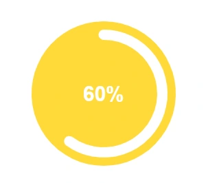

# Blazor ProgressBar Annotation and Label

## Annotation

Use annotations to overlay custom content such as text, icons, or images on the ProgressBar. Each annotation is added through the [`ProgressBarAnnotations`](https://help.syncfusion.com/cr/blazor/Syncfusion.Blazor.ProgressBar.ProgressBarAnnotations.html) collection, and the visual content is supplied by the [`ContentTemplate`](https://help.syncfusion.com/cr/blazor/Syncfusion.Blazor.ProgressBar.ProgressBarAnnotation.html#Syncfusion_Blazor_ProgressBar_ProgressBarAnnotation_ContentTemplate) property of the [`ProgressBarAnnotation`](https://help.syncfusion.com/cr/blazor/Syncfusion.Blazor.ProgressBar.ProgressBarAnnotation.html).

```cshtml
@using Syncfusion.Blazor.ProgressBar

<SfProgressBar Type="ProgressType.Circular" Value="60" Height="160px" Width="160px" EnableRtl="false"
               TrackColor="#FFD939" Radius="100%" InnerRadius="190%" ProgressColor="white" TrackThickness="80"
               ProgressThickness="10" CornerRadius="CornerType.Round" Minimum="0" Maximum="100">
    <ProgressBarAnnotations>
        <ProgressBarAnnotation>
            <ContentTemplate>
                <div style="font-size:20px;font-weight:bold;color:#ffffff">
                    <span>60%</span>
                </div>
            </ContentTemplate>
        </ProgressBarAnnotation>
    </ProgressBarAnnotations>
</SfProgressBar>
```



## Label

When the [`ShowProgressValue`](https://help.syncfusion.com/cr/blazor/Syncfusion.Blazor.ProgressBar.SfProgressBar.html#Syncfusion_Blazor_ProgressBar_SfProgressBar_ShowProgressValue) property is set to **true**, the ProgressBar renders the value as a percentage by default. Use the [`TextRender`](https://help.syncfusion.com/cr/blazor/Syncfusion.Blazor.ProgressBar.ProgressBarEvents.html#Syncfusion_Blazor_ProgressBar_ProgressBarEvents_TextRender) event of [`ProgressBarEvents`](https://help.syncfusion.com/cr/blazor/Syncfusion.Blazor.ProgressBar.ProgressBarEvents.html) to customize the displayed text. The current numeric value is available through the [`Value`](https://help.syncfusion.com/cr/blazor/Syncfusion.Blazor.ProgressBar.TextRenderEventArgs.html#Syncfusion_Blazor_ProgressBar_TextRenderEventArgs_Value) property of [`TextRenderEventArgs`](https://help.syncfusion.com/cr/blazor/Syncfusion.Blazor.ProgressBar.TextRenderEventArgs.html), and the formatted output is assigned to the [`Text`](https://help.syncfusion.com/cr/blazor/Syncfusion.Blazor.ProgressBar.TextRenderEventArgs.html#Syncfusion_Blazor_ProgressBar_TextRenderEventArgs_Text) property of the same arguments.

```cshtml
@using Syncfusion.Blazor.ProgressBar

<SfProgressBar Type="ProgressType.Linear" Value="50" Height="60" Width="90%" TrackColor="#F8C7D8"
               ShowProgressValue="true" ProgressColor="#E3165B" TrackThickness="24" CornerRadius="CornerType.Round"
               ProgressThickness="24" Minimum="0" Maximum="100">
    <ProgressBarEvents TextRender="TextHandler"></ProgressBarEvents>
</SfProgressBar>

@code {
    public void TextHandler(TextRenderEventArgs args)
    {
        args.Text = "..."; // Here you can customize the text format.
    }
}
```


## See Also

* [Style and Appearance](style-appearance.md)
* [ProgressBar Events](events.md)
* [How to dynamically change the ProgressBar value](https://support.syncfusion.com/kb/article/21303/how-to-dynamically-change-the-value-of-blazor-progress-bar)