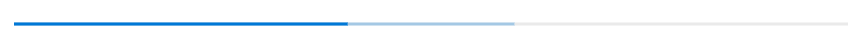
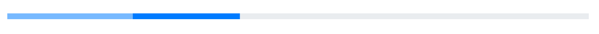

# States in Blazor ProgressBar Component

In this section, the progress can be visualized in different states.

## Determinate

This is the default progress state, which can be used when the estimated progress is known.

```cshtml
@using Syncfusion.Blazor.ProgressBar

<SfProgressBar Type="ProgressType.Linear" Value="100" Height="60" Minimum="0" Maximum="100">
</SfProgressBar>
```


## Indeterminate

 When the progress cannot be estimated or calculated, the indeterminate state of the Progress Bar can be used to set the [IsIndeterminate](https://help.syncfusion.com/cr/blazor/Syncfusion.Blazor.ProgressBar.SfProgressBar.html#Syncfusion_Blazor_ProgressBar_SfProgressBar_IsIndeterminate) property to true. It can be combined with the determinate mode to know the estimating progress before the actual progress starts.

```cshtml
@using Syncfusion.Blazor.ProgressBar

<SfProgressBar Type="ProgressType.Linear" Value="20" Height="60" IsIndeterminate="true" Minimum="0" Maximum="100">
</SfProgressBar>
```


## Buffer

When the [SecondaryProgress](https://help.syncfusion.com/cr/blazor/Syncfusion.Blazor.ProgressBar.SfProgressBar.html#Syncfusion_Blazor_ProgressBar_SfProgressBar_SecondaryProgress) property value is set to **true**, the secondary progress indicator becomes visible, and the primary progress is dependent on it. Users will be able to view both the primary and the secondary progress simultaneously.

```cshtml
@using Syncfusion.Blazor.ProgressBar

<SfProgressBar Type="ProgressType.Linear" Value="40" Height="60" SecondaryProgress="60" Minimum="0" Maximum="100">
</SfProgressBar>
```



## Active

The active animate indicator for the estimated progress can be enabled by setting the [IsActive](https://help.syncfusion.com/cr/blazor/Syncfusion.Blazor.ProgressBar.SfProgressBar.html#Syncfusion_Blazor_ProgressBar_SfProgressBar_IsActive) property to **true** in the `SfProgressBar` and the [Enable](https://help.syncfusion.com/cr/blazor/Syncfusion.Blazor.ProgressBar.ProgressBarAnimation.html#Syncfusion_Blazor_ProgressBar_ProgressBarAnimation_Enable) property to **true** in the [ProgressBarAnimation](https://help.syncfusion.com/cr/blazor/Syncfusion.Blazor.ProgressBar.ProgressBarAnimation.html).

```cshtml
@using Syncfusion.Blazor.ProgressBar

<SfProgressBar Type="ProgressType.Linear" IsActive="true" Value="40" Height="60" Minimum="0" Maximum="100">
    <ProgressBarAnimation Enable="true"></ProgressBarAnimation>
</SfProgressBar>
```



## Striped

The striped visual indicator for the estimated progress can be enabled by setting the [IsStriped](https://help.syncfusion.com/cr/blazor/Syncfusion.Blazor.ProgressBar.SfProgressBar.html#Syncfusion_Blazor_ProgressBar_SfProgressBar_IsStriped) property to **true**.

N>[IsStriped](https://help.syncfusion.com/cr/blazor/Syncfusion.Blazor.ProgressBar.SfProgressBar.html#Syncfusion_Blazor_ProgressBar_SfProgressBar_IsStriped) property is only applicable for the [Linear](https://help.syncfusion.com/cr/blazor/Syncfusion.Blazor.ProgressBar.ProgressType.html#Syncfusion_Blazor_ProgressBar_ProgressType_Linear) [Type](https://help.syncfusion.com/cr/blazor/Syncfusion.Blazor.ProgressBar.ProgressType.html) of the `Progress Bar`.

```cshtml
@using Syncfusion.Blazor.ProgressBar

<SfProgressBar Type="ProgressType.Linear" IsStriped="true" Value="40" Height="60" Minimum="0" Maximum="100">
</SfProgressBar>
```


