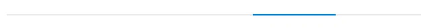
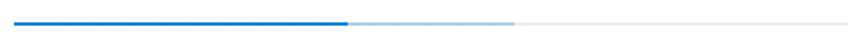
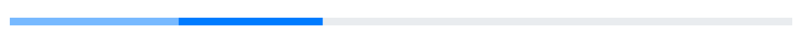

# Blazor ProgressBar States

This section shows how to visualize progress in different states using the Blazor ProgressBar.

## Determinate

This is the default progress state, which can be used when the estimated progress is known.

```cshtml
@using Syncfusion.Blazor.ProgressBar

<SfProgressBar Type="ProgressType.Linear" Value="100" Height="60" Minimum="0" Maximum="100">
</SfProgressBar>
```


## Indeterminate

When the actual progress cannot be estimated or calculated, use the indeterminate state by setting the [IsIndeterminate](https://help.syncfusion.com/cr/blazor/Syncfusion.Blazor.ProgressBar.SfProgressBar.html#Syncfusion_Blazor_ProgressBar_SfProgressBar_IsIndeterminate) property to **true**. In this state, the ProgressBar displays a continuous animation to indicate ongoing activity without revealing a specific progress value.

```cshtml
@using Syncfusion.Blazor.ProgressBar

<SfProgressBar Type="ProgressType.Linear" Value="20" Height="60" IsIndeterminate="true" Minimum="0" Maximum="100">
</SfProgressBar>
```



## Buffer

The [SecondaryProgress](https://help.syncfusion.com/cr/blazor/Syncfusion.Blazor.ProgressBar.SfProgressBar.html#Syncfusion_Blazor_ProgressBar_SfProgressBar_SecondaryProgress) property accepts a numeric value (0–100) that renders a secondary, lighter-colored progress bar behind the primary indicator. It is typically used to represent buffered content—for example, media buffering—where the secondary value shows how much has been buffered ahead of the primary progress.

```cshtml
@using Syncfusion.Blazor.ProgressBar

<SfProgressBar Type="ProgressType.Linear" Value="40" Height="60" SecondaryProgress="60" Minimum="0" Maximum="100">
</SfProgressBar>
```



## Active

An active animated indicator for the estimated progress is enabled by setting the [IsActive](https://help.syncfusion.com/cr/blazor/Syncfusion.Blazor.ProgressBar.SfProgressBar.html#Syncfusion_Blazor_ProgressBar_SfProgressBar_IsActive) property to **true** on the `SfProgressBar` together with the [Enable](https://help.syncfusion.com/cr/blazor/Syncfusion.Blazor.ProgressBar.ProgressBarAnimation.html#Syncfusion_Blazor_ProgressBar_ProgressBarAnimation_Enable) property set to **true** on the [ProgressBarAnimation](https://help.syncfusion.com/cr/blazor/Syncfusion.Blazor.ProgressBar.ProgressBarAnimation.html).

```cshtml
@using Syncfusion.Blazor.ProgressBar

<SfProgressBar Type="ProgressType.Linear" IsActive="true" Value="40" Height="60" Minimum="0" Maximum="100">
    <ProgressBarAnimation Enable="true"></ProgressBarAnimation>
</SfProgressBar>
```



## Striped

The striped visual indicator for the estimated progress can be enabled by setting the [IsStriped](https://help.syncfusion.com/cr/blazor/Syncfusion.Blazor.ProgressBar.SfProgressBar.html#Syncfusion_Blazor_ProgressBar_SfProgressBar_IsStriped) property to **true**.

N> The [IsStriped](https://help.syncfusion.com/cr/blazor/Syncfusion.Blazor.ProgressBar.SfProgressBar.html#Syncfusion_Blazor_ProgressBar_SfProgressBar_IsStriped) property is applicable only when `Type` is [ProgressType.Linear](https://help.syncfusion.com/cr/blazor/Syncfusion.Blazor.ProgressBar.ProgressType.html#Syncfusion_Blazor_ProgressBar_ProgressType_Linear).

```cshtml
@using Syncfusion.Blazor.ProgressBar

<SfProgressBar Type="ProgressType.Linear" IsStriped="true" Value="40" Height="60" Minimum="0" Maximum="100">
</SfProgressBar>
```


