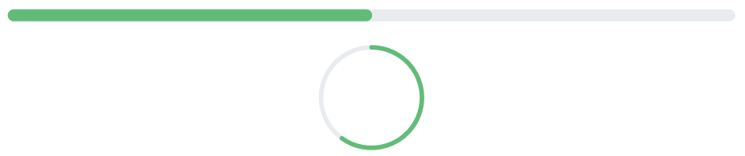
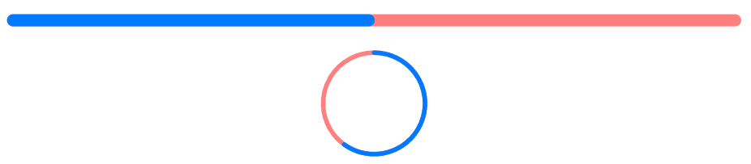

# Style and Appearance in Blazor ProgressBar Component

The Style and Appearance feature allows you to customize the visual design of the **Syncfusion Blazor ProgressBar** control to match your application's branding, theme, and user experience requirements. By leveraging CSS selectors, you can modify colors, typography, spacing, and other visual properties of various ProgressBar elements.

**Basic ProgressBar Setup**

```cshtml
@using Syncfusion.Blazor.ProgressBar

<SfProgressBar Type="ProgressType.Linear" Value="50" Height="60" Minimum="0" Maximum="100">
</SfProgressBar>

<SfProgressBar Type="ProgressType.Circular" Value="60" Height="160" Minimum="0" Maximum="100">
</SfProgressBar>
```

## Customize Progress Bar - Progress Line

Style the linear progress bar to customize colors, height, and visual appearance. The linear progress bar uses CSS selectors to target and modify its presentation properties, allowing you to match your application's design system and branding guidelines.

**Linear**
```css
[id*="_LinearProgress"] path {
    stroke: #28a745 !important;
    opacity: 0.7;
}
```

**Circular**
```css
[id*="_CircularProgress"] path {
    stroke: #28a745 !important;
    opacity: 0.7;
}
```

This CSS customizes the progress bar appearance with stroke color, width, and other properties to create an engaging progress visualization.



## Customize Progress Bar - Track Line

Modify the appearance of the progress bar track (the background area where progress is displayed) to create visual distinction and improve readability.

**Linear**
```css
[id*="_LinearTrack"] path {
    stroke: red !important;
    opacity: 0.7;
}
```

**Circular**
```css
[id*="_CircularTrack"] path {
    stroke: red !important;
    opacity: 0.7;
}
```



## Customize Progress Bar - Range Text

Style the progress value text displayed in the ProgressBar for better visibility and consistency with your design system using the below CSS.

```css
text[id*="_linearLabel"] {
    fill: #4c00fe !important;
    font-size: 14px !important;
    font-weight: 600 !important;
    font-family: "Segoe UI", Arial, sans-serif !important;
}
```

**Example**

```cshtml
@using Syncfusion.Blazor.ProgressBar

<SfProgressBar Type="ProgressType.Linear" Value="50" Height="60" Width="90%" TrackColor="#F8C7D8"
               ShowProgressValue="true" ProgressColor="#E3165B" TrackThickness="24" CornerRadius="CornerType.Round"
               ProgressThickness="24" Minimum="0" Maximum="100">
</SfProgressBar>

<style>
    text[id*="_linearLabel"] {
        fill: #4c00fe !important;
        font-size: 14px !important;
        font-weight: 600 !important;
        font-family: "Segoe UI", Arial, sans-serif !important;
    }
</style>
```


N> SVG presentation attributes such as fill and stroke may require **!important** if overridden by inline SVG attributes.
