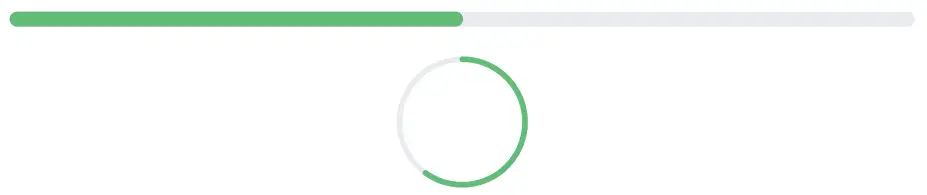
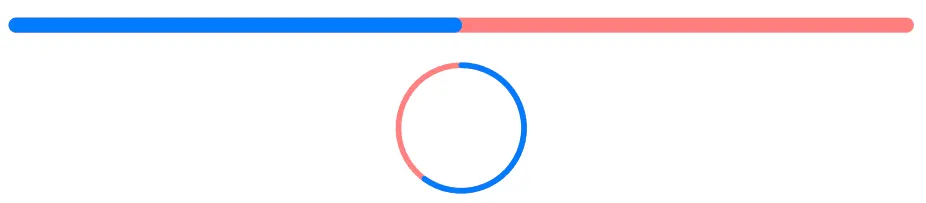
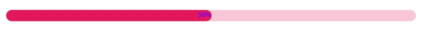

# Blazor ProgressBar Style and Appearance

Customize the visual design of the **Blazor ProgressBar** component to align with your application's branding and theme.

By using CSS selectors and ID-based styling, you can customize colors, typography, spacing, borders, and other visual properties of the ProgressBar progress line, track, labels, and SVG elements.

**Basic ProgressBar Setup**

```cshtml
@using Syncfusion.Blazor.ProgressBar

<SfProgressBar Type="ProgressType.Linear" Value="50" Height="60" Minimum="0" Maximum="100">
</SfProgressBar>

<SfProgressBar Type="ProgressType.Circular" Value="60" Height="160" Minimum="0" Maximum="100">
</SfProgressBar>
```

## Customizing the Progress Line

Change the fill color and opacity of the progress indicator (the portion that represents the completed value) for the linear and circular ProgressBar using CSS selectors.

**Linear**
```css
[id*="_LinearProgress"] path {
    stroke: #28a745 !important;
    opacity: 0.7;
}
```

**Circular**
```css
[id*="_CircularProgress"] path {
    stroke: #28a745 !important;
    opacity: 0.7;
}
```




## Customizing the Track Line

Modify the appearance of the background track (the area behind the progress indicator) for the linear and circular ProgressBar using CSS selectors.

**Linear**
```css
[id*="_LinearTrack"] path {
    stroke: red !important;
    opacity: 0.7;
}
```

**Circular**
```css
[id*="_CircularTrack"] path {
    stroke: red !important;
    opacity: 0.7;
}
```



## Customizing the Range Text

Restyle the progress value text displayed inside the ProgressBar for better readability and consistency with your design system using the CSS below.

```css
text[id*="_linearLabel"] {
    fill: #4c00fe !important;
    font-size: 14px !important;
    font-weight: 600 !important;
    font-family: "Segoe UI", Arial, sans-serif !important;
}
```

**Example**

```cshtml
@using Syncfusion.Blazor.ProgressBar

<SfProgressBar Type="ProgressType.Linear" Value="50" Height="60" Width="90%" TrackColor="#F8C7D8"
               ShowProgressValue="true" ProgressColor="#E3165B" TrackThickness="24" CornerRadius="CornerType.Round"
               ProgressThickness="24" Minimum="0" Maximum="100">
</SfProgressBar>

<style>
    text[id*="_linearLabel"] {
        fill: #4c00fe !important;
        font-size: 14px !important;
        font-weight: 600 !important;
        font-family: "Segoe UI", Arial, sans-serif !important;
    }
</style>
```



N> SVG presentation attributes such as `fill`, `stroke`, and `font-size` may require the `!important` declaration when they are overridden by inline styles on the SVG element.

## See also

* [Getting Started with Blazor ProgressBar](getting-started.md)
* [Blazor ProgressBar Customization](customization.md)
* [Blazor ProgressBar Events](events.md)
* [Blazor ProgressBar Accessibility](accessibility.md)
