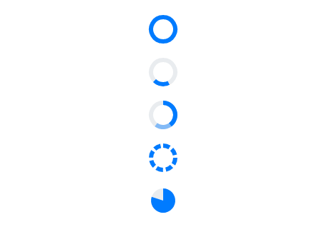

# Types in Blazor ProgressBar Component

The ProgressBar component supports multiple shapes for visualizing progress, including rectangle, circle, and semi-circle, to provide a unique appearance.

## Linear

To display a linear progress bar, set the [Type](https://help.syncfusion.com/cr/blazor/Syncfusion.Blazor.ProgressBar.ProgressType.html) property to [Linear](https://help.syncfusion.com/cr/blazor/Syncfusion.Blazor.ProgressBar.ProgressType.html#Syncfusion_Blazor_ProgressBar_ProgressType_Linear). Linear progress bars support secondary progress, indeterminate state, segments, and various progress modes.

```cshtml

@using Syncfusion.Blazor.ProgressBar

<SfProgressBar Type="ProgressType.Linear" Value="100" Height="60" Minimum="0" Maximum="100">
</SfProgressBar>

<SfProgressBar Type="ProgressType.Linear" Value="20" Height="60" IsIndeterminate="true" Minimum="0" Maximum="100">
    <ProgressBarAnimation Enable="true"></ProgressBarAnimation>
</SfProgressBar>

<SfProgressBar Type="ProgressType.Linear" Value="40" Height="60" SecondaryProgress="60" Minimum="0" Maximum="100">
</SfProgressBar>

<SfProgressBar Type="ProgressType.Linear" Value="100" Height="60" SegmentCount="8" Minimum="0" Maximum="100">
</SfProgressBar>

```


## Circular

To display a circular progress bar, set the [Type](https://help.syncfusion.com/cr/blazor/Syncfusion.Blazor.ProgressBar.ProgressType.html) property to [Circular](https://help.syncfusion.com/cr/blazor/Syncfusion.Blazor.ProgressBar.ProgressType.html#Syncfusion_Blazor_ProgressBar_ProgressType_Circular). Circular progress bars support secondary progress, indeterminate state, segments, pie progress, and various progress modes.

```cshtml

@using Syncfusion.Blazor.ProgressBar

<SfProgressBar Type="ProgressType.Circular" Value="100" Height="60" Minimum="0" Maximum="100">
</SfProgressBar>

<SfProgressBar Type="ProgressType.Circular" Value="20" Height="60" IsIndeterminate="true" Minimum="0" Maximum="100">
    <ProgressBarAnimation Enable="true"></ProgressBarAnimation>
</SfProgressBar>

<SfProgressBar Type="ProgressType.Circular" Value="40" Height="60" SecondaryProgress="60" Minimum="0" Maximum="100">
</SfProgressBar>

<SfProgressBar Type="ProgressType.Circular" Value="100" Height="60" SegmentCount="8" Minimum="0" Maximum="100">
</SfProgressBar>

<SfProgressBar Type="ProgressType.Circular" Value="80" Height="60" EnablePieProgress="true" Minimum="0" Maximum="100">
</SfProgressBar>

```


