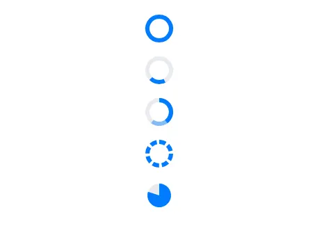

# Blazor Progress Bar Types

This section shows how the ProgressBar renders in two shapes — a rectangle (Linear) and a circle (Circular) — to fit different UI scenarios.

## Linear

To render a linear progress bar, set the [Type](https://help.syncfusion.com/cr/blazor/Syncfusion.Blazor.ProgressBar.ProgressType.html) property to [Linear](https://help.syncfusion.com/cr/blazor/Syncfusion.Blazor.ProgressBar.ProgressType.html#Syncfusion_Blazor_ProgressBar_ProgressType_Linear). It also supports secondary progress, an indeterminate state, segmented fills.

### Determinate

```cshtml
@using Syncfusion.Blazor.ProgressBar

<SfProgressBar Type="ProgressType.Linear" Value="100" Height="60" Minimum="0" Maximum="100">
</SfProgressBar>
```

### Indeterminate

Set the [IsIndeterminate](https://help.syncfusion.com/cr/blazor/Syncfusion.Blazor.ProgressBar.SfProgressBar.html#Syncfusion_Blazor_ProgressBar_SfProgressBar_IsIndeterminate) property to **true** when the actual progress cannot be estimated. The ProgressBar displays a continuous animation in this state. See [States → Indeterminate](states.md#indeterminate) for details.

```cshtml
@using Syncfusion.Blazor.ProgressBar

<SfProgressBar Type="ProgressType.Linear" Value="20" Height="60" IsIndeterminate="true" Minimum="0" Maximum="100">
    <ProgressBarAnimation Enable="true"></ProgressBarAnimation>
</SfProgressBar>
```

### Secondary progress

Use the [SecondaryProgress](https://help.syncfusion.com/cr/blazor/Syncfusion.Blazor.ProgressBar.SfProgressBar.html#Syncfusion_Blazor_ProgressBar_SfProgressBar_SecondaryProgress) property to render a secondary, lighter-colored bar behind the primary progress — commonly used to indicate buffered content. See [States → Buffer](states.md#buffer) for details.

```cshtml
@using Syncfusion.Blazor.ProgressBar

<SfProgressBar Type="ProgressType.Linear" Value="40" Height="60" SecondaryProgress="60" Minimum="0" Maximum="100">
</SfProgressBar>
```

### Segments

Divide the track into multiple segments using the [SegmentCount](https://help.syncfusion.com/cr/blazor/Syncfusion.Blazor.ProgressBar.SfProgressBar.html#Syncfusion_Blazor_ProgressBar_SfProgressBar_SegmentCount) property. Use [SegmentColor](https://help.syncfusion.com/cr/blazor/Syncfusion.Blazor.ProgressBar.SfProgressBar.html#Syncfusion_Blazor_ProgressBar_SfProgressBar_SegmentColor) to assign colors to each segment. See [Customization → Segments](customization.md#segments) for the full API.

```cshtml
@using Syncfusion.Blazor.ProgressBar

<SfProgressBar Type="ProgressType.Linear" Value="100" Height="60" SegmentCount="8" Minimum="0" Maximum="100">
</SfProgressBar>
```


## Circular

To render a circular progress bar, set the [Type](https://help.syncfusion.com/cr/blazor/Syncfusion.Blazor.ProgressBar.ProgressType.html) property to [Circular](https://help.syncfusion.com/cr/blazor/Syncfusion.Blazor.ProgressBar.ProgressType.html#Syncfusion_Blazor_ProgressBar_ProgressType_Circular). It also supports secondary progress, an indeterminate state, segments, pie progress.

### Determinate

```cshtml
@using Syncfusion.Blazor.ProgressBar

<SfProgressBar Type="ProgressType.Circular" Value="100" Height="60" Minimum="0" Maximum="100">
</SfProgressBar>
```

### Indeterminate

Set the [IsIndeterminate](https://help.syncfusion.com/cr/blazor/Syncfusion.Blazor.ProgressBar.SfProgressBar.html#Syncfusion_Blazor_ProgressBar_SfProgressBar_IsIndeterminate) property to **true** to display a continuously animated indicator without revealing progress.

```cshtml
@using Syncfusion.Blazor.ProgressBar

<SfProgressBar Type="ProgressType.Circular" Value="20" Height="60" IsIndeterminate="true" Minimum="0" Maximum="100">
    <ProgressBarAnimation Enable="true"></ProgressBarAnimation>
</SfProgressBar>
```

### Secondary progress

Use the [SecondaryProgress](https://help.syncfusion.com/cr/blazor/Syncfusion.Blazor.ProgressBar.SfProgressBar.html#Syncfusion_Blazor_ProgressBar_SfProgressBar_SecondaryProgress) property to render a secondary, lighter-colored arc behind the primary progress.

```cshtml
@using Syncfusion.Blazor.ProgressBar

<SfProgressBar Type="ProgressType.Circular" Value="40" Height="60" SecondaryProgress="60" Minimum="0" Maximum="100">
</SfProgressBar>
```

### Segments

Divide the ring into multiple segments using the [SegmentCount](https://help.syncfusion.com/cr/blazor/Syncfusion.Blazor.ProgressBar.SfProgressBar.html#Syncfusion_Blazor_ProgressBar_SfProgressBar_SegmentCount) property. Provide a [SegmentColor](https://help.syncfusion.com/cr/blazor/Syncfusion.Blazor.ProgressBar.SfProgressBar.html#Syncfusion_Blazor_ProgressBar_SfProgressBar_SegmentColor) property to apply different colors to each segment. See [Customization → Segments](customization.md#segments) for the full API.

```cshtml
@using Syncfusion.Blazor.ProgressBar

<SfProgressBar Type="ProgressType.Circular" Value="100" Height="60" SegmentCount="8" Minimum="0" Maximum="100">
</SfProgressBar>
```

### Pie progress

Set [EnablePieProgress](https://help.syncfusion.com/cr/blazor/Syncfusion.Blazor.ProgressBar.SfProgressBar.html#Syncfusion_Blazor_ProgressBar_SfProgressBar_EnablePieProgress) to **true** to render the indicator as a filled pie wedge instead of a partial ring — useful for proportion readouts.

```cshtml
@using Syncfusion.Blazor.ProgressBar

<SfProgressBar Type="ProgressType.Circular" Value="80" Height="60" EnablePieProgress="true" Minimum="0" Maximum="100">
</SfProgressBar>
```



## See also

* [Getting Started with Blazor ProgressBar](getting-started.md)
* [Blazor ProgressBar Animation](animation.md)
* [Blazor ProgressBar States](states.md)
* [Blazor ProgressBar Customization](customization.md)
* [Blazor ProgressBar Events](events.md)
* [Blazor ProgressBar Accessibility](accessibility.md)
