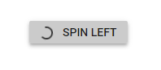

# Accessibility

## ARIA attributes

The web accessibility makes web content and web applications more accessible for people with disabilities. Mostly, it helps in dynamic content change and development of advanced user interface controls with AJAX, HTML, JavaScript, and related technologies. The Progress Button provides a built-in compliance with `WAI-ARIA` specifications. The `WAI-ARIA` support is achieved using the `aria-label`, `aria-valuemin`, `aria-valuemax`, and `aria-valuenow` attributes in the Progress Button. It helps by providing information about the widget for assistive technology in the screen readers.

| Properties | Functionality |
| ------------ | ----------------------- |
| aria-label | Indicates the text content of the Progress Button. |
| aria-valuemin | Indicates the minimum value for the Progress Button. |
| aria-valuemax | Indicates the maximum value for the Progress Button. |
| aria-valuenow | Indicates the current value for the Progress Button. |

## Keyboard interaction

<!-- markdownlint-disable MD033 -->
<table>
<tr>
<td>
<b>Keyboard shortcuts</b></td><td>
<b>Actions</b></td></tr>
<tr>
<td>
<kbd>Enter / Space</kbd></td><td>
Starts the progress</td></tr>
</table>

```csharp
@using Syncfusion.Blazor.SplitButtons

<SfProgressButton Content="Spin Left"></SfProgressButton>
```

Output be like

