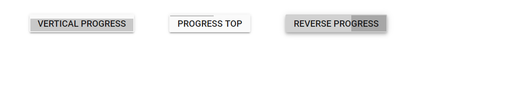

# Customize progress using cssClass in Blazor ProgressButton Component

You can customize the background filler UI using the [CssClass](https://help.syncfusion.com/cr/blazor/Syncfusion.Blazor.SplitButtons.SfProgressButton.html#Syncfusion_Blazor_SplitButtons_SfProgressButton_CssClass) property.

* Adding `e-vertical` to `CssClass` shows vertical progress.
* Adding `e-progress-top` to `CssClass` shows progress at the top.

You can also show reverse progress by adding custom class to the [CssClass](https://help.syncfusion.com/cr/blazor/Syncfusion.Blazor.SplitButtons.SfProgressButton.html#Syncfusion_Blazor_SplitButtons_SfProgressButton_CssClass) property.

```cshtml
@using Syncfusion.Blazor.SplitButtons

<SfProgressButton EnableProgress="true" CssClass="e-hide-spinner e-vertical" Duration="4000" Content="Vertical Progress"></SfProgressButton>
<SfProgressButton EnableProgress="true" CssClass="e-hide-spinner e-progress-top" Duration="4000" Content="Progress Top"></SfProgressButton>
<SfProgressButton EnableProgress="true" CssClass="e-hide-spinner e-reverse-progress" Duration="4000" Content="Reverse Progress"></SfProgressButton>

<style>
    .e-reverse-progress .e-progress {
        right: 0;
        left: auto;
    }
</style>

```

