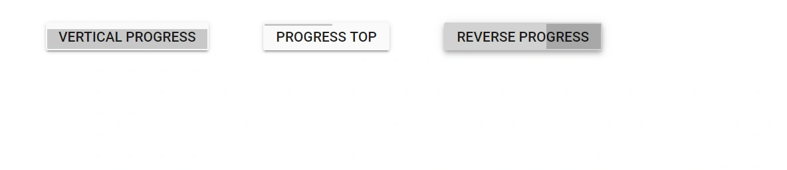

# Styles and Appearances in Blazor ProgressButton Component

Customize the appearance of the ProgressButton by overriding the built-in CSS selectors of the component. Use scoped styles (for example, by adding a custom class via the CssClass parameter) to limit changes to specific instances. To create a consistent look-and-feel across the application, consider using built-in themes or generating a custom theme with the [Theme Studio](https://blazor.syncfusion.com/themestudio/?theme=material).

| CSS Class | Purpose of Class |
| ----- | ----- |
| `.e-progress-btn` | Targets the ProgressButton root element for background, color, border, font, and size customization. |
| `.e-progress-btn:hover` | Targets the ProgressButton in its hovered state. |
| `.e-progress-btn:focus` | Targets the ProgressButton when it receives keyboard or programmatic focus. |
| `.e-progress-btn:active` | Targets the ProgressButton when it is actively pressed. |
| `.e-progress-btn.e-active` | Targets the ProgressButton during the active progress state. |
| `.e-progress-btn .e-btn-content` | Targets the text label content inside the ProgressButton. |
| `.e-progress-btn .e-progress` | Targets the progress fill indicator that animates across the button. |
| `.e-progress-btn.e-vertical .e-progress` | Targets the progress fill when the vertical progress style is applied. |
| `.e-progress-btn .e-spinner-pane` | Targets the container of the spinner element inside the ProgressButton. |
| `.e-progress-btn .e-spinner-pane .e-spinner-inner svg .e-path-circle` | Targets the circular spinner SVG path for color and stroke customization. |


## Change text content and styles of the Blazor ProgressButton

Change the button text and styles during the progress state by updating the Content and the [CssClass](https://help.syncfusion.com/cr/blazor/Syncfusion.Blazor.SplitButtons.SfProgressButton.html#Syncfusion_Blazor_SplitButtons_SfProgressButton_CssClass) parameters in the [OnBegin](https://help.syncfusion.com/cr/blazor/Syncfusion.Blazor.SplitButtons.ProgressButtonEvents.html#Syncfusion_Blazor_SplitButtons_ProgressButtonEvents_OnBegin) and [OnEnd](https://help.syncfusion.com/cr/blazor/Syncfusion.Blazor.SplitButtons.ProgressButtonEvents.html#Syncfusion_Blazor_SplitButtons_ProgressButtonEvents_OnEnd) event handlers.

```cshtml

@using Syncfusion.Blazor.SplitButtons

<SfProgressButton Content="@Content" EnableProgress="true" CssClass="@CssClass" Duration="4000">
    <ProgressButtonEvents OnBegin="Begin" OnEnd="End"></ProgressButtonEvents>
</SfProgressButton>

@code {
    public string Content = "Upload";
    public string CssClass = "e-hide-spinner";
    public void Begin(Syncfusion.Blazor.SplitButtons.ProgressEventArgs args)
    {
        Content = "Uploading...";
        CssClass = "e-hide-spinner e-info";
    }
    public async Task End(Syncfusion.Blazor.SplitButtons.ProgressEventArgs args)
    {
        Content = "Success";
        CssClass = "e-hide-spinner e-success";
        await Task.Delay(1000);
        Content = "Upload";
        CssClass = "e-hide-spinner";
    }
}

```


## Customize progress using cssClass in Blazor ProgressButton

Customize the progress indicator (filler) by using the [CssClass](https://help.syncfusion.com/cr/blazor/Syncfusion.Blazor.SplitButtons.SfProgressButton.html#Syncfusion_Blazor_SplitButtons_SfProgressButton_CssClass) property.

* Adding `e-vertical` to `CssClass` displays vertical progress.
* Adding `e-progress-top` to `CssClass` places the progress at the top of the button.

Reverse progress can also be shown by adding a custom class through the [CssClass](https://help.syncfusion.com/cr/blazor/Syncfusion.Blazor.SplitButtons.SfProgressButton.html#Syncfusion_Blazor_SplitButtons_SfProgressButton_CssClass) property.

```cshtml

@using Syncfusion.Blazor.SplitButtons

<SfProgressButton EnableProgress="true" CssClass="e-hide-spinner e-vertical" Duration="4000" Content="Vertical Progress"></SfProgressButton>
<SfProgressButton EnableProgress="true" CssClass="e-hide-spinner e-progress-top" Duration="4000" Content="Progress Top"></SfProgressButton>
<SfProgressButton EnableProgress="true" CssClass="e-hide-spinner e-reverse-progress" Duration="4000" Content="Reverse Progress"></SfProgressButton>

<style>
    .e-reverse-progress .e-progress {
        right: 0;
        left: auto;
    }
</style>

```




## Stop Progress Indicator in Blazor ProgressButton

Stop the active progress programmatically by calling the [EndProgressAsync](https://help.syncfusion.com/cr/blazor/Syncfusion.Blazor.SplitButtons.SfProgressButton.html#Syncfusion_Blazor_SplitButtons_SfProgressButton_EndProgressAsync) method on the ProgressButton instance obtained via @ref. In the following example, clicking the Stop button invokes the handler that awaits EndProgressAsync to halt the current progress.

```cshtml
@using Syncfusion.Blazor.SplitButtons
@using Syncfusion.Blazor.Buttons

<SfProgressButton Content="Spin Left" IsPrimary="true" @ref="ProgressBtnObj"></SfProgressButton>
<SfButton Content="Stop" OnClick="clicked"></SfButton>

@code {
    SfProgressButton ProgressBtnObj;
    private async Task clicked()
    {
      await ProgressBtnObj.EndProgressAsync();
    }
}
```


## Hide Spinner in Blazor ProgressButton

Hide the spinner in the ProgressButton by applying the built-in e-hide-spinner CSS class to the [CssClass](https://help.syncfusion.com/cr/blazor/Syncfusion.Blazor.SplitButtons.SfProgressButton.html#Syncfusion_Blazor_SplitButtons_SfProgressButton_CssClass) parameter. This hides only the spinner while keeping the progress fill visible. Multiple CSS classes can be combined in CssClass as needed.

```cshtml
@using Syncfusion.Blazor.SplitButtons

<SfProgressButton EnableProgress="true" CssClass="e-hide-spinner" Content="Progress"></SfProgressButton>

```


## Customizing the font of the Blazor ProgressButton

The font family, font size, font weight, and letter spacing of the ProgressButton label can be customized by targeting the `.e-progress-btn` or `.e-progress-btn .e-btn-content` CSS class. Scoping these rules through a custom class added via the `CssClass` property ensures the changes apply only to the targeted instance.

```cshtml
@using Syncfusion.Blazor.SplitButtons

<SfProgressButton EnableProgress="true" Duration="4000" Content="Upload File" CssClass="e-hide-spinner font-btn"></SfProgressButton>

<style>
    /* Font customization for the ProgressButton label */
    .font-btn.e-progress-btn .e-btn-content {
        font-family: 'Segoe UI', Tahoma, Geneva, Verdana, sans-serif;
        font-size: 15px;
        font-weight: 700;
        letter-spacing: 0.5px;
        text-transform: uppercase;
    }
</style>
```

## Customizing the width of the Blazor ProgressButton

The width of the ProgressButton is controlled by targeting the `.e-progress-btn` CSS class. Setting a fixed `width` or `min-width` ensures the button maintains a consistent size regardless of its label text length. This is especially useful when the button label changes during progress (for example, switching from "Upload" to "Uploading...").

```cshtml
@using Syncfusion.Blazor.SplitButtons

<SfProgressButton EnableProgress="true" Duration="4000" Content="Export" CssClass="e-hide-spinner width-btn"></SfProgressButton>

<style>
    /* Fixed width for the ProgressButton */
    .width-btn.e-progress-btn {
        min-width: 160px;
        text-align: center;
    }
</style>
```

## Customizing the background and text color of the Blazor ProgressButton

The background color and text color of the ProgressButton can be customized by targeting the `.e-progress-btn` class. Separate rules for `:hover` and `.e-active` states provide visual feedback during interaction and while progress is running.

```cshtml
@using Syncfusion.Blazor.SplitButtons

<SfProgressButton EnableProgress="true" Duration="4000" Content="Submit" CssClass="custom-color-btn"></SfProgressButton>

<style>
    /* Default state */
    .custom-color-btn.e-progress-btn {
        background-color: #4a90d9;
        color: #ffffff;
        border-color: #357abd;
    }

    /* Hover state */
    .custom-color-btn.e-progress-btn:hover {
        background-color: #357abd;
        border-color: #2a6099;
        color: #ffffff;
    }

    /* Active/progress running state */
    .custom-color-btn.e-progress-btn.e-active {
        background-color: #2a6099;
        color: #ffffff;
    }

    /* Progress fill color */
    .custom-color-btn.e-progress-btn .e-progress {
        background-color: rgba(255, 255, 255, 0.25);
    }
</style>
```

## Customizing the border and border-radius of the Blazor ProgressButton

The border style, border width, and border radius of the ProgressButton are set through the `.e-progress-btn` CSS class. Increasing the `border-radius` produces a pill-shaped button, while a value of `0` results in a fully square button.

```cshtml
@using Syncfusion.Blazor.SplitButtons

<SfProgressButton EnableProgress="true" Duration="4000" Content="Process" CssClass="e-hide-spinner border-btn"></SfProgressButton>

<style>
    /* Pill-shaped button with custom border */
    .border-btn.e-progress-btn {
        border: 2px solid #4a90d9;
        border-radius: 24px;
        padding: 6px 24px;
    }

    .border-btn.e-progress-btn:hover {
        border-color: #2a6099;
    }

    /* Round the progress fill corners to match the button shape */
    .border-btn.e-progress-btn .e-progress {
        border-radius: 24px;
    }
</style>
```