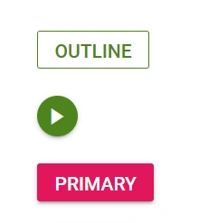

# Types and Icons in Blazor Progress Button

This section describes the available ProgressButton types and how to configure icons for the component.

## Types

The types of Blazor Progress Button are as follows:

* Outline Progress Button
* Round Progress Button
* Primary Progress Button

### Outline Blazor  Progress Button

An outline Progress Button has a border with a transparent background. To create an outline Progress Button, set the [CssClass](https://help.syncfusion.com/cr/blazor/Syncfusion.Blazor.SplitButtons.SfProgressButton.html#Syncfusion_Blazor_SplitButtons_SfProgressButton_CssClass) property to `e-outline`.

```cshtml
@using Syncfusion.Blazor.SplitButtons

<SfProgressButton Content="Outline" EnableProgress="true" CssClass="e-outline e-success">
    <ProgressButtonSpinSettings Position="SpinPosition.Center"></ProgressButtonSpinSettings>
</SfProgressButton>
```

### Round Blazor  Progress Button

A round Progress Button is circular and typically displays an icon representing its action. To create a round Progress Button, set the [CssClass](https://help.syncfusion.com/cr/blazor/Syncfusion.Blazor.SplitButtons.SfProgressButton.html#Syncfusion_Blazor_SplitButtons_SfProgressButton_CssClass) property to `e-round`.

```cshtml
@using Syncfusion.Blazor.SplitButtons

<SfProgressButton CssClass="e-round e-small e-success" IconCss="e-icons e-play-icon">
<ProgressButtonSpinSettings Position="SpinPosition.Center"></ProgressButtonSpinSettings>
</SfProgressButton>

<style>
    .e-play-icon::before {
        content: '\e324';
    }
</style>
```

### Primary Blazor  Progress Button

A primary Progress Button uses a solid background to emphasize a primary action. To create a primary Progress Button, set the [IsPrimary](https://help.syncfusion.com/cr/blazor/Syncfusion.Blazor.SplitButtons.SfProgressButton.html#Syncfusion_Blazor_SplitButtons_SfProgressButton_IsPrimary) property to `true`.

```cshtml
@using Syncfusion.Blazor.SplitButtons

<SfProgressButton Content="Primary" IsPrimary="true"></SfProgressButton>
```



## Icons

The `IconCss` property accepts any of the supported Syncfusion icon classes. See the [Syncfusion Blazor Icons reference](https://blazor.syncfusion.com/documentation/appearance/icons) for the full list of available built-in icons.

### IconPosition values

The [IconPosition](https://help.syncfusion.com/cr/blazor/Syncfusion.Blazor.SplitButtons.SfProgressButton.html#Syncfusion_Blazor_SplitButtons_SfProgressButton_IconPosition) property accepts the following values:

| Value | Description |
| --- | --- |
| `Left` | Places the icon to the left of the content (default). |
| `Right` | Places the icon to the right of the content. |
| `Top` | Places the icon above the content. |
| `Bottom` | Places the icon below the content. |

### Blazor  Progress Button with font icons

The Blazor  Progress Button can display an icon to visually represent the action. Assign the [IconCss](https://help.syncfusion.com/cr/blazor/Syncfusion.Blazor.SplitButtons.SfProgressButton.html#Syncfusion_Blazor_SplitButtons_SfProgressButton_IconCss) property to `e-icons` plus the desired icon class. By default, the icon is positioned to the Left. Use [IconPosition](https://help.syncfusion.com/cr/blazor/Syncfusion.Blazor.SplitButtons.SfProgressButton.html#Syncfusion_Blazor_SplitButtons_SfProgressButton_IconPosition) to change the icon placement.

```cshtml
@using Syncfusion.Blazor.SplitButtons
@using Syncfusion.Blazor.Buttons

<SfProgressButton IconCss="e-icons e-play-icon" IconPosition="IconPosition.Left">PLAY
</SfProgressButton>

<style>
    .e-play-icon::before {
        content: '\e324';
    }
</style>

```

