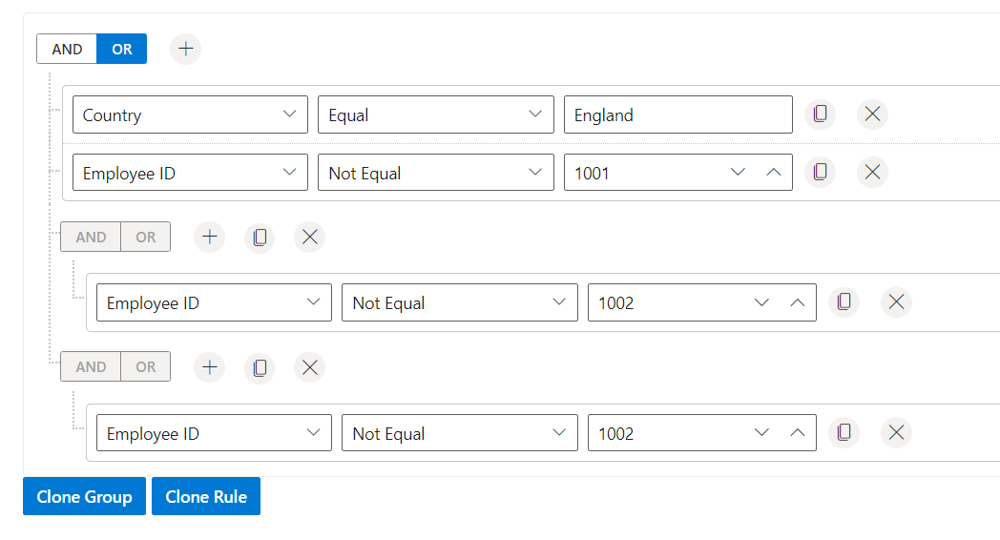

# Clone Group/ Rule in Blazor QueryBuilder Component

The [Blazor Query Builder](https://www.syncfusion.com/blazor-components/blazor-query-builder) allows you to clone rules as well as groups. The Clone options will create an exact replica of a rule or group next to the original. You can use [ShowButtons](https://help.syncfusion.com/cr/blazor/Syncfusion.Blazor.QueryBuilder.QueryBuilderShowButtons.html) to enable/disable these buttons.

You can `clone` groups and rules by interacting through the user interface and methods.

* Use the [CloneGroup](https://help.syncfusion.com/cr/blazor/Syncfusion.Blazor.QueryBuilder.SfQueryBuilder-1.html#Syncfusion_Blazor_QueryBuilder_SfQueryBuilder_1_CloneGroup_Syncfusion_Blazor_QueryBuilder_RuleModel_System_String_System_Boolean_) method to clone group.
* Use [CloneRule](https://help.syncfusion.com/cr/blazor/Syncfusion.Blazor.QueryBuilder.SfQueryBuilder-1.html#Syncfusion_Blazor_QueryBuilder_SfQueryBuilder_1_CloneRule_Syncfusion_Blazor_QueryBuilder_RuleModel_System_String_) method to clone rule.

```cshtml
@using Syncfusion.Blazor.QueryBuilder
@using Syncfusion.Blazor.Buttons

<SfQueryBuilder TValue="EmployeeDetails" @ref="QuerybuilderObj">
    <QueryBuilderShowButtons RuleDelete="true" GroupDelete="true" GroupInsert="true" CloneGroup="true" CloneRule="true"></QueryBuilderShowButtons>
    <QueryBuilderRule Condition="or" Rules="@Rules"></QueryBuilderRule>
    <QueryBuilderColumns>
        <QueryBuilderColumn Field="EmployeeID" Label="Employee ID" Type="ColumnType.Number"></QueryBuilderColumn>
        <QueryBuilderColumn Field="FirstName" Label="First Name" Type="ColumnType.String"></QueryBuilderColumn>
        <QueryBuilderColumn Field="TitleOfCourtesy" Label="Title Of Courtesy" Type="ColumnType.Boolean"></QueryBuilderColumn>
        <QueryBuilderColumn Field="HireDate" Label="Hire Date" Type="ColumnType.Date" Format="MM/dd/yyyy"></QueryBuilderColumn>
        <QueryBuilderColumn Field="Country" Label="Country" Type="ColumnType.String"></QueryBuilderColumn>
    </QueryBuilderColumns>
</SfQueryBuilder>

<SfButton @onclick="cloneGroup" IsPrimary="true" Content="Clone Group"></SfButton>
<SfButton @onclick="cloneRule" IsPrimary="true" Content="Clone Rule"></SfButton>

@code {
    SfQueryBuilder<EmployeeDetails> QuerybuilderObj;
    List<RuleModel> Rules = new List<RuleModel>()
    {
            new RuleModel { Field="Country", Label="Country", Type="String", Operator="equal", Value = "England" },
            new RuleModel { Field="EmployeeID", Label="EmployeeID", Type="Number", Operator="notequal", Value = 1001 },
            new RuleModel { Condition = "or", Rules = new List<RuleModel>()
            {
                new RuleModel { Field="EmployeeID", Label="EmployeeID", Type="Number", Operator="notequal", Value = 1002 },
            } }
    };

    RuleModel SampRule = new RuleModel()
        {
            Label = "Employee ID",
            Field = "EmployeeID",
            Type = "Number",
            Operator = "equal",
            Value = 1091
        };

    RuleModel SampGroup = new RuleModel()
        {
            Condition = "or",
            Rules = new List<RuleModel>()
        {
            new RuleModel()
            {
                Label = "Employee ID",
                Field = "EmployeeID",
                Type = "Number",
                Operator = "equal",
                Value = 1091
            }
        }
        };

    public string[] GroupID = new string[] { "group1" };

    private void cloneGroup()
    {
        QuerybuilderObj.CloneGroup("group1", 2);
    }

    private void cloneRule()
    {
        QuerybuilderObj.CloneRule("group0_rule0", 1);
    }

    public class EmployeeDetails
    {
        public int EmployeeID { get; set; }
        public string FirstName { get; set; }
        public bool TitleOfCourtesy { get; set; }
        public string Title { get; set; }
        public DateTime HireDate { get; set; }
        public string Country { get; set; }
        public string City { get; set; }
    }
}

```



N> You can also explore our [Blazor Query Builder example](https://blazor.syncfusion.com/demos/query-builder/default-functionalities?theme=bootstrap4) to know how to render and configure the query builder.