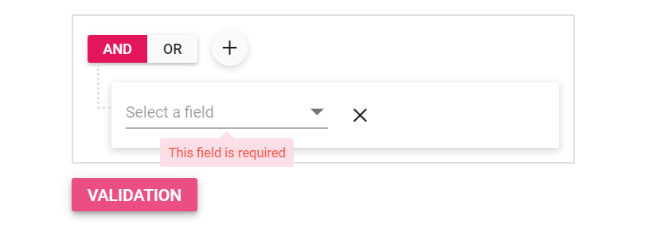

# Columns in Blazor QueryBuilder Component

The column definitions are used as the [DataSource](https://help.syncfusion.com/cr/blazor/Syncfusion.Blazor.QueryBuilder.SfQueryBuilder.html#Syncfusion_Blazor_QueryBuilder_SfQueryBuilder_DataSource) schema in the Query Builder. This plays a vital role in rendering column values. The Query Builder operations such as create or delete conditions and create or delete groups are performed based on the column definitions. The [Field](https://help.syncfusion.com/cr/blazor/Syncfusion.Blazor.QueryBuilder.QueryBuilderColumn.html#Syncfusion_Blazor_QueryBuilder_QueryBuilderColumn_Field) property of the [Columns](https://help.syncfusion.com/cr/blazor/Syncfusion.Blazor.QueryBuilder.SfQueryBuilder.html#Syncfusion_Blazor_QueryBuilder_SfQueryBuilder_Columns) is necessary to map the data source values in the query builder columns.

N> If the column field is not specified in the data source, the column values will be empty.

## Auto generation

The [Columns](https://help.syncfusion.com/cr/blazor/Syncfusion.Blazor.QueryBuilder.SfQueryBuilder.html#Syncfusion_Blazor_QueryBuilder_SfQueryBuilder_Columns) are automatically generated from the datasource when the [Columns](https://help.syncfusion.com/cr/blazor/Syncfusion.Blazor.QueryBuilder.SfQueryBuilder.html#Syncfusion_Blazor_QueryBuilder_SfQueryBuilder_Columns) declaration is empty or undefined while initializing the query builder. All the columns in the `DataSource` are bound as the query builder columns.

N> When columns are auto-generated, the column type will be determined from the first record of the data source.

```cshtml
@using Syncfusion.Blazor.QueryBuilder

<SfQueryBuilder DataSource="@EmployeeData"></SfQueryBuilder>

@code {
    //Local datasource
    public List<EmployeeDetails> EmployeeData = new List<EmployeeDetails>
    {
        new EmployeeDetails{ FirstName = "Martin", EmployeeID = 1001, Country = "England", City = "Manchester", HireDate = new DateTime(2014, 4, 23) },
        new EmployeeDetails{ FirstName = "Benjamin", EmployeeID = 1002, Country = "England", City = "Birmingham", HireDate = new DateTime(2014, 6, 19) },
        new EmployeeDetails{ FirstName = "Stuart", EmployeeID = 1003, Country = "England", City = "London", HireDate = new DateTime(2014, 7, 4) },
        new EmployeeDetails{ FirstName = "Ben", EmployeeID = 1004, Country = "USA", City = "California", HireDate = new DateTime(2014, 8, 15) },
        new EmployeeDetails{ FirstName = "Joseph", EmployeeID = 1005, Country = "Spain", City = "Madrid", HireDate = new DateTime(2014, 8, 29) }
    };

    public class EmployeeDetails
    {
        public string FirstName { get; set; }
        public int EmployeeID { get; set; }
        public string Country { get; set; }
        public string City { get; set; }
        public DateTime HireDate { get; set; }
    }
}

```

## Labels

By default, the column label is displayed from the column [Field](https://help.syncfusion.com/cr/blazor/Syncfusion.Blazor.QueryBuilder.QueryBuilderColumn.html#Syncfusion_Blazor_QueryBuilder_QueryBuilderColumn_Field) value. To override the default label, you have to define the [Label](https://help.syncfusion.com/cr/blazor/Syncfusion.Blazor.QueryBuilder.QueryBuilderColumn.html#Syncfusion_Blazor_QueryBuilder_QueryBuilderColumn_Label) value.

N> If both the field and label are not defined in the column, the column renders with `empty` text.

## Operators

The operator for a column can be defined in the [Columns](https://help.syncfusion.com/cr/blazor/Syncfusion.Blazor.QueryBuilder.SfQueryBuilder.html#Syncfusion_Blazor_QueryBuilder_SfQueryBuilder_Columns) property. You can directly set the custom operators using [OperatorsModel](https://help.syncfusion.com/cr/blazor/Syncfusion.Blazor.QueryBuilder.OperatorsModel.html) in columns `Operator` property. The available operators and its supported data types are:

| Operators | Description | Supported Types |
| ------------ | ----------------------- | ------------------ |
| startswith  | Checks whether the value begins with the specified value. | String |
| notstartswith  | Checks whether the value does not begin with the specified prefix. | String |
| endswith  | Checks whether the value ends with the specified value. | String |
| notendswith  | Checks whether the value does not end with the specified value. | String |
| contains | Checks whether the value contains the specified value. | String |
| notcontains | Checks whether the value does not include the specified value. | String |
| equal | Checks whether the value is equal to the specified value. | String, Number ,Date, Boolean |
| notequal | Checks for values not equal to the specified value. | String, Number, Date, Boolean |
| greaterthan | Checks whether the value is greater than the specified value. | Date, Number |
| greaterthanorequal | Checks whether a value is greater than or equal to the specified value. | Date, Number |
| lessthan | Checks whether the value is lesser than the specified value.| Date, Number |
| lessthanorequal | Checks whether the value is lesser than or equal to the specified value. | Date, Number |
| between | Checks whether the value is between the two-specific value. | Date, Number |
| notbetween | Checks whether the value is not between the two-specific value. | Date, Number |
| in | Checks whether the value is one of the specific values. | String, Number |
| notin | Checks whether the value is not in the specific values. | String, Number |
| isempty | Checks whether the value is empty. | String |
| isnotempty | Checks whether the value is not empty. | String |
| isnull | Checks whether the value is null. | String, Number |
| isnotnull | Checks whether the value is not null. | String, Number |

## Step

The [Blazor Query Builder](https://www.syncfusion.com/blazor-components/blazor-query-builder) allows to set the step values to the number fields. It allows to increase or decrease the numeric value with the predefined Step value using the [Step](https://help.syncfusion.com/cr/blazor/Syncfusion.Blazor.QueryBuilder.QueryBuilderColumn.html#Syncfusion_Blazor_QueryBuilder_QueryBuilderColumn_Step) property.

N> By default the Step value is 1.

```cshtml
@using Syncfusion.Blazor.QueryBuilder

<SfQueryBuilder TValue="EmployeeDetails">
    <QueryBuilderColumns>
        <QueryBuilderColumn Field="EmployeeID" Label="Employee ID" Type="ColumnType.Number" Step="5"></QueryBuilderColumn>
        <QueryBuilderColumn Field="FirstName" Label="First Name" Type="ColumnType.String"></QueryBuilderColumn>
        <QueryBuilderColumn Field="Title" Label="Title" Type="ColumnType.String"></QueryBuilderColumn>
    </QueryBuilderColumns>
</SfQueryBuilder>

@code {
    public class EmployeeDetails
    {
        public int EmployeeID { get; set; }
        public string FirstName { get; set; }
        public bool TitleOfCourtesy { get; set; }
        public string Title { get; set; }
        public DateTime HireDate { get; set; }
        public string Country { get; set; }
        public string City { get; set; }
    }
}

```

N> You can also explore our [Blazor Query Builder example](https://blazor.syncfusion.com/demos/query-builder/default-functionalities?theme=bootstrap5) to know how to render and configure the query builder.

## Format

The [Blazor Query Builder](https://www.syncfusion.com/blazor-components/blazor-query-builder) formats date and number values. Use the [Format](https://help.syncfusion.com/cr/blazor/Syncfusion.Blazor.QueryBuilder.QueryBuilderColumn.html#Syncfusion_Blazor_QueryBuilder_QueryBuilderColumn_Format) property, to format date and number values.

N> From the standard numeric format, you can use the numeric related format specifiers such as n,p, and c in the format property. By using these format specifiers, you can achieve the percentage and currency textbox behavior.

In the following sample, the date field is formatted as MM/yyyy/dd and the number field is formatted as currency type.

```cshtml
@using Syncfusion.Blazor.QueryBuilder

<SfQueryBuilder TValue="EmployeeDetails">
    <QueryBuilderRule Condition="and" Rules="Rules"></QueryBuilderRule>
    <QueryBuilderColumns>
        <QueryBuilderColumn Field="HireDate" Label="Hire Date" Type="ColumnType.Date" Format="MM-yyyy-dd"></QueryBuilderColumn>
        <QueryBuilderColumn Field="FirstName" Label="First Name" Type="ColumnType.String"></QueryBuilderColumn>
        <QueryBuilderColumn Field="Salary" Label="Salary" Type="ColumnType.Number" Format="c2"></QueryBuilderColumn>
    </QueryBuilderColumns>
</SfQueryBuilder>

@code {
    List<RuleModel> Rules = new List<RuleModel>()
    {
        new RuleModel { Field="HireDate", Label="HireDate", Type="Date", Operator="equal", Value = new DateTime(DateTime.Now.Year,DateTime.Now.Month,4) },
        new RuleModel { Field="Salary", Label="Salary",  Type="Number", Operator="greaterthan", Value = 23 }
    };
    public class EmployeeDetails
    {
        public int EmployeeID { get; set; }
        public string FirstName { get; set; }
        public bool TitleOfCourtesy { get; set; }
        public string Title { get; set; }
        public DateTime HireDate { get; set; }
        public string Country { get; set; }
        public string City { get; set; }
        public int Salary { get; set; }
    }
}

```


N> You can also explore our [Blazor Query Builder example](https://blazor.syncfusion.com/demos/query-builder/default-functionalities?theme=bootstrap5) to know how to render and configure the query builder.

## Validations

Validation allows to validate the conditions and it display errors for invalid fields. To enable validation in the Query Builder, set [AllowValidation](https://help.syncfusion.com/cr/blazor/Syncfusion.Blazor.QueryBuilder.SfQueryBuilder.html#Syncfusion_Blazor_QueryBuilder_SfQueryBuilder_AllowValidation) to true. Column fields are validated after setting the [AllowValidation](https://help.syncfusion.com/cr/blazor/Syncfusion.Blazor.QueryBuilder.SfQueryBuilder.html#Syncfusion_Blazor_QueryBuilder_SfQueryBuilder_AllowValidation) property to true.

N> You can set `Min` and `Max` values for number values.

```cshtml
@using Syncfusion.Blazor.QueryBuilder

<SfQueryBuilder TValue="EmployeeDetails" AllowValidation="true">
    <QueryBuilderColumnValidation Max="100" Min="0"></QueryBuilderColumnValidation>
    <QueryBuilderColumns>
        <QueryBuilderColumn Field="EmployeeID" Label="Employee ID" Type="ColumnType.Number"></QueryBuilderColumn>
        <QueryBuilderColumn Field="FirstName" Label="First Name" Type="ColumnType.String"></QueryBuilderColumn>
        <QueryBuilderColumn Field="TitleOfCourtesy" Label="Title of Courtesy" Type="ColumnType.Boolean" Values="Values"></QueryBuilderColumn>
        <QueryBuilderColumn Field="Title" Label="Title" Type="ColumnType.String"></QueryBuilderColumn>
        <QueryBuilderColumn Field="HireDate" Label="Hire Date" Type="ColumnType.Date"></QueryBuilderColumn>
        <QueryBuilderColumn Field="Country" Label="Country" Type="ColumnType.String"></QueryBuilderColumn>
        <QueryBuilderColumn Field="City" Label="City" Type="ColumnType.String"></QueryBuilderColumn>
    </QueryBuilderColumns>
</SfQueryBuilder>

@code {
    private string[] Values = new string[] { "Mr.", "Mrs." };
    public class EmployeeDetails
    {
        public int EmployeeID { get; set; }
        public string FirstName { get; set; }
        public bool TitleOfCourtesy { get; set; }
        public string Title { get; set; }
        public DateTime HireDate { get; set; }
        public string Country { get; set; }
        public string City { get; set; }
    }
}

```


