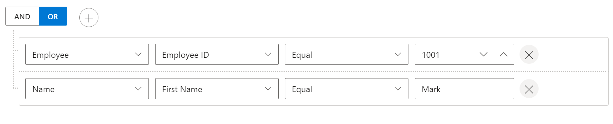

# Data Binding in Blazor QueryBuilder Component

The [Blazor Query Builder](https://www.syncfusion.com/blazor-components/blazor-query-builder) uses `SfDataManager` to bind the dataSource which supports both RESTful JSON data services binding and IEnumerable binding. The [DataSource](https://help.syncfusion.com/cr/blazor/Syncfusion.Blazor.QueryBuilder.SfQueryBuilder-1.html#Syncfusion_Blazor_QueryBuilder_SfQueryBuilder_1_DataSource) property can be assigned either with the instance of `SfDataManager` or list of objects. It supports the following kinds of data binding method:

* List Binding
* Remote data

N> When using DataSource as `IEnumerable<T>` component type, (TValue) will be inferred from its value. While using SfDataManager for data binding then the TValue must be provided explicitly in the query builder component.

## List Binding

To bind list data to the [Blazor Query Builder](https://www.syncfusion.com/blazor-components/blazor-query-builder), you can assign the [DataSource](https://help.syncfusion.com/cr/blazor/Syncfusion.Blazor.QueryBuilder.SfQueryBuilder-1.html#Syncfusion_Blazor_QueryBuilder_SfQueryBuilder_1_DataSource) property with a list of data.

```cshtml
@using Syncfusion.Blazor.QueryBuilder

<SfQueryBuilder DataSource="@EmployeeData">
    <QueryBuilderRule Condition="or" Rules="@Rules"></QueryBuilderRule>
    <QueryBuilderColumns>
        <QueryBuilderColumn Field="EmployeeID" Label="Employee ID" Type="ColumnType.Number"></QueryBuilderColumn>
        <QueryBuilderColumn Field="FirstName" Label="First Name" Type="ColumnType.String"></QueryBuilderColumn>
        <QueryBuilderColumn Field="HireDate" Label="Hire Date" Type="ColumnType.Date"></QueryBuilderColumn>
        <QueryBuilderColumn Field="Country" Label="Country" Type="ColumnType.String"></QueryBuilderColumn>
    </QueryBuilderColumns>
</SfQueryBuilder>

@code {
    //Rules binding
    List<RuleModel> Rules = new List<RuleModel>()
    {
            new RuleModel { Field="Country", Label="Country", Type="String", Operator="equal", Value = "England" },
            new RuleModel { Field="EmployeeID", Label="EmployeeID",  Type="Number", Operator="notequal", Value = 1001 }
    };

    //List Datas
    public List<EmployeeDetails> EmployeeData = new List<EmployeeDetails>
    {
        new EmployeeDetails{ FirstName = "Martin", EmployeeID = 1001, Country = "England", City = "Manchester", HireDate = new DateTime(2014, 4, 23) },
        new EmployeeDetails{ FirstName = "Benjamin", EmployeeID = 1002, Country = "England", City = "Birmingham", HireDate = new DateTime(2014, 6, 19) },
        new EmployeeDetails{ FirstName = "Stuart", EmployeeID = 1003, Country = "England", City = "London", HireDate = new DateTime(2014, 7, 4) },
        new EmployeeDetails{ FirstName = "Ben", EmployeeID = 1004, Country = "USA", City = "California", HireDate = new DateTime(2014, 8, 15) },
        new EmployeeDetails{ FirstName = "Joseph", EmployeeID = 1005, Country = "Spain", City = "Madrid", HireDate = new DateTime(2014, 8, 29) }
    };

    public class EmployeeDetails
    {
        public string FirstName { get; set; }
        public int EmployeeID { get; set; }
        public string Country { get; set; }
        public string City { get; set; }
        public DateTime HireDate { get; set; }
    }
}

```

## Remote Data

To bind remote data to the [Blazor Query Builder](https://www.syncfusion.com/blazor-components/blazor-query-builder) component, assign service data as an instance of `SfDataManager` to the [DataSource](https://help.syncfusion.com/cr/blazor/Syncfusion.Blazor.QueryBuilder.SfQueryBuilder-1.html#Syncfusion_Blazor_QueryBuilder_SfQueryBuilder_1_DataSource) property or by using [SfDataManager](https://help.syncfusion.com/cr/blazor/Syncfusion.Blazor.Data.SfDataManager.html) component. To interact with remote data source, provide the endpoint `Url`.

Refer to the following code example for remote Data binding using `OData` service.

### Binding with OData services

[OData](https://www.odata.org/documentation/odata-version-3-0/) is a standardized protocol for creating and consuming data. You can retrieve data from OData service using the SfDataManager. Refer to the following code example for remote Data binding using OData service.

```cshtml

@using Syncfusion.Blazor.QueryBuilder
@using Syncfusion.Blazor.Data

<SfQueryBuilder TValue="OrderDetails" Width="70%">
    <SfDataManager Url="https://js.syncfusion.com/ejServices/Wcf/Northwind.svc/Orders" Adaptor="Syncfusion.Blazor.Adaptors.ODataAdaptor"></SfDataManager>
</SfQueryBuilder>

@code {
    public class OrderDetails
    {
        public int? OrderID { get; set; }
        public string CustomerID { get; set; }
        public int? EmployeeID { get; set; }
        public double? Freight { get; set; }
        public string ShipCity { get; set; }
        public bool Verified { get; set; }
        public DateTime? OrderDate { get; set; }
        public string ShipName { get; set; }
        public string ShipCountry { get; set; }
        public DateTime? ShippedDate { get; set; }
        public string ShipAddress { get; set; }
    }
}

```

### Binding with OData v4 services

The ODataV4 is an improved version of OData protocols, and the `SfDataManager` can also retrieve and consume OData v4 services. For more details on OData v4 services, refer to the [OData documentation](https://docs.oasis-open.org/odata/odata/v4.0/errata03/os/complete/part1-protocol/odata-v4.0-errata03-os-part1-protocol-complete.html#_Toc453752197). To bind OData v4 service, use the `ODataV4Adaptor`.

```cshtml

@using Syncfusion.Blazor.QueryBuilder
@using Syncfusion.Blazor.Data

<SfQueryBuilder TValue="OrderDetails" Width="70%">
    <SfDataManager Url="https://services.odata.org/V4/Northwind/Northwind.svc/Orders" Adaptor="Syncfusion.Blazor.Adaptors.ODataV4Adaptor"></SfDataManager>
</SfQueryBuilder>

@code {
    public class OrderDetails
    {
        public int? OrderID { get; set; }
        public string CustomerID { get; set; }
        public int? EmployeeID { get; set; }
        public double? Freight { get; set; }
        public string ShipCity { get; set; }
        public bool Verified { get; set; }
        public DateTime? OrderDate { get; set; }
        public string ShipName { get; set; }
        public string ShipCountry { get; set; }
        public DateTime? ShippedDate { get; set; }
        public string ShipAddress { get; set; }
    }
}

```

### Web API

The WebApiAdaptor can be used to bind query builder with Web API created using OData endpoint.

```cshtml

@using Syncfusion.Blazor.QueryBuilder
@using Syncfusion.Blazor.Data

<SfQueryBuilder TValue="OrderDetails">
    <SfDataManager Url="https://ej2services.syncfusion.com/production/web-services/api/Orders" Adaptor="Syncfusion.Blazor.Adaptors.WebApiAdaptor"></SfDataManager>
</SfQueryBuilder>

@code {
    public class OrderDetails
    {
        public int? OrderID { get; set; }
        public string CustomerID { get; set; }
        public int? EmployeeID { get; set; }
        public double? Freight { get; set; }
        public string ShipCity { get; set; }
        public bool Verified { get; set; }
        public DateTime? OrderDate { get; set; }
        public string ShipName { get; set; }
        public string ShipCountry { get; set; }
        public DateTime? ShippedDate { get; set; }
        public string ShipAddress { get; set; }
    }
}

```

## Complex Data Binding

Complex Data Binding allows you to create subfield for columns. To implement complex data binding, either bind the complex data in nested columns or specify complex data source and Separator must be given in query builder.

```cshtml

@using Syncfusion.Blazor.QueryBuilder

<SfQueryBuilder TValue="Complex" Separator="." @ref="QueryBuilderObj">
    <QueryBuilderRule Condition="or" Rules="@Rules"></QueryBuilderRule>
    <QueryBuilderColumns>
        <QueryBuilderColumn Field="Employee" Label="Employee" Type="ColumnType.Object">
            <QueryBuilderColumns>
                <QueryBuilderColumn Field="ID" Label="Employee ID" Type="ColumnType.Number"></QueryBuilderColumn>
                <QueryBuilderColumn Field="DOB" Label="Date of birth" Type="ColumnType.Date"></QueryBuilderColumn>
                <QueryBuilderColumn Field="HireDate" Label="Hire Date" Type="ColumnType.Date"></QueryBuilderColumn>
                <QueryBuilderColumn Field="Salary" Label="Salary" Type="ColumnType.Number"></QueryBuilderColumn>
                <QueryBuilderColumn Field="Age" Label="Age" Type="ColumnType.Number"></QueryBuilderColumn>
                <QueryBuilderColumn Field="Title" Label="Title" Type="ColumnType.String"></QueryBuilderColumn>
            </QueryBuilderColumns>
        </QueryBuilderColumn>
        <QueryBuilderColumn Field="Name" Label="Name" Type="ColumnType.Object">
            <QueryBuilderColumns>
                <QueryBuilderColumn Field="FirstName" Label="First Name" Type="ColumnType.String"></QueryBuilderColumn>
                <QueryBuilderColumn Field="LasttName" Label="Last Name" Type="ColumnType.String"></QueryBuilderColumn>
            </QueryBuilderColumns>
        </QueryBuilderColumn>
        <QueryBuilderColumn Field="Country" Label="Country" Type="ColumnType.Object">
            <QueryBuilderColumns>
                <QueryBuilderColumn Field="State" Label="State" Type="ColumnType.Object">
                    <QueryBuilderColumns>
                        <QueryBuilderColumn Field="City" Label="City" Type="ColumnType.String"></QueryBuilderColumn>
                        <QueryBuilderColumn Field="ZipCode" Label="Zip Code" Type="ColumnType.String"></QueryBuilderColumn>
                    </QueryBuilderColumns>
                </QueryBuilderColumn>
                <QueryBuilderColumn Field="Region" Label="Region" Type="ColumnType.String"></QueryBuilderColumn>
                <QueryBuilderColumn Field="Name" Label="Name" Type="ColumnType.String"></QueryBuilderColumn>
            </QueryBuilderColumns>
        </QueryBuilderColumn>
    </QueryBuilderColumns>
</SfQueryBuilder>
@code {
    SfQueryBuilder<Complex> QueryBuilderObj;
    List<RuleModel> Rules = new List<RuleModel>()
    {
        new RuleModel { Field="Employee.ID", Label="ID", Type="Number", Operator="equal", Value = 1001 },
        new RuleModel { Field="Name.FirstName", Label="First Name", Type="String", Operator="equal", Value = "Mark" },
        new RuleModel { Field="Country.State.City", Label="City", Type="String", Operator="equal", Value = "Jersey City" }
    };
    public class Employee
    {
        public string ID { get; set; }
        public DateTime DOB { get; set; }
        public DateTime HireDate { get; set; }
        public int Salary { get; set; }
        public int Age { get; set; }
        public string Title { get; set; }
    }
    public class Country
    {
        public State State { get; set; }
        public string Region { get; set; }
        public string Name { get; set; }
    }
    public class State
    {
        public string City { get; set; }
        public int Zipcode { get; set; }
    }
    public class Name
    {
        public string FirstName { get; set; }
        public string LastName { get; set; }
    }
    public class Complex
    {
        public Employee Employee { get; set; }
        public Name Name { get; set; }
        public Country Country { get; set; }
    }
}

```



N> You can also explore our [Blazor Query Builder example](https://blazor.syncfusion.com/demos/query-builder/default-functionalities?theme=bootstrap5) to know how to render and configure the query builder.