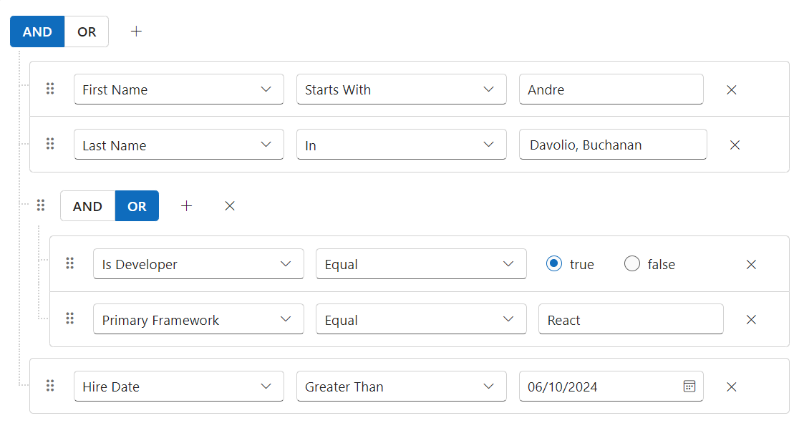

# Drag and drop in Blazor QueryBuilder Component

The [Blazor Query Builder](https://www.syncfusion.com/blazor-components/blazor-query-builder) supports drag-and-drop reordering of rules and groups for a more intuitive query-building experience. Enable this per instance by setting the [`AllowDragAndDrop`](https://help.syncfusion.com/cr/blazor/Syncfusion.Blazor.QueryBuilder.SfQueryBuilder-1.html#Syncfusion_Blazor_QueryBuilder_SfQueryBuilder_1_AllowDragAndDrop) property to `true` (default is `false`). Rules and groups can be dragged within the same group or across groups; items retain their type (a rule cannot be dropped as a group and vice versa).

Drag-and-drop events provide hooks to monitor and customize behavior:
- [`DragStart`](https://help.syncfusion.com/cr/blazor/Syncfusion.Blazor.QueryBuilder.QueryBuilderDragStart.html): Fires when a drag begins (access the source item and cancel if needed).
- [`Drag`](https://help.syncfusion.com/cr/blazor/Syncfusion.Blazor.QueryBuilder.QueryBuilderDrag.html): Fires during dragging (track current target and position).
- [`Drop`](https://help.syncfusion.com/cr/blazor/Syncfusion.Blazor.QueryBuilder.QueryBuilderDrop.html): Fires when the item is dropped (determine target group and insert index, or cancel to enforce business rules).

Touch input is supported on mobile and tablet devices. For accessibility, consider offering parallel UI actions (such as add/remove buttons) for users who rely on keyboard navigation.

```cshtml
@using Syncfusion.Blazor.QueryBuilder
@using Syncfusion.Blazor.Buttons

<SfQueryBuilder TValue="EmployeeDetails" @ref="QuerybuilderObj" AllowDragAndDrop="true">
    <QueryBuilderRule Condition="or" Rules="@Rules"></QueryBuilderRule>
    <QueryBuilderColumns>
        <QueryBuilderColumns>
            <QueryBuilderColumn Field="EmployeeID" Label="Employee ID" Type="ColumnType.Number"></QueryBuilderColumn>
                <QueryBuilderColumn Field="FirstName" Label="First Name" Type="ColumnType.String"></QueryBuilderColumn>
                <QueryBuilderColumn Field="LastName" Label="Last Name" Type="ColumnType.String"></QueryBuilderColumn>
                <QueryBuilderColumn Field="IsDeveloper" Label="IsDeveloper" Type="ColumnType.Boolean"></QueryBuilderColumn>
                <QueryBuilderColumn Field="Age" Label="Age" Type="ColumnType.Number"></QueryBuilderColumn>
                <QueryBuilderColumn Field="PrimaryFramework" Label="Primary Framework" Type="ColumnType.String"></QueryBuilderColumn>
                <QueryBuilderColumn Field="HireDate" Label="Hire Date" Type="ColumnType.Date"></QueryBuilderColumn>
                <QueryBuilderColumn Field="Country" Label="Country" Type="ColumnType.String"></QueryBuilderColumn>
        </QueryBuilderColumns>
    </QueryBuilderColumns>
</SfQueryBuilder>

@code {
    SfQueryBuilder<EmployeeDetails> QuerybuilderObj;
    List<RuleModel> Rules = new List<RuleModel>()
    {
        new RuleModel { Label="First Name", Field="FirstName", Type="String", Operator="equal", Value = "Andre" },
        new RuleModel { Label="Last Name", Field="LastName", Type="String", Operator="equal", Value = "Davolio" },
        new RuleModel { Label="Age", Field="Age", Type="Number", Operator="equal", Value = 29 },
        new RuleModel {
            Condition = "or", Rules = new List<RuleModel>() {
                new RuleModel { Label= "Is Developer", Field = "IsDeveloper", Type = "Boolean", Operator = "equal", Value = true },
                new RuleModel { Label= "Primary Framework", Field = "PrimaryFramework", Type = "String", Operator = "equal", Value = "React"}
            }
        }
    };

    public class EmployeeDetails
    {
        public int EmployeeID { get; set; }
        public string FirstName { get; set; }
        public string LastName { get; set; }
        public int Age { get; set; }
        public bool IsDeveloper { get; set; }
        public string PrimaryFramework { get; set; }
        public DateTime HireDate { get; set; }
        public string Country { get; set; }
    }
}

```



N> You can also explore our [Blazor Query Builder example](https://blazor.syncfusion.com/demos/query-builder/default-functionalities?theme=bootstrap4) to know how to render and configure the query builder.