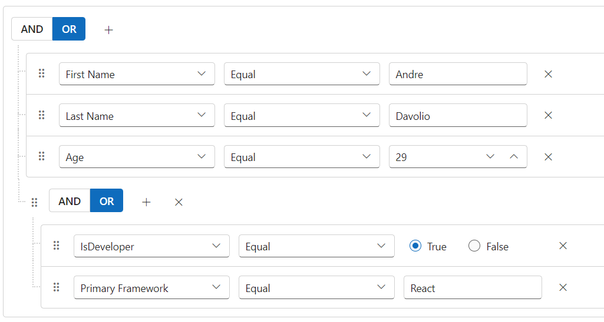

# Drag and drop in Blazor QueryBuilder Component

The [Blazor Query Builder](https://www.syncfusion.com/blazor-components/blazor-query-builder) provides the functionality to reposition rules or groups within the component effortlessly. This enhancement provides a more intuitive and flexible way to construct and modify queries. You can use [AllowDragAndDrop](https://help.syncfusion.com/cr/blazor/Syncfusion.Blazor.QueryBuilder.QueryBuilderAllowDragAndDrop.html) to perform drag and drop functionality. And we have events support for drag and drop features that, indicates the [DragStart](https://help.syncfusion.com/cr/blazor/Syncfusion.Blazor.QueryBuilder.QueryBuilderDragStart.html), [Drag](https://help.syncfusion.com/cr/blazor/Syncfusion.Blazor.QueryBuilder.QueryBuilderDrag.html) and [Drop](https://help.syncfusion.com/cr/blazor/Syncfusion.Blazor.QueryBuilder.QueryBuilderDrop.html) actions.

```cshtml
@using Syncfusion.Blazor.QueryBuilder
@using Syncfusion.Blazor.Buttons

<SfQueryBuilder TValue="EmployeeDetails" @ref="QuerybuilderObj" AllowDragAndDrop="true">
    <QueryBuilderRule Condition="or" Rules="@Rules"></QueryBuilderRule>
    <QueryBuilderColumns>
        <QueryBuilderColumns>
            <QueryBuilderColumn Field="EmployeeID" Label="Employee ID" Type="ColumnType.Number"></QueryBuilderColumn>
                <QueryBuilderColumn Field="FirstName" Label="First Name" Type="ColumnType.String"></QueryBuilderColumn>
                <QueryBuilderColumn Field="LastName" Label="Last Name" Type="ColumnType.String"></QueryBuilderColumn>
                <QueryBuilderColumn Field="IsDeveloper" Label="IsDeveloper" Type="ColumnType.Boolean"></QueryBuilderColumn>
                <QueryBuilderColumn Field="Age" Label="Age" Type="ColumnType.Number"></QueryBuilderColumn>
                <QueryBuilderColumn Field="PrimaryFramework" Label="Primary Framework" Type="ColumnType.String"></QueryBuilderColumn>
                <QueryBuilderColumn Field="HireDate" Label="Hire Date" Type="ColumnType.Date"></QueryBuilderColumn>
                <QueryBuilderColumn Field="Country" Label="Country" Type="ColumnType.String"></QueryBuilderColumn>
        </QueryBuilderColumns>
    </QueryBuilderColumns>
</SfQueryBuilder>

@code {
    SfQueryBuilder<EmployeeDetails> QuerybuilderObj;
    List<RuleModel> Rules = new List<RuleModel>()
    {
        new RuleModel { Label="First Name", Field="FirstName", Type="String", Operator="equal", Value = "Andre" },
        new RuleModel { Label="Last Name", Field="LastName", Type="String", Operator="equal", Value = "Davolio" },
        new RuleModel { Label="Age", Field="Age", Type="Number", Operator="equal", Value = 29 },
        new RuleModel {
            Condition = "or", Rules = new List<RuleModel>() {
                new RuleModel { Label= "Is Developer", Field = "IsDeveloper", Type = "Boolean", Operator = "equal", Value = true },
                new RuleModel { Label= "Primary Framework", Field = "PrimaryFramework", Type = "String", Operator = "equal", Value = "React"}
            }
        }
    };

    public class EmployeeDetails
    {
        public int EmployeeID { get; set; }
        public string FirstName { get; set; }
        public string LastName { get; set; }
        public int Age { get; set; }
        public bool IsDeveloper { get; set; }
        public string PrimaryFramework { get; set; }
        public DateTime HireDate { get; set; }
        public string Country { get; set; }
    }
}

```



N> You can also explore our [Blazor Query Builder example](https://blazor.syncfusion.com/demos/query-builder/default-functionalities?theme=bootstrap4) to know how to render and configure the query builder.