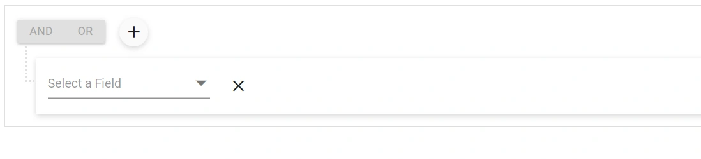

# Getting Started with Blazor Query Builder in Server App

This section briefly explains about how to include [Blazor Query Builder](https://www.syncfusion.com/blazor-components/blazor-query-builder) component in a Blazor Server App using [Visual Studio](https://visualstudio.microsoft.com/vs/), [Visual Studio Code](https://code.visualstudio.com/), and the [.NET CLI](https://learn.microsoft.com/en-us/dotnet/core/tools/).

### Create a new Blazor Server App





Create a **Blazor Server App** using Visual Studio via [Microsoft Templates](https://learn.microsoft.com/en-us/aspnet/core/blazor/tooling?view=aspnetcore-10.0&pivots=vs) or the [Blazor Extension](https://blazor.syncfusion.com/documentation/visual-studio-integration/template-studio). For detailed instructions, refer to the [Blazor Server App Getting Started](https://blazor.syncfusion.com/documentation/getting-started/blazor-server-side-visual-studio) documentation.





Run the following command to create a new Blazor Server App.




dotnet new blazor -o BlazorServerApp --interactivity Server




Alternatively, create a **Blazor Server App** using Visual Studio Code via [Microsoft Templates](https://learn.microsoft.com/en-us/aspnet/core/blazor/tooling?view=aspnetcore-10.0&pivots=vsc), the [Blazor Extension](https://blazor.syncfusion.com/documentation/visual-studio-code-integration/create-project), or the [C# Dev Kit](https://marketplace.visualstudio.com/items?itemName=ms-dotnettools.csdevkit) extension.





Run the following command to create a new Blazor Server App.




dotnet new blazor -o BlazorApp --interactivity Server








N> Configure the appropriate [Interactive render mode](https://learn.microsoft.com/en-us/aspnet/core/blazor/components/render-modes?view=aspnetcore-10.0#render-modes) and [Interactivity location](https://learn.microsoft.com/en-us/aspnet/core/blazor/tooling?view=aspnetcore-10.0&pivots=vs) while creating a Blazor Server App. For detailed information, refer to the [interactive render mode documentation](https://blazor.syncfusion.com/documentation/common/interactive-render-mode).

### Install the required Blazor packages

Install [Syncfusion.Blazor.QueryBuilder](https://www.nuget.org/packages/Syncfusion.Blazor.QueryBuilder/) and [Syncfusion.Blazor.Themes](https://www.nuget.org/packages/Syncfusion.Blazor.Themes/) NuGet packages. All Syncfusion Blazor packages are available on [nuget.org](https://www.nuget.org/packages?q=syncfusion.blazor). See the [NuGet packages](https://blazor.syncfusion.com/documentation/nuget-packages) topic for details.





1. Go to *Tools → NuGet Package Manager → Manage NuGet Packages for Solution*.
2. Search the required NuGet packages (`Syncfusion.Blazor.QueryBuilder` and `Syncfusion.Blazor.Themes`) and install them.

Alternatively, you can install the same packages using the Package Manager Console with the following commands.




Install-Package Syncfusion.Blazor.QueryBuilder -Version {{ site.releaseversion }}
Install-Package Syncfusion.Blazor.Themes -Version {{ site.releaseversion }}








Open the terminal and run the following commands.




dotnet add package Syncfusion.Blazor.QueryBuilder -v {{ site.releaseversion }}
dotnet add package Syncfusion.Blazor.Themes -v {{ site.releaseversion }}








Open the command prompt and run the following commands.




dotnet add package Syncfusion.Blazor.QueryBuilder -v {{ site.releaseversion }}
dotnet add package Syncfusion.Blazor.Themes -v {{ site.releaseversion }}








### Add import namespaces

After the packages are installed, open the **~/_Imports.razor** file and import the `Syncfusion.Blazor` and `Syncfusion.Blazor.QueryBuilder` namespaces.




@using Syncfusion.Blazor
@using Syncfusion.Blazor.QueryBuilder




### Register the Blazor service

Open the **Program.cs** file in Blazor Server App and register the Blazor service.




....
using Syncfusion.Blazor;
....
builder.Services.AddSyncfusionBlazor();
....




### Add stylesheet and script resources

The theme stylesheet and script can be accessed from NuGet through [Static Web Assets](https://blazor.syncfusion.com/documentation/appearance/themes#static-web-assets). Include the [stylesheet](https://blazor.syncfusion.com/documentation/appearance/themes) and [script references](https://blazor.syncfusion.com/documentation/common/adding-script-references) in the **App.razor** file.
 


 
...
<link href="_content/Syncfusion.Blazor.Themes/fluent2.css" rel="stylesheet" />
...

 



N> Check out the [Blazor Themes](https://blazor.syncfusion.com/documentation/appearance/themes) topic to discover various methods ([Static Web Assets](https://blazor.syncfusion.com/documentation/appearance/themes#static-web-assets), [CDN](https://blazor.syncfusion.com/documentation/appearance/themes#cdn-reference), and [CRG](https://blazor.syncfusion.com/documentation/common/custom-resource-generator)) for referencing themes in Blazor application. Also, check out the [Adding Script Reference](https://blazor.syncfusion.com/documentation/common/adding-script-references) topic to learn different approaches for adding script references in Blazor application.

### Add Blazor Query Builder component

Open a Razor file located in the **~/Pages/*.razor** (for example, **Home.razor**) and add the [Blazor Query Builder](https://www.syncfusion.com/blazor-components/blazor-query-builder) component inside the razor file.

N>If the interactivity location is set to `Per page/component`, define a render mode at the top of the razor file. (For example `InteractiveServer`). If the Interactivity is set to `Global`, the render mode is automatically configured in the `App.razor` file by default.




@rendermode InteractiveServer

@using Syncfusion.Blazor.QueryBuilder

<SfQueryBuilder TValue="EmployeeDetails">
    <QueryBuilderColumns>
        <QueryBuilderColumn Field="EmployeeID" Label="Employee ID" Type="ColumnType.Number"></QueryBuilderColumn>
        <QueryBuilderColumn Field="FirstName" Label="First Name" Type="ColumnType.String"></QueryBuilderColumn>
        <QueryBuilderColumn Field="TitleOfCourtesy" Label="Title of Courtesy" Type="ColumnType.Boolean" Values="Values"></QueryBuilderColumn>
        <QueryBuilderColumn Field="Title" Label="Title" Type="ColumnType.String"></QueryBuilderColumn>
        <QueryBuilderColumn Field="HireDate" Label="Hire Date" Type="ColumnType.Date"></QueryBuilderColumn>
        <QueryBuilderColumn Field="Country" Label="Country" Type="ColumnType.String"></QueryBuilderColumn>
        <QueryBuilderColumn Field="City" Label="City" Type="ColumnType.String"></QueryBuilderColumn>
    </QueryBuilderColumns>
</SfQueryBuilder>

@code {
    private string[] Values = new string[] { "Mr.", "Mrs." };
    public class EmployeeDetails
    {
        public int EmployeeID { get; set; }
        public string FirstName { get; set; }
        public bool TitleOfCourtesy { get; set; }
        public string Title { get; set; }
        public DateTime HireDate { get; set; }
        public string Country { get; set; }
        public string City { get; set; }
    }
}




**Run the application**





Press <kbd>Ctrl</kbd>+<kbd>F5</kbd> (Windows) or <kbd>⌘</kbd>+<kbd>F5</kbd> (macOS) to launch the application. The Blazor Query Builder component will render in your default web browser.





Open the terminal and run the following command.




dotnet run








Open the command prompt and run the following command.




dotnet run








N> [View Sample in GitHub.](https://github.com/SyncfusionExamples/Blazor-Getting-Started-Examples/tree/main/QueryBuilder)

### See also

* [Getting Started with Blazor for Client-Side in .NET Core CLI](https://blazor.syncfusion.com/documentation/getting-started/blazor-webassembly-dotnet-cli)
* [Getting Started with Blazor for Server-Side in Visual Studio](https://blazor.syncfusion.com/documentation/getting-started/blazor-server-side-visual-studio)
* [Getting Started with Blazor for Server-Side in .NET Core CLI](https://blazor.syncfusion.com/documentation/getting-started/blazor-server-side-dotnet-cli)