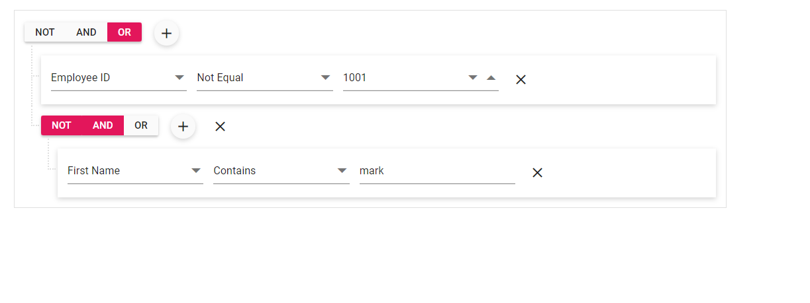

# Show Not Operator in Blazor QueryBuilder Component

Query Builder supports the logical NOT operator alongside AND and OR to negate a group’s combined condition. Enable the NOT operator by setting the [EnableNotCondition](https://help.syncfusion.com/cr/blazor/Syncfusion.Blazor.QueryBuilder.SfQueryBuilder-1.html#Syncfusion_Blazor_QueryBuilder_SfQueryBuilder_1_EnableNotCondition) property to `true`.

N> The `EnableNotCondition` property is false by default.

```cshtml

@using Syncfusion.Blazor.QueryBuilder

<SfQueryBuilder TValue="@EmployeeDetails" EnableNotCondition="true">
    <QueryBuilderRule Condition="or" Not="false" Rules="@Rules"></QueryBuilderRule>
    <QueryBuilderColumns>
        <QueryBuilderColumn Field="EmployeeID" Label="Employee ID" Type="ColumnType.Number"></QueryBuilderColumn>
        <QueryBuilderColumn Field="FirstName" Label="First Name" Type="ColumnType.String"></QueryBuilderColumn>
        <QueryBuilderColumn Field="HireDate" Label="Hire Date" Type="ColumnType.Date"></QueryBuilderColumn>
        <QueryBuilderColumn Field="Country" Label="Country" Type="ColumnType.String"></QueryBuilderColumn>
    </QueryBuilderColumns>
</SfQueryBuilder>

@code {
    List<RuleModel> Rules = new List<RuleModel>()
    {
        new RuleModel { Field="EmployeeID", Label="EmployeeID", Type="Number", Operator="notequal", Value = 1001 },
        new RuleModel { Condition = "and", Not=true, Rules = new List<RuleModel>(){ new RuleModel() { Field = "FirstName", Label = "First Name", Type = "String", Operator = "contains", Value = "mark" } }}
    };

    public class EmployeeDetails
    {
        public string FirstName { get; set; }
        public int EmployeeID { get; set; }
        public string Country { get; set; }
        public string City { get; set; }
        public DateTime HireDate { get; set; }
    }
}

```

