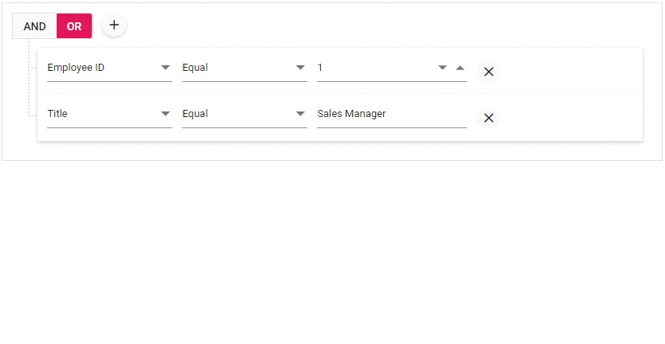

# Blazor QueryBuilder Component in WebAssembly App using Visual Studio

This article provides step-by-step instructions for building a Blazor WebAssembly app with the Blazor Query Builder component using Visual Studio.

## Prerequisites

- [System requirements for Blazor components](https://blazor.syncfusion.com/documentation/system-requirements)

## Create a Blazor WebAssembly App in Visual Studio

Create a Blazor WebAssembly app using either the Microsoft project templates or the Syncfusion Template Studio for a guided setup.

- Microsoft templates: [Blazor tooling in Visual Studio](https://learn.microsoft.com/aspnet/core/blazor/tooling)
- Syncfusion<sup style="font-size:70%">&reg;</sup> Blazor Extension: [Template Studio](https://blazor.syncfusion.com/documentation/visual-studio-integration/template-studio)

## Install Syncfusion<sup style="font-size:70%">&reg;</sup> Blazor QueryBuilder and Themes NuGet in the App

To add the Query Builder component to the app, open the NuGet Package Manager in Visual Studio (Tools → NuGet Package Manager → Manage NuGet Packages for Solution), then search for and install [Syncfusion.Blazor.QueryBuilder](https://www.nuget.org/packages/Syncfusion.Blazor.QueryBuilder) and [Syncfusion.Blazor.Themes](https://www.nuget.org/packages/Syncfusion.Blazor.Themes/). Alternatively, use the following Package Manager commands.




Install-Package Syncfusion.Blazor.QueryBuilder -Version {{ site.releaseversion }}

Install-Package Syncfusion.Blazor.Themes -Version {{ site.releaseversion }}




N> Syncfusion<sup style="font-size:70%">&reg;</sup> Blazor components are available on NuGet. See the [Syncfusion Blazor packages on NuGet](https://www.nuget.org/packages?q=syncfusion.blazor) and the [NuGet packages](https://blazor.syncfusion.com/documentation/nuget-packages) topic for a list of packages and component details.
## Register Syncfusion<sup style="font-size:70%">&reg;</sup> Blazor Service

Open **~/_Imports.razor** file and import the `Syncfusion.Blazor` and `Syncfusion.Blazor.QueryBuilder` namespaces.




@using Syncfusion.Blazor
@using Syncfusion.Blazor.QueryBuilder




Now, register the Syncfusion<sup style="font-size:70%">&reg;</sup> Blazor services in **~/Program.cs** of the Blazor WebAssembly app.




using Microsoft.AspNetCore.Components.Web;
using Microsoft.AspNetCore.Components.WebAssembly.Hosting;
using Syncfusion.Blazor;

var builder = WebAssemblyHostBuilder.CreateDefault(args);
builder.RootComponents.Add<App>("#app");
builder.RootComponents.Add<HeadOutlet>("head::after");

builder.Services.AddScoped(sp => new HttpClient { BaseAddress = new Uri(builder.HostEnvironment.BaseAddress) });

builder.Services.AddSyncfusionBlazor();
await builder.Build().RunAsync();
....




## Add stylesheet and script resources

The theme stylesheet and script are provided via NuGet using [Static Web Assets](https://blazor.syncfusion.com/documentation/appearance/themes#static-web-assets). Reference the stylesheet and script in the `<head>` of the main page as follows:

* For Blazor WebAssembly app, include it in the **~/index.html** file.

```html
<head>
    ....
    <link href="_content/Syncfusion.Blazor.Themes/bootstrap5.css" rel="stylesheet" />
    <script src="_content/Syncfusion.Blazor.Core/scripts/syncfusion-blazor.min.js" type="text/javascript"></script>
</head>
```
N> Choose one theme stylesheet (Bootstrap, Fluent, Material, or Tailwind). See [Blazor Themes](https://blazor.syncfusion.com/documentation/appearance/themes) for theme options and delivery methods ([Static Web Assets](https://blazor.syncfusion.com/documentation/appearance/themes#static-web-assets), [CDN](https://blazor.syncfusion.com/documentation/appearance/themes#cdn-reference), and [CRG](https://blazor.syncfusion.com/documentation/common/custom-resource-generator)). For script options, refer to [Adding script references](https://blazor.syncfusion.com/documentation/common/adding-script-references). Only one script reference is required.

## Add Blazor QueryBuilder component

Add the Syncfusion<sup style="font-size:70%">&reg;</sup> Blazor QueryBuilder component in the **~/Pages/Index.razor** file.




<SfQueryBuilder TValue="EmployeeDetails">
<QueryBuilderColumns>
    <QueryBuilderColumn Field="EmployeeID" Label="Employee ID" Type="ColumnType.Number"></QueryBuilderColumn>
    <QueryBuilderColumn Field="FirstName" Label="First Name" Type="ColumnType.String"></QueryBuilderColumn>
    <QueryBuilderColumn Field="TitleOfCourtesy" Label="Title of Courtesy" Type="ColumnType.Boolean" Values="Values"></QueryBuilderColumn>
    <QueryBuilderColumn Field="Title" Label="Title" Type="ColumnType.String"></QueryBuilderColumn>
    <QueryBuilderColumn Field="HireDate" Label="Hire Date" Type="ColumnType.Date"></QueryBuilderColumn>
    <QueryBuilderColumn Field="Country" Label="Country" Type="ColumnType.String"></QueryBuilderColumn>
    <QueryBuilderColumn Field="City" Label="City" Type="ColumnType.String"></QueryBuilderColumn>
</QueryBuilderColumns>
</SfQueryBuilder>

@code {
    private string[] Values = new string[] { "Mr.", "Mrs." };

    public class EmployeeDetails
    {
        public int EmployeeID { get; set; }
        public string FirstName { get; set; }
        public bool TitleOfCourtesy { get; set; }
        public string Title { get; set; }
        public DateTime HireDate { get; set; }
        public string Country { get; set; }
        public string City { get; set; }
    }
}




* Press <kbd>Ctrl</kbd>+<kbd>F5</kbd> (Windows) or <kbd>⌘</kbd>+<kbd>F5</kbd> (macOS) to launch the application. This will render the Syncfusion<sup style="font-size:70%">&reg;</sup> Blazor QueryBuilder component in the default web browser.


