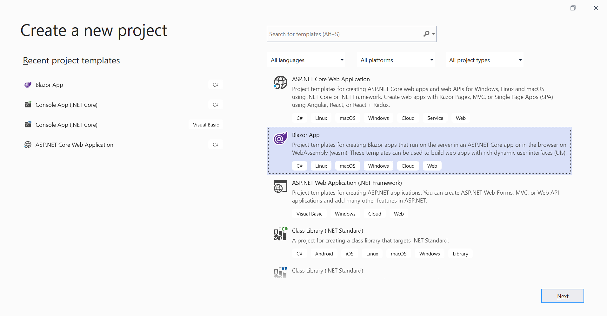
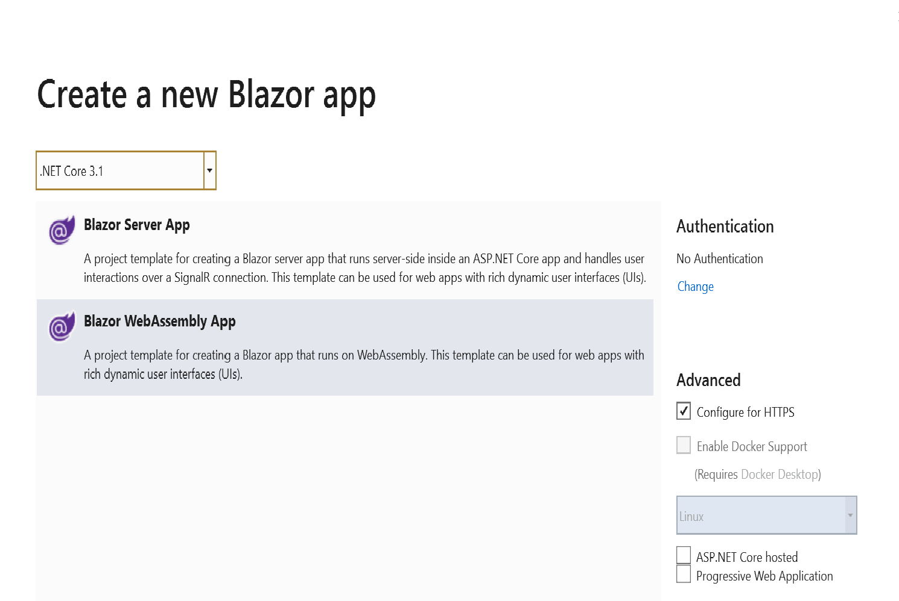

# Blazor QueryBuilder Component in WebAssembly App using Visual Studio

This article provides a step-by-step instructions to configure Syncfusion [Blazor Query Builder](https://www.syncfusion.com/blazor-components/blazor-query-builder) in a simple Blazor WebAssembly application using [Visual Studio 2019](https://visualstudio.microsoft.com/vs/).

> Starting with version 17.4.0.39 (2019 Volume 4), you need to include a valid license key (either paid or trial key) within your applications. Please refer to this [help topic](https://help.syncfusion.com/common/essential-studio/licensing/license-key#blazor) for more information.

## Prerequisites

* [Visual Studio 2019](https://visualstudio.microsoft.com/vs/)
* [.NET Core SDK 3.1.3](https://dotnet.microsoft.com/download/dotnet-core/3.1)

> .NET Core SDK 3.1.3 requires Visual Studio 2019 16.6 or later. Syncfusion Blazor components are compatible with .NET Core 5.0 Preview 6 and it requires Visual Studio 16.7 Preview 1 or later.

## Create a Blazor WebAssembly project in Visual Studio 2019

1. Install the essential project templates in the Visual Studio 2019 by running the below command line in the command prompt.

    ```
    dotnet new -i Microsoft.AspNetCore.Components.WebAssembly.Templates::3.2.0-rc1.20223.4
    ```

2. Choose **Create a new project** from the Visual Studio dashboard.

    

3. Select **Blazor App** from the template and click **Next** button.

    

4. Now, the project configuration window will popup. Click **Create** button to create a new project with the default project configuration.

    

5. Choose **Blazor WebAssembly App** from the dashboard and click **Create** button to create a new Blazor WebAssembly application. Make sure **.NET Core** and **ASP.NET Core 3.1** is selected at the top.

    

    > ASP.NET Core 3.1 available in Visual Studio 2019 version.
  
## Importing Syncfusion Blazor component in the application

1. Now, install **Syncfusion.Blazor** NuGet package to the newly created application by using the **NuGet Package Manager**. Right-click the project and select Manage NuGet Packages.

    

2. Search **Syncfusion.Blazor** keyword in the Browser tab and install **Syncfusion.Blazor** NuGet package in the application.

    

3. The Syncfusion Blazor package will be installed in the project, once the installation process is completed.

4. Open **~/_Imports.razor** file and import the `Syncfusion.Blazor`.

    ```cshtml
    @using Syncfusion.Blazor
    @using Syncfusion.Blazor.QueryBuilder.
    ```

5. Open the **~/Program.cs** file and register the Syncfusion Blazor Service.

    ```c#
    using Syncfusion.Blazor;

    namespace WebApplication1
    {
        public class Program
        {
            public static async Task Main(string[] args)
            {
                ....
                ....
                builder.Services.AddSyncfusionBlazor();
                await builder.Build().RunAsync();
            }
        }
    }
    ```

6. Add the Syncfusion bootstrap4 theme in the `<head>` element of the **~/wwwroot/index.html** page.

    ```html
    <head>
        ....
        ....
        <link href="_content/Syncfusion.Blazor/styles/bootstrap4.css" rel="stylesheet" />
    </head>
    ```

    > The same theme file can be referred through the CDN version by using [https://cdn.syncfusion.com/blazor/{{ site.blazorversion }}/styles/bootstrap4.css](https://cdn.syncfusion.com/blazor/18.2.44/styles/bootstrap4.css).
    > To use manual scripts other than the scripts from NuGet package, register the Blazor service in **~/Program.cs** file by using true parameter as mentioned below.

     ```c#
    using Syncfusion.Blazor;

     namespace WebApplication1
     {
         public class Program
       {
             public static async Task Main(string[] args)
             {
                ....
                ....
                builder.Services.AddSyncfusionBlazor(true);
                await builder.Build.RunAsync();
             }
         }
     }
     ```

## Adding Query Builder component to the application

Now, add the [Blazor Query Builder](https://www.syncfusion.com/blazor-components/blazor-query-builder) component in `razor` page in the `Pages` folder. For example, the Query Builder component is added in the `~/Pages/Index.razor` page.

```cshtml
@using Syncfusion.Blazor.QueryBuilder

<SfQueryBuilder TValue="EmployeeDetails">
<QueryBuilderColumns>
    <QueryBuilderColumn Field="EmployeeID" Label="Employee ID" Type="ColumnType.Number"></QueryBuilderColumn>
    <QueryBuilderColumn Field="FirstName" Label="First Name" Type="ColumnType.String"></QueryBuilderColumn>
    <QueryBuilderColumn Field="TitleOfCourtesy" Label="Title of Courtesy" Type="ColumnType.Boolean" Values="Values"></QueryBuilderColumn>
    <QueryBuilderColumn Field="Title" Label="Title" Type="ColumnType.String"></QueryBuilderColumn>
    <QueryBuilderColumn Field="HireDate" Label="Hire Date" Type="ColumnType.Date"></QueryBuilderColumn>
    <QueryBuilderColumn Field="Country" Label="Country" Type="ColumnType.String"></QueryBuilderColumn>
    <QueryBuilderColumn Field="City" Label="City" Type="ColumnType.String"></QueryBuilderColumn>
</QueryBuilderColumns>
</SfQueryBuilder>

@code {
    private string[] Values = new string[] { "Mr.", "Mrs." };

    public class EmployeeDetails
    {
        public int EmployeeID { get; set; }
        public string FirstName { get; set; }
        public bool TitleOfCourtesy { get; set; }
        public string Title { get; set; }
        public DateTime HireDate { get; set; }
        public string Country { get; set; }
        public string City { get; set; }
    }
}
```

## Run the application

After successful compilation of your application, simply press F5 to run the application. The [Blazor Query Builder](https://www.syncfusion.com/blazor-components/blazor-query-builder) component will render in the web browser as shown below


