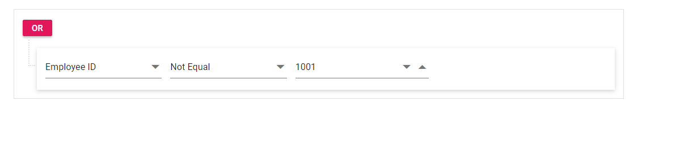

# Readonly in Blazor QueryBuilder Component

The readonly property in the query builder disables the user interactions on the component. You can enable this feature by setting the [Readonly](https://help.syncfusion.com/cr/blazor/Syncfusion.Blazor.QueryBuilder.SfQueryBuilder.html#Syncfusion_Blazor_QueryBuilder_SfQueryBuilder_Readonly) property to `true`.

```cshtml

@using Syncfusion.Blazor.QueryBuilder

<SfQueryBuilder TValue="@EmployeeDetails" Readonly="true">
    <QueryBuilderRule Condition="or" Rules="@Rules"></QueryBuilderRule>
    <QueryBuilderColumns>
        <QueryBuilderColumn Field="EmployeeID" Label="Employee ID" Type="ColumnType.Number"></QueryBuilderColumn>
        <QueryBuilderColumn Field="FirstName" Label="First Name" Type="ColumnType.String"></QueryBuilderColumn>
        <QueryBuilderColumn Field="HireDate" Label="Hire Date" Type="ColumnType.Date"></QueryBuilderColumn>
        <QueryBuilderColumn Field="Country" Label="Country" Type="ColumnType.String"></QueryBuilderColumn>
    </QueryBuilderColumns>
</SfQueryBuilder>

@code {
    List<RuleModel> Rules = new List<RuleModel>()
    {
        new RuleModel { Field="EmployeeID", Label="EmployeeID", Type="Number", Operator="notequal", Value = 1001 }
    };

    public class EmployeeDetails
    {
        public string FirstName { get; set; }
        public int EmployeeID { get; set; }
        public string Country { get; set; }
        public string City { get; set; }
        public DateTime HireDate { get; set; }
    }
}

```

