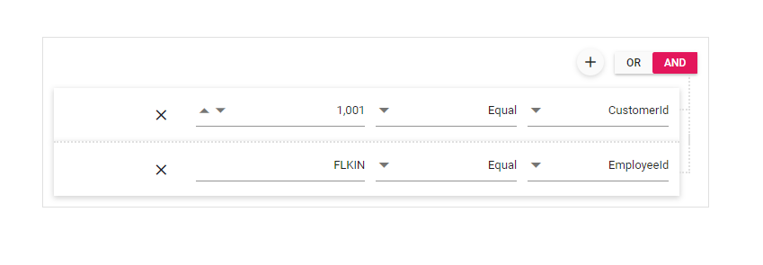

# Right to Left in Blazor QueryBuilder Component

RTL provides an option to switch the text direction and layout of the Query Builder component from right-to-left. It improves the user experiences and accessibility for users who use right-to-left languages (Arabic, Farsi, Urdu, etc.). To enable this feature, set the [EnableRtl](https://help.syncfusion.com/cr/blazor/Syncfusion.Blazor.QueryBuilder.SfQueryBuilder.html#Syncfusion_Blazor_QueryBuilder_SfQueryBuilder_EnableRtl) to true.

```cshtml
@using Syncfusion.Blazor.QueryBuilder

<SfQueryBuilder DataSource="@EmployeeData" EnableRtl="true">
    <QueryBuilderRule Condition="or" Rules="@Rules"></QueryBuilderRule>
    <QueryBuilderColumns>
        <QueryBuilderColumn Field="EmployeeID" Label="Employee ID" Type="ColumnType.Number"></QueryBuilderColumn>
        <QueryBuilderColumn Field="FirstName" Label="First Name" Type="ColumnType.String"></QueryBuilderColumn>
        <QueryBuilderColumn Field="HireDate" Label="Hire Date" Type="ColumnType.Date"></QueryBuilderColumn>
        <QueryBuilderColumn Field="Country" Label="Country" Type="ColumnType.String"></QueryBuilderColumn>
    </QueryBuilderColumns>
</SfQueryBuilder>

@code {
    List<RuleModel> Rules = new List<RuleModel>()
    {
            new RuleModel { Field="Country", Label="Country", Type="String", Operator="equal", Value = "England" },
            new RuleModel { Field="EmployeeID", Label="EmployeeID",  Type="Number", Operator="notequal", Value = 1001 }
    };

    public List<EmployeeDetails> EmployeeData = new List<EmployeeDetails>
    {
        new EmployeeDetails{ FirstName = "Martin", EmployeeID = 1001, Country = "England", City = "Manchester", HireDate = new DateTime(2014, 4, 23) },
        new EmployeeDetails{ FirstName = "Benjamin", EmployeeID = 1002, Country = "England", City = "Birmingham", HireDate = new DateTime(2014, 6, 19) },
        new EmployeeDetails{ FirstName = "Stuart", EmployeeID = 1003, Country = "England", City = "London", HireDate = new DateTime(2014, 7, 4) },
        new EmployeeDetails{ FirstName = "Ben", EmployeeID = 1004, Country = "USA", City = "California", HireDate = new DateTime(2014, 8, 15) },
        new EmployeeDetails{ FirstName = "Joseph", EmployeeID = 1005, Country = "Spain", City = "Madrid", HireDate = new DateTime(2014, 8, 29) }
    };

    public class EmployeeDetails
    {
        public string FirstName { get; set; }
        public int EmployeeID { get; set; }
        public string Country { get; set; }
        public string City { get; set; }
        public DateTime HireDate { get; set; }
    }
}

```

