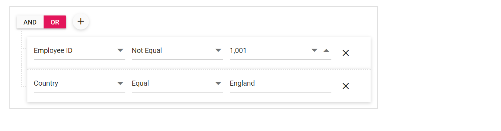
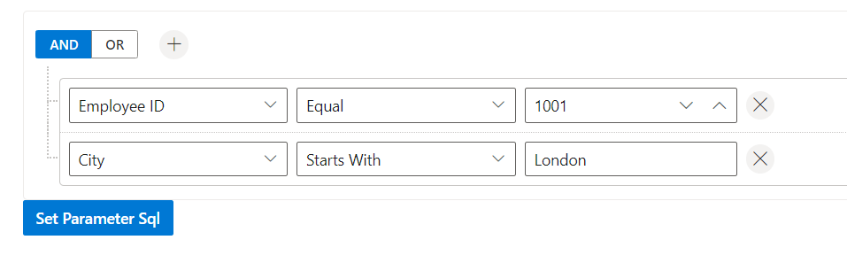
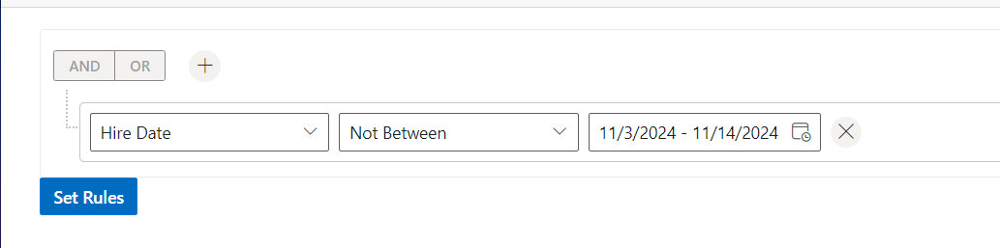

# Importing and Exporting in Blazor QueryBuilder Component

Importing facilitates the viewing or editing of predefined conditions available in JSON, SQL, and MongoDB query formats, while exporting enables obtaining the created rules in the query builder as JSON, SQL, and MongoDB queries.

## Importing

Importing enables users to bring predefined conditions into the system for viewing or editing, available in formats such as JSON, SQL, and MongoDB query. It facilitates the quick incorporation of pre-defined rules or parameters into workflows, streamlining the setup process by importing directly from external sources or saved configurations.

### Importing from JSON Object

Importing from JSON enables users to bring predefined conditions encoded in JSON format into the system. This feature streamlines the process by providing a standardized format for importing data, ensuring compatibility, and ease of use.

#### Initial rendering

To initially apply conditions, you can establish the rules in **QueryBuilderRule** by importing a structured JSON object and defining its properties.

```cshtml

@using Syncfusion.Blazor.QueryBuilder

<SfQueryBuilder DataSource="@EmployeeData" @ref="QueryBuilderObj">
    <QueryBuilderRule Condition="or" Rules="Rules"></QueryBuilderRule>
    <QueryBuilderColumns>
        <QueryBuilderColumn Field="EmployeeID" Label="Employee ID" Type="ColumnType.Number"></QueryBuilderColumn>
        <QueryBuilderColumn Field="FirstName" Label="First Name" Type="ColumnType.String"></QueryBuilderColumn>
        <QueryBuilderColumn Field="TitleOfCourtesy" Label="Title Of Courtesy" Type="ColumnType.Boolean"></QueryBuilderColumn>
        <QueryBuilderColumn Field="HireDate" Label="Hire Date" Type="ColumnType.Date"></QueryBuilderColumn>
        <QueryBuilderColumn Field="Country" Label="Country" Type="ColumnType.String"></QueryBuilderColumn>
        <QueryBuilderColumn Field="City" Label="City" Type="ColumnType.String"></QueryBuilderColumn>
    </QueryBuilderColumns>
</SfQueryBuilder>

@code {
    SfQueryBuilder<EmployeeDetails> QueryBuilderObj;
    List<RuleModel> Rules = new List<RuleModel>()
    {
            new RuleModel { Field="Country", Label="Country", Type="String", Operator="equal", Value = "England" },
            new RuleModel { Field="EmployeeID", Label="EmployeeID",  Type="Number", Operator="notequal", Value = 1001 }
    };
    public List<EmployeeDetails> EmployeeData = new List<EmployeeDetails>
    {
        new EmployeeDetails{ FirstName = "Martin", EmployeeID = 1001, Country = "England", City = "Manchester", HireDate = new DateTime(2014, 4, 23) },
        new EmployeeDetails{ FirstName = "Benjamin", EmployeeID = 1002, Country = "England", City = "Birmingham", HireDate = new DateTime(2014, 6, 19) },
        new EmployeeDetails{ FirstName = "Stuart", EmployeeID = 1003, Country = "England", City = "London", HireDate = new DateTime(2014, 7, 4) },
        new EmployeeDetails{ FirstName = "Ben", EmployeeID = 1004, Country = "USA", City = "California", HireDate = new DateTime(2014, 8, 15) },
        new EmployeeDetails{ FirstName = "Joseph", EmployeeID = 1005, Country = "Spain", City = "Madrid", HireDate = new DateTime(2014, 8, 29) }
    };

    public class EmployeeDetails
    {
        public int EmployeeID { get; set; }
        public string FirstName { get; set; }
        public bool TitleOfCourtesy { get; set; }
        public string Title { get; set; }
        public DateTime HireDate { get; set; }
        public string Country { get; set; }
        public string City { get; set; }
    }
}
```



#### Post rendering

You can set the conditions from structured JSON object through the [SetRules](https://help.syncfusion.com/cr/blazor/Syncfusion.Blazor.QueryBuilder.SfQueryBuilder-1.html#Syncfusion_Blazor_QueryBuilder_SfQueryBuilder_1_SetRules_System_Collections_Generic_List_Syncfusion_Blazor_QueryBuilder_RuleModel__System_String_System_Nullable_System_Boolean__System_Boolean_) method.

### Importing from SQL Query

Importing from SQL involves integrating predefined conditions or data stored in a SQL database into the Query Builder. This enables the direct integration of SQL queries, thereby improving workflow efficiency and data accuracy within the application. SQL importing supports various types, including Inline SQL, Parameter SQL, and Named Parameter SQL.

#### Importing from Inline SQL Query

Importing from Inline SQL involves integrating SQL queries directly into the Query Builder. This method streamlines the process by enabling users to input SQL statements directly into the application for analysis, manipulation, or further processing within the Query Builder. Conditions can be set from Inline SQL queries using the [SetRulesFromSql](https://help.syncfusion.com/cr/blazor/Syncfusion.Blazor.QueryBuilder.SfQueryBuilder-1.html#Syncfusion_Blazor_QueryBuilder_SfQueryBuilder_1_SetRulesFromSql_System_String_) method.

```cshtml
@using Syncfusion.Blazor.QueryBuilder
@using Syncfusion.Blazor.Buttons

<SfQueryBuilder DataSource="@EmployeeData" @ref="QueryBuilderObj">
    <QueryBuilderColumns>
        <QueryBuilderColumn Field="EmployeeID" Label="Employee ID" Type="ColumnType.Number"></QueryBuilderColumn>
        <QueryBuilderColumn Field="FirstName" Label="First Name" Type="ColumnType.String"></QueryBuilderColumn>
        <QueryBuilderColumn Field="TitleOfCourtesy" Label="Title Of Courtesy" Type="ColumnType.Boolean"></QueryBuilderColumn>
        <QueryBuilderColumn Field="HireDate" Label="Hire Date" Type="ColumnType.Date"></QueryBuilderColumn>
        <QueryBuilderColumn Field="Country" Label="Country" Type="ColumnType.String"></QueryBuilderColumn>
        <QueryBuilderColumn Field="City" Label="City" Type="ColumnType.String"></QueryBuilderColumn>
    </QueryBuilderColumns>
</SfQueryBuilder>
<SfButton CssClass="e-primary" @onclick="setRules">Set Rules</SfButton>

@code {
    SfQueryBuilder<EmployeeDetails> QueryBuilderObj;
    public List<EmployeeDetails> EmployeeData = new List<EmployeeDetails>
    {
        new EmployeeDetails{ FirstName = "Martin", EmployeeID = 1001, Country = "England", City = "Manchester", HireDate = new DateTime(2014, 4, 23) },
        new EmployeeDetails{ FirstName = "Benjamin", EmployeeID = 1002, Country = "England", City = "Birmingham", HireDate = new DateTime(2014, 6, 19) },
        new EmployeeDetails{ FirstName = "Stuart", EmployeeID = 1003, Country = "England", City = "London", HireDate = new DateTime(2014, 7, 4) },
        new EmployeeDetails{ FirstName = "Ben", EmployeeID = 1004, Country = "USA", City = "California", HireDate = new DateTime(2014, 8, 15) },
        new EmployeeDetails{ FirstName = "Joseph", EmployeeID = 1005, Country = "Spain", City = "Madrid", HireDate = new DateTime(2014, 8, 29) }
    };

    public class EmployeeDetails
    {
        public int EmployeeID { get; set; }
        public string FirstName { get; set; }
        public bool TitleOfCourtesy { get; set; }
        public string Title { get; set; }
        public DateTime HireDate { get; set; }
        public string Country { get; set; }
        public string City { get; set; }
    }

    private void setRules()
    {
        QueryBuilderObj.SetRulesFromSql("EmployeeID = 1001 AND City LIKE ('Manchester%')");
    }
}
```


#### Importing from Parameter SQL Query

Importing from Parameter SQL involves integrating SQL queries with parameters directly into the Query Builder. This method allows users to input SQL statements containing parameters, which can be dynamically filled in during execution. It streamlines the process by enabling flexible and customizable querying within the application. Conditions can be set from Parameter SQL queries using the [SetParameterSql](https://help.syncfusion.com/cr/blazor/Syncfusion.Blazor.QueryBuilder.SfQueryBuilder-1.html#Syncfusion_Blazor_QueryBuilder_SfQueryBuilder_1_SetParameterSql_Syncfusion_Blazor_QueryBuilder_ParameterSql_) method.

```cshtml
@using Syncfusion.Blazor.QueryBuilder
@using Syncfusion.Blazor.Buttons

<SfQueryBuilder DataSource="@EmployeeData" @ref="QueryBuilderObj">
    <QueryBuilderColumns>
        <QueryBuilderColumn Field="EmployeeID" Label="Employee ID" Type="ColumnType.Number"></QueryBuilderColumn>
        <QueryBuilderColumn Field="FirstName" Label="First Name" Type="ColumnType.String"></QueryBuilderColumn>
        <QueryBuilderColumn Field="TitleOfCourtesy" Label="Title Of Courtesy" Type="ColumnType.Boolean"></QueryBuilderColumn>
        <QueryBuilderColumn Field="HireDate" Label="Hire Date" Type="ColumnType.Date"></QueryBuilderColumn>
        <QueryBuilderColumn Field="Country" Label="Country" Type="ColumnType.String"></QueryBuilderColumn>
        <QueryBuilderColumn Field="City" Label="City" Type="ColumnType.String"></QueryBuilderColumn>
    </QueryBuilderColumns>
</SfQueryBuilder>
<SfButton CssClass="e-primary" @onclick="setRules">Set Parameter Sql</SfButton>

@code {
    SfQueryBuilder<EmployeeDetails> QueryBuilderObj;
    public List<EmployeeDetails> EmployeeData = new List<EmployeeDetails>
    {
        new EmployeeDetails{ FirstName = "Martin", EmployeeID = 1001, Country = "England", City = "Manchester", HireDate = new DateTime(2014, 4, 23) },
        new EmployeeDetails{ FirstName = "Benjamin", EmployeeID = 1002, Country = "England", City = "Birmingham", HireDate = new DateTime(2014, 6, 19) },
        new EmployeeDetails{ FirstName = "Stuart", EmployeeID = 1003, Country = "England", City = "London", HireDate = new DateTime(2014, 7, 4) },
        new EmployeeDetails{ FirstName = "Ben", EmployeeID = 1004, Country = "USA", City = "California", HireDate = new DateTime(2014, 8, 15) },
        new EmployeeDetails{ FirstName = "Joseph", EmployeeID = 1005, Country = "Spain", City = "Madrid", HireDate = new DateTime(2014, 8, 29) }
    };

    public class EmployeeDetails
    {
        public int EmployeeID { get; set; }
        public string FirstName { get; set; }
        public bool TitleOfCourtesy { get; set; }
        public string Title { get; set; }
        public DateTime HireDate { get; set; }
        public string Country { get; set; }
        public string City { get; set; }
    }

    private void setRules()
    {
        ParameterSql parameterSql = new ParameterSql
        {
            Sql = "EmployeeID = ? AND City LIKE (?)",
            Params = new object[] { 1001, "London" }
        };
        QueryBuilderObj.SetParameterSql(parameterSql);
    }
}
```



#### Importing from Named Parameter SQL Query

Importing from Named Parameter SQL involves integrating SQL queries with named parameters directly into the Query Builder. This method enables users to input SQL statements containing named parameters, providing flexibility and customization during execution. It streamlines the process by allowing dynamic parameter assignment within the application's query environment. Conditions can be set from Named Parameter SQL queries using the [SetNamedParameterSql](https://help.syncfusion.com/cr/blazor/Syncfusion.Blazor.QueryBuilder.SfQueryBuilder-1.html#Syncfusion_Blazor_QueryBuilder_SfQueryBuilder_1_SetNamedParameterSql_Syncfusion_Blazor_QueryBuilder_NamedParameterSql_) method.

```cshtml
@using Syncfusion.Blazor.QueryBuilder
@using Syncfusion.Blazor.Buttons

<SfQueryBuilder DataSource="@EmployeeData" @ref="QueryBuilderObj">
    <QueryBuilderColumns>
        <QueryBuilderColumn Field="EmployeeID" Label="Employee ID" Type="ColumnType.Number"></QueryBuilderColumn>
        <QueryBuilderColumn Field="FirstName" Label="First Name" Type="ColumnType.String"></QueryBuilderColumn>
        <QueryBuilderColumn Field="TitleOfCourtesy" Label="Title Of Courtesy" Type="ColumnType.Boolean"></QueryBuilderColumn>
        <QueryBuilderColumn Field="HireDate" Label="Hire Date" Type="ColumnType.Date"></QueryBuilderColumn>
        <QueryBuilderColumn Field="Country" Label="Country" Type="ColumnType.String"></QueryBuilderColumn>
        <QueryBuilderColumn Field="City" Label="City" Type="ColumnType.String"></QueryBuilderColumn>
    </QueryBuilderColumns>
</SfQueryBuilder>
<SfButton CssClass="e-primary" @onclick="setRules">Set Parameter Sql</SfButton>

@code {
    SfQueryBuilder<EmployeeDetails> QueryBuilderObj;
    public List<EmployeeDetails> EmployeeData = new List<EmployeeDetails>
    {
        new EmployeeDetails{ FirstName = "Martin", EmployeeID = 1001, Country = "England", City = "Manchester", HireDate = new DateTime(2014, 4, 23) },
        new EmployeeDetails{ FirstName = "Benjamin", EmployeeID = 1002, Country = "England", City = "Birmingham", HireDate = new DateTime(2014, 6, 19) },
        new EmployeeDetails{ FirstName = "Stuart", EmployeeID = 1003, Country = "England", City = "London", HireDate = new DateTime(2014, 7, 4) },
        new EmployeeDetails{ FirstName = "Ben", EmployeeID = 1004, Country = "USA", City = "California", HireDate = new DateTime(2014, 8, 15) },
        new EmployeeDetails{ FirstName = "Joseph", EmployeeID = 1005, Country = "Spain", City = "Madrid", HireDate = new DateTime(2014, 8, 29) }
    };

    public class EmployeeDetails
    {
        public int EmployeeID { get; set; }
        public string FirstName { get; set; }
        public bool TitleOfCourtesy { get; set; }
        public string Title { get; set; }
        public DateTime HireDate { get; set; }
        public string Country { get; set; }
        public string City { get; set; }
    }

    private void setRules()
    {
        NamedParameterSql namedParameterSql = new NamedParameterSql
        {
            Sql = "EmployeeID = :EmployeeID_1 AND City LIKE (:City_1)",
            Params = new Dictionary<string, object> { { "EmployeeID_1", 1002 }, { "City_1", "America" } }
        };
        QueryBuilderObj.SetNamedParameterSql(namedParameterSql);
    }
}
```


### Importing from MongoDB Query

Importing from MongoDB Query involves integrating MongoDB queries directly into the Query Builder. This enables users to input MongoDB query statements directly into the application, allowing for seamless integration and manipulation of MongoDB data within the Query Builder environment. It streamlines the process by facilitating direct access to MongoDB data for analysis, filtering, and further processing within the application. Conditions can be set from Named Parameter SQL queries using the [SetMongoQuery](https://help.syncfusion.com/cr/blazor/Syncfusion.Blazor.QueryBuilder.SfQueryBuilder-1.html#Syncfusion_Blazor_QueryBuilder_SfQueryBuilder_1_SetMongoQuery_System_String_) method.

```cshtml
@using Syncfusion.Blazor.QueryBuilder
@using Syncfusion.Blazor.Buttons

<SfQueryBuilder DataSource="@EmployeeData" @ref="QueryBuilderObj">
    <QueryBuilderColumns>
        <QueryBuilderColumn Field="EmployeeID" Label="Employee ID" Type="ColumnType.Number"></QueryBuilderColumn>
        <QueryBuilderColumn Field="FirstName" Label="First Name" Type="ColumnType.String"></QueryBuilderColumn>
        <QueryBuilderColumn Field="TitleOfCourtesy" Label="Title Of Courtesy" Type="ColumnType.Boolean"></QueryBuilderColumn>
        <QueryBuilderColumn Field="HireDate" Label="Hire Date" Type="ColumnType.Date"></QueryBuilderColumn>
        <QueryBuilderColumn Field="Country" Label="Country" Type="ColumnType.String"></QueryBuilderColumn>
        <QueryBuilderColumn Field="City" Label="City" Type="ColumnType.String"></QueryBuilderColumn>
    </QueryBuilderColumns>
</SfQueryBuilder>
<SfButton CssClass="e-primary" @onclick="setRules">Set Rules</SfButton>

@code {
    SfQueryBuilder<EmployeeDetails> QueryBuilderObj;
    public List<EmployeeDetails> EmployeeData = new List<EmployeeDetails>
    {
        new EmployeeDetails{ FirstName = "Martin", EmployeeID = 1001, Country = "England", City = "Manchester", HireDate = new DateTime(2014, 4, 23) },
        new EmployeeDetails{ FirstName = "Benjamin", EmployeeID = 1002, Country = "England", City = "Birmingham", HireDate = new DateTime(2014, 6, 19) },
        new EmployeeDetails{ FirstName = "Stuart", EmployeeID = 1003, Country = "England", City = "London", HireDate = new DateTime(2014, 7, 4) },
        new EmployeeDetails{ FirstName = "Ben", EmployeeID = 1004, Country = "USA", City = "California", HireDate = new DateTime(2014, 8, 15) },
        new EmployeeDetails{ FirstName = "Joseph", EmployeeID = 1005, Country = "Spain", City = "Madrid", HireDate = new DateTime(2014, 8, 29) }
    };

    public class EmployeeDetails
    {
        public int EmployeeID { get; set; }
        public string FirstName { get; set; }
        public bool TitleOfCourtesy { get; set; }
        public string Title { get; set; }
        public DateTime HireDate { get; set; }
        public string Country { get; set; }
        public string City { get; set; }
    }

    private void setRules()
    {
        string mongoQuery = "{'$and':[{'$or':[{'HireDate':{'$lt': '11/03/2024'}},{'HireDate':{'$gt':'11/14/2024'}}]}]}";
        QueryBuilderObj.SetMongoQuery(mongoQuery);
    }
}
```



## Exporting

Exporting from the [Blazor Query Builder](https://www.syncfusion.com/blazor-components/blazor-query-builder) allows users to preserve or store the created conditions. The defined conditions can be exported using various methods, including:

### Exporting to JSON Object

You can extract the established conditions in the Query Builder and convert them into a structured JSON object format using the [GetRules](https://help.syncfusion.com/cr/blazor/Syncfusion.Blazor.QueryBuilder.SfQueryBuilder-1.html#Syncfusion_Blazor_QueryBuilder_SfQueryBuilder_1_GetRules) method. This process enables users to save or transfer the conditions for further use or analysis in other applications or systems that support JSON data.

```cshtml
@using Syncfusion.Blazor.Buttons
@using Syncfusion.Blazor.QueryBuilder
@using Newtonsoft.Json

<SfQueryBuilder TValue="EmployeeDetails" @ref="QueryBuilderObj">
    <QueryBuilderColumns>
        <QueryBuilderColumn Field="EmployeeID" Label="Employee ID" Type="ColumnType.Number"></QueryBuilderColumn>
        <QueryBuilderColumn Field="FirstName" Label="First Name" Type="ColumnType.String"></QueryBuilderColumn>
        <QueryBuilderColumn Field="HireDate" Label="Hire Date" Type="ColumnType.Date" Format="yyyy-dd-MM" Operators="dateOpr"></QueryBuilderColumn>
    </QueryBuilderColumns>
</SfQueryBuilder>

<SfButton id="open" CssClass="e-primary" @onclick="Get">Get</SfButton>
<SfButton id="open" CssClass="e-primary" @onclick="Set">Set</SfButton>

@code {
    private SfQueryBuilder<EmployeeDetails> QueryBuilderObj;
    private List<OperatorsModel> dateOpr = new List<OperatorsModel> {
        new OperatorsModel {Text = "Between", Value = "between"},
        new OperatorsModel {Text = "Not Between", Value = "notbetween"}
    };
    private string rule;
    public class EmployeeDetails
    {
        public int EmployeeID { get; set; }
        public string FirstName { get; set; }
        public bool TitleOfCourtesy { get; set; }
        public string Title { get; set; }
        public DateTime HireDate { get; set; }
        public string Country { get; set; }
        public string City { get; set; }
    }

    private void Get() {
        rule = JsonConvert.SerializeObject(QueryBuilderObj.GetRules());
    }

    private void Set() {
        RuleModel ruleModel = JsonConvert.DeserializeObject<RuleModel>(rule);
        QueryBuilderObj.SetRules(ruleModel.Rules,"and");
    }
}

```

### Exporting to SQL Query

Exporting to SQL involves converting the defined conditions within the Query Builder into SQL queries. This functionality allows users to generate SQL code representing the conditions set in the Query Builder, which can then be executed directly on a SQL database or used for further analysis and processing. SQL exporting supports various types, including Inline SQL, Parameter SQL, and Named Parameter SQL.

#### Exporting to Inline SQL Query

Exporting to Inline SQL Query entails embedding the defined conditions from the Query Builder directly into SQL statements within the exported code. This method ensures that the conditions are seamlessly integrated into the SQL query syntax, enabling straightforward execution or further processing within SQL database systems. This can be achieved using the [GetSqlFromRules](https://help.syncfusion.com/cr/blazor/Syncfusion.Blazor.QueryBuilder.SfQueryBuilder-1.html#Syncfusion_Blazor_QueryBuilder_SfQueryBuilder_1_GetSqlFromRules_Syncfusion_Blazor_QueryBuilder_RuleModel_System_Boolean_) method.

```cshtml
@using Syncfusion.Blazor.QueryBuilder
@using Syncfusion.Blazor.Buttons

<SfQueryBuilder DataSource="@EmployeeDetails" @ref="QueryBuilderObj">
    <QueryBuilderColumns>
        <QueryBuilderColumn Field="EmployeeID" Label="Employee ID" Type="ColumnType.Number"></QueryBuilderColumn>
        <QueryBuilderColumn Field="FirstName" Label="First Name" Type="ColumnType.String"></QueryBuilderColumn>
        <QueryBuilderColumn Field="TitleOfCourtesy" Label="Title Of Courtesy" Type="ColumnType.Boolean"></QueryBuilderColumn>
        <QueryBuilderColumn Field="HireDate" Label="Hire Date" Type="ColumnType.Date"></QueryBuilderColumn>
        <QueryBuilderColumn Field="Country" Label="Country" Type="ColumnType.String"></QueryBuilderColumn>
        <QueryBuilderColumn Field="City" Label="City" Type="ColumnType.String"></QueryBuilderColumn>
    </QueryBuilderColumns>
    <QueryBuilderRule Condition="or" Rules="Rules"></QueryBuilderRule>
</SfQueryBuilder>
<SfButton CssClass="e-primary" @onclick="getSql">Get SQL</SfButton>

@code {
    SfQueryBuilder<Employee> QueryBuilderObj;
    public List<Employee> EmployeeDetails = new List<Employee>
        {
        new Employee{ FirstName = "Martin", EmployeeID = "1001", Country = "England", City = "Manchester", HireDate = "23/04/2014" },
        new Employee{ FirstName = "Benjamin", EmployeeID = "1002", Country = "England", City = "Birmingham", HireDate = "19/06/2014" },
        new Employee{ FirstName = "Stuart", EmployeeID = "1003", Country = "England", City = "London", HireDate = "04/07/2014"},
        new Employee{ FirstName = "Ben", EmployeeID = "1004", Country = "USA", City = "California", HireDate = "15/08/2014" },
        new Employee{ FirstName = "Joseph", EmployeeID = "1005", Country = "Spain", City = "Madrid", HireDate = "29/08/2014" }
    };

    public class Employee {
        public string FirstName { get; set; }
        public string EmployeeID { get; set; }
        public string Country { get; set; }
        public string City { get; set; }
        public string HireDate { get; set; }
    }

    public List<RuleModel> Rules = new List<RuleModel>
    {
        new RuleModel { Label="Employee ID", Field = "EmployeeID", Type="Number", Operator = "notequal", Value = 1001},
        new RuleModel { Label="Country", Field = "Country", Type="String", Operator = "equal", Value = "England"}
    };

    private void getSql()
    {
        QueryBuilderObj.GetSqlFromRules(QueryBuilderObj.GetRules());
    }
 }

```

#### Exporting to Parameter SQL Query

Exporting to Parameter SQL involves incorporating the defined conditions from the Query Builder into SQL queries with parameters. This method allows for dynamic value assignment during execution, enhancing flexibility and adaptability in query processing within SQL database. This can be accomplished using the [GetParameterSql](https://help.syncfusion.com/cr/blazor/Syncfusion.Blazor.QueryBuilder.SfQueryBuilder-1.html#Syncfusion_Blazor_QueryBuilder_SfQueryBuilder_1_GetParameterSql_Syncfusion_Blazor_QueryBuilder_RuleModel_) method for exporting to Parameter SQL query.

```cshtml
@using Syncfusion.Blazor.QueryBuilder
@using Syncfusion.Blazor.Buttons

<SfQueryBuilder DataSource="@EmployeeDetails" @ref="QueryBuilderObj">
    <QueryBuilderColumns>
        <QueryBuilderColumn Field="EmployeeID" Label="Employee ID" Type="ColumnType.Number"></QueryBuilderColumn>
        <QueryBuilderColumn Field="FirstName" Label="First Name" Type="ColumnType.String"></QueryBuilderColumn>
        <QueryBuilderColumn Field="TitleOfCourtesy" Label="Title Of Courtesy" Type="ColumnType.Boolean"></QueryBuilderColumn>
        <QueryBuilderColumn Field="HireDate" Label="Hire Date" Type="ColumnType.Date"></QueryBuilderColumn>
        <QueryBuilderColumn Field="Country" Label="Country" Type="ColumnType.String"></QueryBuilderColumn>
        <QueryBuilderColumn Field="City" Label="City" Type="ColumnType.String"></QueryBuilderColumn>
    </QueryBuilderColumns>
    <QueryBuilderRule Condition="or" Rules="Rules"></QueryBuilderRule>
</SfQueryBuilder>
<SfButton CssClass="e-primary" @onclick="getSql">Get Parameter Sql</SfButton>

@code {
    SfQueryBuilder<Employee> QueryBuilderObj;
    public List<Employee> EmployeeDetails = new List<Employee>
        {
        new Employee{ FirstName = "Martin", EmployeeID = "1001", Country = "England", City = "Manchester", HireDate = "23/04/2014" },
        new Employee{ FirstName = "Benjamin", EmployeeID = "1002", Country = "England", City = "Birmingham", HireDate = "19/06/2014" },
        new Employee{ FirstName = "Stuart", EmployeeID = "1003", Country = "England", City = "London", HireDate = "04/07/2014"},
        new Employee{ FirstName = "Ben", EmployeeID = "1004", Country = "USA", City = "California", HireDate = "15/08/2014" },
        new Employee{ FirstName = "Joseph", EmployeeID = "1005", Country = "Spain", City = "Madrid", HireDate = "29/08/2014" }
    };

    public class Employee {
        public string FirstName { get; set; }
        public string EmployeeID { get; set; }
        public string Country { get; set; }
        public string City { get; set; }
        public string HireDate { get; set; }
    }

    public List<RuleModel> Rules = new List<RuleModel>
    {
        new RuleModel { Label="Employee ID", Field = "EmployeeID", Type="Number", Operator = "notequal", Value = 1001},
        new RuleModel { Label="Country", Field = "Country", Type="String", Operator = "equal", Value = "England"}
    };

    private void getSql()
    {
        QueryBuilderObj.GetParameterSql(QueryBuilderObj.GetRules());
    }
 }

```

#### Exporting to Named Parameter SQL Query

Exporting to Named Parameter SQL entails integrating the defined conditions from the Query Builder into SQL queries with named parameters. This method offers enhanced readability and flexibility during execution by using named placeholders for parameter values. Named Parameter SQL facilitates easier maintenance and modification of queries, making it convenient for dynamic parameter assignment within SQL database. This can be accomplished using the method [GetNamedParameterSql](https://help.syncfusion.com/cr/blazor/Syncfusion.Blazor.QueryBuilder.SfQueryBuilder-1.html#Syncfusion_Blazor_QueryBuilder_SfQueryBuilder_1_GetNamedParameterSql_Syncfusion_Blazor_QueryBuilder_RuleModel_)  for exporting to Named Parameter SQL query.

```cshtml
@using Syncfusion.Blazor.QueryBuilder
@using Syncfusion.Blazor.Buttons

<SfQueryBuilder DataSource="@EmployeeDetails" @ref="QueryBuilderObj">
    <QueryBuilderColumns>
        <QueryBuilderColumn Field="EmployeeID" Label="Employee ID" Type="ColumnType.Number"></QueryBuilderColumn>
        <QueryBuilderColumn Field="FirstName" Label="First Name" Type="ColumnType.String"></QueryBuilderColumn>
        <QueryBuilderColumn Field="TitleOfCourtesy" Label="Title Of Courtesy" Type="ColumnType.Boolean"></QueryBuilderColumn>
        <QueryBuilderColumn Field="HireDate" Label="Hire Date" Type="ColumnType.Date"></QueryBuilderColumn>
        <QueryBuilderColumn Field="Country" Label="Country" Type="ColumnType.String"></QueryBuilderColumn>
        <QueryBuilderColumn Field="City" Label="City" Type="ColumnType.String"></QueryBuilderColumn>
    </QueryBuilderColumns>
    <QueryBuilderRule Condition="or" Rules="Rules"></QueryBuilderRule>
</SfQueryBuilder>
<SfButton CssClass="e-primary" @onclick="getSql">Get Parameter Sql</SfButton>

@code {
    SfQueryBuilder<Employee> QueryBuilderObj;
    public List<Employee> EmployeeDetails = new List<Employee>
        {
        new Employee{ FirstName = "Martin", EmployeeID = "1001", Country = "England", City = "Manchester", HireDate = "23/04/2014" },
        new Employee{ FirstName = "Benjamin", EmployeeID = "1002", Country = "England", City = "Birmingham", HireDate = "19/06/2014" },
        new Employee{ FirstName = "Stuart", EmployeeID = "1003", Country = "England", City = "London", HireDate = "04/07/2014"},
        new Employee{ FirstName = "Ben", EmployeeID = "1004", Country = "USA", City = "California", HireDate = "15/08/2014" },
        new Employee{ FirstName = "Joseph", EmployeeID = "1005", Country = "Spain", City = "Madrid", HireDate = "29/08/2014" }
    };

    public class Employee {
        public string FirstName { get; set; }
        public string EmployeeID { get; set; }
        public string Country { get; set; }
        public string City { get; set; }
        public string HireDate { get; set; }
    }

    public List<RuleModel> Rules = new List<RuleModel>
    {
        new RuleModel { Label="Employee ID", Field = "EmployeeID", Type="Number", Operator = "notequal", Value = 1001},
        new RuleModel { Label="Country", Field = "Country", Type="String", Operator = "equal", Value = "England"}
    };

    private void getSql()
    {
        QueryBuilderObj.GetNamedParameterSql(QueryBuilderObj.GetRules());
    }
 }

```

### Exporting to MongoDB Query

Exporting to MongoDB Query involves converting the defined conditions within the Query Builder into MongoDB query syntax. This process allows users to generate MongoDB queries representing the conditions set in the Query Builder, which can then be executed directly on a MongoDB database or used for further analysis and processing. This can be accomplished using the [GetMongoQuery](https://help.syncfusion.com/cr/blazor/Syncfusion.Blazor.QueryBuilder.SfQueryBuilder-1.html#Syncfusion_Blazor_QueryBuilder_SfQueryBuilder_1_GetMongoQuery_Syncfusion_Blazor_QueryBuilder_RuleModel_) method for exporting to MongoDB query.

```cshtml
@using Syncfusion.Blazor.QueryBuilder
@using Syncfusion.Blazor.Buttons

<SfQueryBuilder DataSource="@EmployeeDetails" @ref="QueryBuilderObj">
    <QueryBuilderColumns>
        <QueryBuilderColumn Field="EmployeeID" Label="Employee ID" Type="ColumnType.Number"></QueryBuilderColumn>
        <QueryBuilderColumn Field="FirstName" Label="First Name" Type="ColumnType.String"></QueryBuilderColumn>
        <QueryBuilderColumn Field="TitleOfCourtesy" Label="Title Of Courtesy" Type="ColumnType.Boolean"></QueryBuilderColumn>
        <QueryBuilderColumn Field="HireDate" Label="Hire Date" Type="ColumnType.Date"></QueryBuilderColumn>
        <QueryBuilderColumn Field="Country" Label="Country" Type="ColumnType.String"></QueryBuilderColumn>
        <QueryBuilderColumn Field="City" Label="City" Type="ColumnType.String"></QueryBuilderColumn>
    </QueryBuilderColumns>
    <QueryBuilderRule Condition="or" Rules="Rules"></QueryBuilderRule>
</SfQueryBuilder>
<SfButton CssClass="e-primary" @onclick="getSql">Get SQL</SfButton>

@code {
    SfQueryBuilder<Employee> QueryBuilderObj;
    public List<Employee> EmployeeDetails = new List<Employee>
        {
        new Employee{ FirstName = "Martin", EmployeeID = "1001", Country = "England", City = "Manchester", HireDate = "23/04/2014" },
        new Employee{ FirstName = "Benjamin", EmployeeID = "1002", Country = "England", City = "Birmingham", HireDate = "19/06/2014" },
        new Employee{ FirstName = "Stuart", EmployeeID = "1003", Country = "England", City = "London", HireDate = "04/07/2014"},
        new Employee{ FirstName = "Ben", EmployeeID = "1004", Country = "USA", City = "California", HireDate = "15/08/2014" },
        new Employee{ FirstName = "Joseph", EmployeeID = "1005", Country = "Spain", City = "Madrid", HireDate = "29/08/2014" }
    };

    public class Employee {
        public string FirstName { get; set; }
        public string EmployeeID { get; set; }
        public string Country { get; set; }
        public string City { get; set; }
        public string HireDate { get; set; }
    }

    public List<RuleModel> Rules = new List<RuleModel>
    {
        new RuleModel { Label="Employee ID", Field = "EmployeeID", Type="Number", Operator = "notequal", Value = 1001},
        new RuleModel { Label="Country", Field = "Country", Type="String", Operator = "equal", Value = "England"}
    };

    private void getSql()
    {
        QueryBuilderObj.GetMongoQuery(QueryBuilderObj.GetRules());
    }
 }

```

N> You can also explore our [Blazor Query Builder example](https://blazor.syncfusion.com/demos/query-builder/default-functionalities?theme=bootstrap5) to know how to render and configure the query builder.