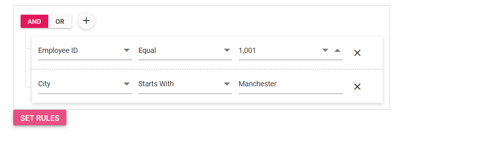

# Importing

Importing allows you to view or edit the predefined conditions which is available in List rules or SQL rules. You can import the conditions either initial rendering or post rendering.

## Initial rendering

To apply conditions initially, you can define the condition and rules in **QueryBuilderRule** . Here, you can import list of rules by defining the **QueryBuilderRule**.

```csharp

@using Syncfusion.Blazor.QueryBuilder

<SfQueryBuilder DataSource="@EmployeeData" @ref="QueryBuilderObj">
    <QueryBuilderRule Condition="or" Rules="Rules"></QueryBuilderRule>
    <QueryBuilderColumns>
        <QueryBuilderColumn Field="EmployeeID" Label="Employee ID" Type="ColumnType.Number"></QueryBuilderColumn>
        <QueryBuilderColumn Field="FirstName" Label="First Name" Type="ColumnType.String"></QueryBuilderColumn>
        <QueryBuilderColumn Field="TitleOfCourtesy" Label="Title Of Courtesy" Type="ColumnType.Boolean"></QueryBuilderColumn>
        <QueryBuilderColumn Field="HireDate" Label="Hire Date" Type="ColumnType.Date"></QueryBuilderColumn>
        <QueryBuilderColumn Field="Country" Label="Country" Type="ColumnType.String"></QueryBuilderColumn>
        <QueryBuilderColumn Field="City" Label="City" Type="ColumnType.String"></QueryBuilderColumn>
    </QueryBuilderColumns>
</SfQueryBuilder>

@code {
    SfQueryBuilder<EmployeeDetails> QueryBuilderObj;
    List<RuleModel> Rules = new List<RuleModel>()
    {
            new RuleModel { Field="Country", Label="Country", Type="String", Operator="equal", Value = "England" },
            new RuleModel { Field="EmployeeID", Label="EmployeeID",  Type="Number", Operator="notequal", Value = 1001 }
    };
    public List<EmployeeDetails> EmployeeData = new List<EmployeeDetails>
    {
        new EmployeeDetails{ FirstName = "Martin", EmployeeID = 1001, Country = "England", City = "Manchester", HireDate = new DateTime(2014, 4, 23) },
        new EmployeeDetails{ FirstName = "Benjamin", EmployeeID = 1002, Country = "England", City = "Birmingham", HireDate = new DateTime(2014, 6, 19) },
        new EmployeeDetails{ FirstName = "Stuart", EmployeeID = 1003, Country = "England", City = "London", HireDate = new DateTime(2014, 7, 4) },
        new EmployeeDetails{ FirstName = "Ben", EmployeeID = 1004, Country = "USA", City = "California", HireDate = new DateTime(2014, 8, 15) },
        new EmployeeDetails{ FirstName = "Joseph", EmployeeID = 1005, Country = "Spain", City = "Madrid", HireDate = new DateTime(2014, 8, 29) }
    };

    public class EmployeeDetails
    {
        public int EmployeeID { get; set; }
        public string FirstName { get; set; }
        public bool TitleOfCourtesy { get; set; }
        public string Title { get; set; }
        public DateTime HireDate { get; set; }
        public string Country { get; set; }
        public string City { get; set; }
    }
}
```

Output will be shown as


## Post rendering

### Importing from SQL

You can set the conditions from SQL query through the [`SetRulesFromSql`](https://help.syncfusion.com/cr/blazor/Syncfusion.Blazor.QueryBuilder.SfQueryBuilder.html#Syncfusion_Blazor_QueryBuilder_SfQueryBuilder_SetRulesFromSql_System_String_) method.
In the following sample sql rules binding on querybuilder on button click.

```csharp
@using Syncfusion.Blazor.QueryBuilder
@using Syncfusion.Blazor.Buttons

<SfQueryBuilder DataSource="@EmployeeData" @ref="QueryBuilderObj">
    <QueryBuilderColumns>
        <QueryBuilderColumn Field="EmployeeID" Label="Employee ID" Type="ColumnType.Number"></QueryBuilderColumn>
        <QueryBuilderColumn Field="FirstName" Label="First Name" Type="ColumnType.String"></QueryBuilderColumn>
        <QueryBuilderColumn Field="TitleOfCourtesy" Label="Title Of Courtesy" Type="ColumnType.Boolean"></QueryBuilderColumn>
        <QueryBuilderColumn Field="HireDate" Label="Hire Date" Type="ColumnType.Date"></QueryBuilderColumn>
        <QueryBuilderColumn Field="Country" Label="Country" Type="ColumnType.String"></QueryBuilderColumn>
        <QueryBuilderColumn Field="City" Label="City" Type="ColumnType.String"></QueryBuilderColumn>
    </QueryBuilderColumns>
</SfQueryBuilder>
<SfButton CssClass="e-primary" @onclick="setRules">Set Rules</SfButton>

@code {
    SfQueryBuilder<EmployeeDetails> QueryBuilderObj;
    public List<EmployeeDetails> EmployeeData = new List<EmployeeDetails>
    {
        new EmployeeDetails{ FirstName = "Martin", EmployeeID = 1001, Country = "England", City = "Manchester", HireDate = new DateTime(2014, 4, 23) },
        new EmployeeDetails{ FirstName = "Benjamin", EmployeeID = 1002, Country = "England", City = "Birmingham", HireDate = new DateTime(2014, 6, 19) },
        new EmployeeDetails{ FirstName = "Stuart", EmployeeID = 1003, Country = "England", City = "London", HireDate = new DateTime(2014, 7, 4) },
        new EmployeeDetails{ FirstName = "Ben", EmployeeID = 1004, Country = "USA", City = "California", HireDate = new DateTime(2014, 8, 15) },
        new EmployeeDetails{ FirstName = "Joseph", EmployeeID = 1005, Country = "Spain", City = "Madrid", HireDate = new DateTime(2014, 8, 29) }
    };

    public class EmployeeDetails
    {
        public int EmployeeID { get; set; }
        public string FirstName { get; set; }
        public bool TitleOfCourtesy { get; set; }
        public string Title { get; set; }
        public DateTime HireDate { get; set; }
        public string Country { get; set; }
        public string City { get; set; }
    }

    private void setRules()
    {
        QueryBuilderObj.SetRulesFromSql("EmployeeID = 1001 AND City LIKE ('Manchester%')");
    }
}
```

Output will be shown as



## Exporting

Exporting allows you to save or maintain the created conditions through the [Blazor Query Builder](https://www.syncfusion.com/blazor-components/blazor-query-builder). You can export the defined conditions by the following ways.

## Exporting to SQL

You can export the defined conditions to SQL query through the [`GetSqlFromRules`](https://help.syncfusion.com/cr/blazor/Syncfusion.Blazor.QueryBuilder.SfQueryBuilder.html#Syncfusion_Blazor_QueryBuilder_SfQueryBuilder_GetSqlFromRules) method.

```csharp
@using Syncfusion.Blazor.QueryBuilder
@using Syncfusion.Blazor.Buttons

<SfQueryBuilder DataSource="@EmployeeDetails" Rule="@ImportRules" @ref="QueryBuilderObj">
    <QueryBuilderColumns>
        <QueryBuilderColumn Field="EmployeeID" Label="Employee ID" Type="ColumnType.Number"></QueryBuilderColumn>
        <QueryBuilderColumn Field="FirstName" Label="First Name" Type="ColumnType.String"></QueryBuilderColumn>
        <QueryBuilderColumn Field="TitleOfCourtesy" Label="Title Of Courtesy" Type="ColumnType.Boolean"></QueryBuilderColumn>
        <QueryBuilderColumn Field="HireDate" Label="Hire Date" Type="ColumnType.Date"></QueryBuilderColumn>
        <QueryBuilderColumn Field="Country" Label="Country" Type="ColumnType.String"></QueryBuilderColumn>
        <QueryBuilderColumn Field="City" Label="City" Type="ColumnType.String"></QueryBuilderColumn>
    </QueryBuilderColumns>
</SfQueryBuilder>
<SfButton CssClass="e-primary" @onclick="getSql">Get SQL</SfButton>

@code {
    SfQueryBuilder QueryBuilderObj;
    public List<Employee> EmployeeDetails = new List<Employee>
        {
        new Employee{ FirstName = "Martin", EmployeeID = "1001", Country = "England", City = "Manchester", HireDate = "23/04/2014" },
        new Employee{ FirstName = "Benjamin", EmployeeID = "1002", Country = "England", City = "Birmingham", HireDate = "19/06/2014" },
        new Employee{ FirstName = "Stuart", EmployeeID = "1003", Country = "England", City = "London", HireDate = "04/07/2014"},
        new Employee{ FirstName = "Ben", EmployeeID = "1004", Country = "USA", City = "California", HireDate = "15/08/2014" },
        new Employee{ FirstName = "Joseph", EmployeeID = "1005", Country = "Spain", City = "Madrid", HireDate = "29/08/2014" }
    };

    public class Employee {
        public string FirstName { get; set; }
        public string EmployeeID { get; set; }
        public string Country { get; set; }
        public string City { get; set; }
        public string HireDate { get; set; }
    }

    public QueryBuilderRule ImportRules = new QueryBuilderRule
    {
        Condition = "or",
        Rules = new List<RuleModel>{
            new RuleModel { Field = "EmployeeID", type="Number",  Value = 1001, Operator = "notequal" },
            new RuleModel { Field = "Country", type="String", Value = "England", Operator = "equal" }
        }
    };

    private async void getSql()
    {
        string sql = await QueryBuilderObj.GetSqlFromRules();
    }
 }

```

> You can also explore our [Blazor Query Builder example](https://blazor.syncfusion.com/demos/query-builder/default-functionalities?theme=bootstrap4) to knows how to render and configure the query builder.