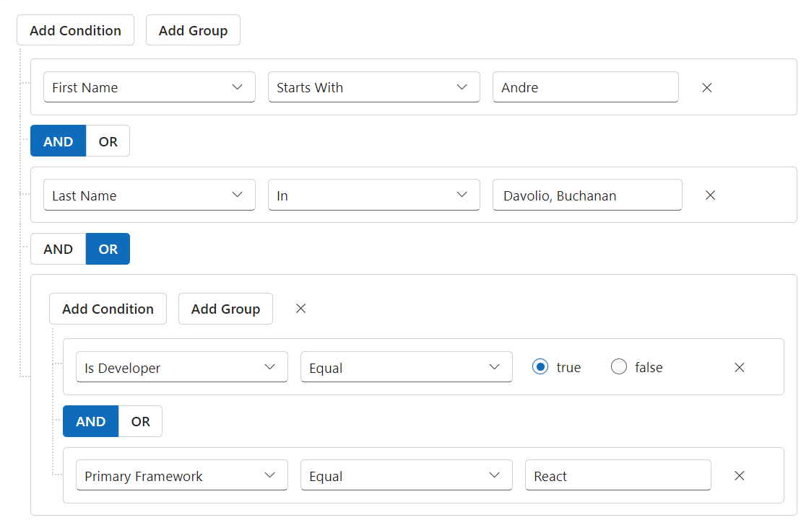

# Separate Connector in Blazor QueryBuilder Component

The [Blazor Query Builder](https://www.syncfusion.com/blazor-components/blazor-query-builder) provides the functionality to integrate standalone connectors between rules or groups within the same group. This allows for greater flexibility, as users can connect rules or groups using different connectors, enhancing the complexity and precision of query construction. You can use [EnableIndividualConditions](https://help.syncfusion.com/cr/blazor/Syncfusion.Blazor.QueryBuilder.QueryBuilderEnableIndividualConditions.html) to perform separate connector functionality.

```cshtml
@using Syncfusion.Blazor.QueryBuilder

<SfQueryBuilder TValue="EmployeeDetails" @ref="QuerybuilderObj" EnableIndividualConditions="true">
    <QueryBuilderRule Condition="or" Rules="@Rules"></QueryBuilderRule>
    <QueryBuilderColumns>
        <QueryBuilderColumns>
            <QueryBuilderColumn Field="EmployeeID" Label="Employee ID" Type="ColumnType.Number"></QueryBuilderColumn>
                <QueryBuilderColumn Field="FirstName" Label="First Name" Type="ColumnType.String"></QueryBuilderColumn>
                <QueryBuilderColumn Field="LastName" Label="Last Name" Type="ColumnType.String"></QueryBuilderColumn>
                <QueryBuilderColumn Field="IsDeveloper" Label="IsDeveloper" Type="ColumnType.Boolean"></QueryBuilderColumn>
                <QueryBuilderColumn Field="Age" Label="Age" Type="ColumnType.Number"></QueryBuilderColumn>
                <QueryBuilderColumn Field="PrimaryFramework" Label="Primary Framework" Type="ColumnType.String"></QueryBuilderColumn>
                <QueryBuilderColumn Field="HireDate" Label="Hire Date" Type="ColumnType.Date"></QueryBuilderColumn>
                <QueryBuilderColumn Field="Country" Label="Country" Type="ColumnType.String"></QueryBuilderColumn>
        </QueryBuilderColumns>
    </QueryBuilderColumns>
</SfQueryBuilder>

@code {
    SfQueryBuilder<EmployeeDetails> QuerybuilderObj;
    List<RuleModel> Rules = new List<RuleModel>()
    {
        new RuleModel { Label="First Name", Field="FirstName", Type="String", Operator="equal", Value = "Andre", Condition = "and" },
        new RuleModel { Label="Last Name", Field="LastName", Type="String", Operator="in", Value = new string[] { "Davolio", "Buchanan" } },
        new RuleModel { Label="Last Name", Field="LastName", Type="String", Operator="equal", Value = "Davolio", Condition = "or" },
        new RuleModel { Label="Age", Field="Age", Type="Number", Operator="equal", Value = 29, Condition = "and" },
        new RuleModel {
            Condition = "or", Rules = new List<RuleModel>() {
                new RuleModel { Label= "Is Developer", Field = "IsDeveloper", Type = "Boolean", Operator = "equal", Value = true, Condition = "and" },
                new RuleModel { Label= "Primary Framework", Field = "PrimaryFramework", Type = "String", Operator = "equal", Value = "React"}
            }
        }
    };

    public class EmployeeDetails
    {
        public int EmployeeID { get; set; }
        public string FirstName { get; set; }
        public string LastName { get; set; }
        public int Age { get; set; }
        public bool IsDeveloper { get; set; }
        public string PrimaryFramework { get; set; }
        public DateTime HireDate { get; set; }
        public string Country { get; set; }
    }
}

```



N> You can also explore our [Blazor Query Builder example](https://blazor.syncfusion.com/demos/query-builder/default-functionalities?theme=bootstrap4) to know how to render and configure the query builder.