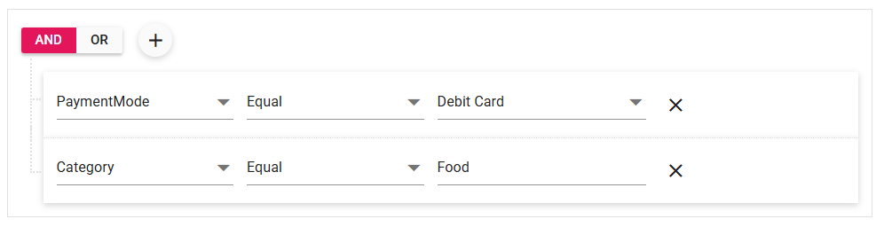

# Templates in Blazor QueryBuilder Component

This section describes the template options available in the [Blazor Query Builder](https://www.syncfusion.com/blazor-components/blazor-query-builder) to customize editors and layout.

## Value Template

Use a value template to render a custom editor for a column’s value field. Define the template with the [`ValueTemplate`](https://help.syncfusion.com/cr/blazor/Syncfusion.Blazor.QueryBuilder.QueryBuilderTemplates.html#Syncfusion_Blazor_QueryBuilder_QueryBuilderTemplates_ValueTemplate) property.

```cshtml
@using Syncfusion.Blazor.QueryBuilder
@using Syncfusion.Blazor.DropDowns

<div class="col-lg-12 control-section">
    <SfQueryBuilder TValue="ExpenseData" Width="100%" DataSource="@DataSource">
        <QueryBuilderRule Condition="and" Rules="@Rules"></QueryBuilderRule>
        <QueryBuilderColumns>
            <QueryBuilderColumn Field="PaymentMode" Label="PaymentMode" Type=Syncfusion.Blazor.QueryBuilder.ColumnType.String>
                <QueryBuilderTemplates>
                    <ValueTemplate>
                        @{
                            string value = context.Value != null ? context.Value : DefaultValue;
                        }
                        <SfDropDownList TValue="string" TItem="ItemFields" DataSource="@Items" @bind-Value="@value">
                            <DropDownListFieldSettings Text="Id"></DropDownListFieldSettings>
                            <DropDownListEvents TItem="ItemFields" TValue="string" ValueChange="e => OnChange(e, context)"></DropDownListEvents>
                        </SfDropDownList>
                    </ValueTemplate>
                </QueryBuilderTemplates>
            </QueryBuilderColumn>
            <QueryBuilderColumn Field="Category" Label="Category" Type=Syncfusion.Blazor.QueryBuilder.ColumnType.String></QueryBuilderColumn>
            <QueryBuilderColumn Field="Description" Label="Description" Type=ColumnType.String></QueryBuilderColumn>
            <QueryBuilderColumn Field="Amount" Label="Amount" Type=Syncfusion.Blazor.QueryBuilder.ColumnType.Number></QueryBuilderColumn>
        </QueryBuilderColumns>
    </SfQueryBuilder>
</div>
@code{
    public string DefaultValue = "Cash";
    public List<ExpenseData> DataSource;
    public class ExpenseData
    {
        public string Category { get; set; }
        public string PaymentMode { get; set; }
        public string Description { get; set; }
        public int Amount { get; set; }
    }
    protected override void OnInitialized()
    {
        DataSource = new List<ExpenseData>()
        {
            new ExpenseData() {Category= "Food", PaymentMode="Credit Card", Description="Boiled peanuts", Amount=100 },
            new ExpenseData() {Category= "Food", PaymentMode="Debit Card", Description="Boiled peanuts", Amount=200 },
            new ExpenseData() {Category= "Food", PaymentMode="Cash", Description="Confederate cush", Amount=300 },
            new ExpenseData() {Category= "Transportation", PaymentMode="Cash", Description="Public and other transportation", Amount=150 },
            new ExpenseData() {Category= "Transportation", PaymentMode="Debit Card", Description="Public and other transportation", Amount=250 }
        };
    }
    public class ItemFields
    {
        public string Id { get; set; }
    }
    public List<ItemFields> Items = new List<ItemFields>() {
        new ItemFields(){ Id= "Cash" },
        new ItemFields(){ Id= "Debit Card" },
        new ItemFields(){ Id= "Credit Card" },
        new ItemFields(){ Id= "Net Banking" }
    };
    public void OnChange(Syncfusion.Blazor.DropDowns.ChangeEventArgs<string, ItemFields> args, RuleModel Rule)
    {
        Rule.Value = args.Value;
    }
    List<RuleModel> Rules = new List<RuleModel>()
    {
        new RuleModel { Label="PaymentMode", Field="PaymentMode", Type="String", Operator="equal", Value="Debit Card" },
        new RuleModel { Label="Category", Field="Category", Type="String", Operator="equal", Value="Food" }
    };
}

```



## Column Template

A column template allows customizing the entire editor area for a column, including the field and value UI. Define the template with the [`ColumnTemplate`](https://help.syncfusion.com/cr/blazor/Syncfusion.Blazor.QueryBuilder.QueryBuilderTemplates.html#Syncfusion_Blazor_QueryBuilder_QueryBuilderTemplates_ColumnTemplate) property.

In the following sample, the DropDownList component is used as a custom editor for both the field and value in the PaymentMode column.

```cshtml

@using Syncfusion.Blazor.QueryBuilder
@using Syncfusion.Blazor.DropDowns
@using Newtonsoft.Json

<div class="col-lg-12 control-section">
    <SfQueryBuilder TValue="ExpenseData" @ref="qb" DataSource="@DataSource" Width="75%">
        <QueryBuilderEvents TValue="ExpenseData" Created="UpdateContent" RuleChanged="UpdateContent"></QueryBuilderEvents>
        <QueryBuilderRule Condition="and" Rules="@Rules"></QueryBuilderRule>
        <QueryBuilderColumns>
            <QueryBuilderColumn Field="PaymentMode" Label="PaymentMode" Type=Syncfusion.Blazor.QueryBuilder.ColumnType.String>
                <QueryBuilderTemplates>
                    <ColumnTemplate>
                        <div class="e-field">
                            <SfDropDownList TItem="string" TValue="string" DataSource="@Columns" @bind-Value="context.Label">
                                <DropDownListFieldSettings Text="PaymentMode"></DropDownListFieldSettings>
                                <DropDownListEvents TItem="string" TValue="string" Created="e => ValueCreated(context)" ValueChange="e => ChangeField(e, context)"></DropDownListEvents>
                            </SfDropDownList>
                        </div>
                        <div class="e-value-field">
                            <SfDropDownList TValue="string" TItem="ItemFields" DataSource="@Items" @bind-Value="@DefaultValue">
                                <DropDownListFieldSettings Text="Id"></DropDownListFieldSettings>
                                <DropDownListEvents TItem="ItemFields" TValue="string" ValueChange="e => ChangeValue(e, context)"></DropDownListEvents>
                            </SfDropDownList>
                        </div>
                    </ColumnTemplate>
                </QueryBuilderTemplates>
            </QueryBuilderColumn>
            <QueryBuilderColumn Field="Category" Label="Category" Type=Syncfusion.Blazor.QueryBuilder.ColumnType.String></QueryBuilderColumn>
            <QueryBuilderColumn Field="Description" Label="Description" Type=ColumnType.String></QueryBuilderColumn>
            <QueryBuilderColumn Field="Amount" Label="Amount" Type=Syncfusion.Blazor.QueryBuilder.ColumnType.Number></QueryBuilderColumn>
        </QueryBuilderColumns>
    </SfQueryBuilder>
</div>

<table class="col-lg-3">
    <tbody>
        <tr>
            <td colspan="2">
                <textarea id="table" readonly>@content</textarea>
            </td>
        </tr>
    </tbody>
</table>


@code {
    SfQueryBuilder<ExpenseData> qb;
    private string content;
    public List<ExpenseData> DataSource;
    public string DefaultValue = "Cash";

    public class ItemFields
    {
        public string Id { get; set; }
    }

    public List<ItemFields> Items = new List<ItemFields>() {
        new ItemFields(){ Id= "Cash" },
        new ItemFields(){ Id= "Debit Card" },
        new ItemFields(){ Id= "Credit Card" },
        new ItemFields(){ Id= "Net Banking" }
    };

    public string[] Columns = new string[] {
        "PaymentMode", "Category", "Description", "Amount"
    };

    public void UpdateContent()
    {
        content = JsonConvert.SerializeObject(qb.GetValidRules(), Formatting.Indented, new JsonSerializerSettings
        {
            NullValueHandling = NullValueHandling.Ignore
        });
    }

    public void ValueCreated(RuleModel Rule)
    {
        Rule.Value = "Cash";
        UpdateContent();
    }

    public void ChangeValue(Syncfusion.Blazor.DropDowns.ChangeEventArgs<string, ItemFields> args, RuleModel Rule)
    {
        Rule.Value = args.Value;
        UpdateContent();
    }

    private void ChangeField(Syncfusion.Blazor.DropDowns.ChangeEventArgs<string, string> args, RuleModel Rule)
    {
        Rule.Field = args.Value;
        Rule.Label = args.Value;
        Rule.Operator = "equal";
        UpdateContent();
    }

    public class ExpenseData
    {
        public string Category { get; set; }
        public string PaymentMode { get; set; }
        public string Description { get; set; }
        public int Amount { get; set; }
    }
    protected override void OnInitialized()
    {
        DataSource = new List<ExpenseData>()
        {
            new ExpenseData() {Category= "Food", PaymentMode="Credit Card", Description="Boiled peanuts", Amount=100 },
            new ExpenseData() {Category= "Food", PaymentMode="Debit Card", Description="Boiled peanuts", Amount=200 },
            new ExpenseData() {Category= "Food", PaymentMode="Cash", Description="Confederate cush", Amount=300 },
            new ExpenseData() {Category= "Transportation", PaymentMode="Cash", Description="Public and other transportation", Amount=150 },
            new ExpenseData() {Category= "Transportation", PaymentMode="Debit Card", Description="Public and other transportation", Amount=250 }
        };
    }

    List<RuleModel> Rules = new List<RuleModel>()
    {
        new RuleModel { Label="PaymentMode", Field="PaymentMode", Type="String", Operator="equal", Value="Cash" }
    };
}

<style>
    .e-query-builder {
        margin: 0 auto;
        float: left;
    }
    .e-rule-field .e-field,
    .e-rule-field .e-value-field {
        display: inline-block;
    }
    .e-rule-field .e-value-field {
        padding-left: 20px;
    }

    #table {
        width: 110%;
        height: 500px;
        border: 1px solid grey;
        overflow: auto;
        font-family: monospace;
    }
</style>

```


## Header Template

A header template customizes the group header area, including the AND/OR operators and the Add Rule/Add Group actions. Define the template with the [`HeaderTemplate`](https://help.syncfusion.com/cr/blazor/Syncfusion.Blazor.QueryBuilder.QueryBuilderTemplates.html#Syncfusion_Blazor_QueryBuilder_QueryBuilderTemplates_HeaderTemplate) property.

In the following sample, the DropDownList is used to switch the group condition (AND/OR), and buttons are used to add or delete groups and add conditions.

```cshtml

@using Syncfusion.Blazor.QueryBuilder
@using Syncfusion.Blazor.DropDowns
@using Syncfusion.Blazor.Buttons

<SfQueryBuilder TValue="EmployeeDetails" @ref="qbObj">
    <QueryBuilderRule Condition="and" Rules="Rules"></QueryBuilderRule>
    <QueryBuilderTemplates>
        <HeaderTemplate>
            <SfDropDownList ID="@context.ID" TValue="string" TItem="Operator" CssClass="e-outline" Width="100px" DataSource="@operData" @ref="ddlObj">
                <DropDownListFieldSettings Text="Text"></DropDownListFieldSettings>
                <DropDownListEvents TValue="string" TItem="Operator" Created="e => ddlCreated(e, context)" ValueChange="e => onChange(e, context)"></DropDownListEvents>
            </SfDropDownList>
            <div id="addgrp">
                <SfButton Content="Add Group" CssClass="e-small e-outline" @onclick="e => addGrpBtn(e, context)"></SfButton>
            </div>
            <div id="addgrp">
                <SfButton Content="Add Condition" CssClass="e-small e-outline" @onclick="e => addCondBtn(e, context)"></SfButton>
            </div>
            @if (context.ID.Split("_")[1].IndexOf("0") < 0)
            {
                <div id="addgrp">
                    <SfButton Content="Delete Group" CssClass="e-small e-outline e-danger" @onclick="e => deleteGrpBtn(e, context)"></SfButton>
                </div>
            }
        </HeaderTemplate>
    </QueryBuilderTemplates>
    <QueryBuilderColumns>
        <QueryBuilderColumn Field="EmployeeID" Label="Employee ID" Type="ColumnType.Number"></QueryBuilderColumn>
        <QueryBuilderColumn Field="FirstName" Label="First Name" Type="ColumnType.String"></QueryBuilderColumn>
        <QueryBuilderColumn Field="TitleOfCourtesy" Label="Title of Courtesy" Type="ColumnType.Boolean" Values="Values"></QueryBuilderColumn>
        <QueryBuilderColumn Field="Title" Label="Title" Type="ColumnType.String"></QueryBuilderColumn>
        <QueryBuilderColumn Field="HireDate" Label="Hire Date" Type="ColumnType.Date"></QueryBuilderColumn>
        <QueryBuilderColumn Field="Country" Label="Country" Type="ColumnType.String"></QueryBuilderColumn>
        <QueryBuilderColumn Field="City" Label="City" Type="ColumnType.String"></QueryBuilderColumn>
    </QueryBuilderColumns>
</SfQueryBuilder>

@code {
    SfDropDownList<string, Operator> ddlObj { set { ddlRefs.Add(value); } }
    SfQueryBuilder<EmployeeDetails> qbObj;
    List<SfDropDownList<string, Operator>> ddlRefs = new List<SfDropDownList<string, Operator>>();
    private string[] Values = new string[] { "Mr.", "Mrs." };
    private string grpID;
    List<RuleModel> Rules = new List<RuleModel>()
    {
            new RuleModel { Field="Country", Label="Country", Type="String", Operator="equal", Value = "England" },
            new RuleModel { Field="EmployeeID", Label="EmployeeID",  Type="Number", Operator="notequal", Value = 1001 },
            new RuleModel { Condition="or", Rules=new List<RuleModel>() { new RuleModel() { Field="FirstName", Label="First Name", Type = "String", Operator ="equal", Value="Mark" } }}
    };
    public class Operator
    {
        public string Text { get; set; }
    }
    public class EmployeeDetails
    {
        public int EmployeeID { get; set; }
        public string FirstName { get; set; }
        public bool TitleOfCourtesy { get; set; }
        public string Title { get; set; }
        public DateTime HireDate { get; set; }
        public string Country { get; set; }
        public string City { get; set; }
    }
    List<Operator> operData = new List<Operator>()
    {
        new Operator() { Text = "AND" },
        new Operator() { Text = "OR" }
    };
    private void ddlCreated(Object obj, HeaderTemplateModel model)
    {
        foreach (SfDropDownList<string, Operator> ddlObj in ddlRefs)
        {
            if (ddlObj.ID == model.ID)
            {
                ddlObj.Value = model.Condition.ToUpper();
            }
        }
    }
    private void onChange(ChangeEventArgs<string, Operator> args, HeaderTemplateModel model)
    {
        if (args.IsInteracted)
        {
            model.Condition = args.Value.ToLower();
        }
    }
    private void addGrpBtn(MouseEventArgs args, HeaderTemplateModel model)
    {
        grpID = model.ID.Split("_")[1];
        qbObj.AddGroup(new RuleModel { Condition = "or", Rules = new List<RuleModel>() { new RuleModel() } }, grpID);
    }
    private void addCondBtn(MouseEventArgs args, HeaderTemplateModel model)
    {
        grpID = model.ID.Split("_")[1];
        qbObj.AddRule(new RuleModel(), grpID);
    }
    private void deleteGrpBtn(MouseEventArgs args, HeaderTemplateModel model)
    {
        grpID = model.ID.Split("_")[1];
        qbObj.DeleteGroup(grpID);
    }
}

<style>
    #addgrp {
        display: inline-block;
        padding: 0 0 0 12px;
    }
</style>

```


N> Explore the [Blazor Query Builder example](https://blazor.syncfusion.com/demos/query-builder/default-functionalities?theme=bootstrap5) to know how to render and configure the query builder.