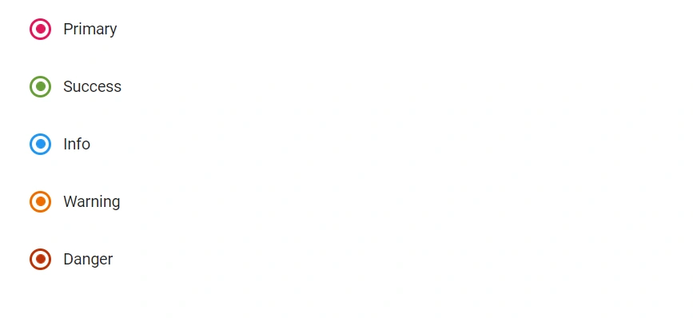
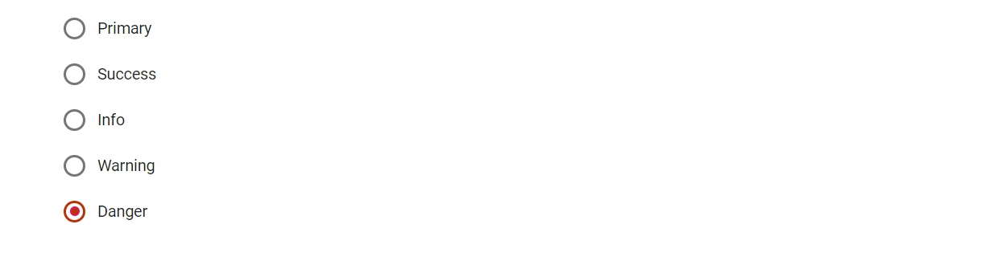
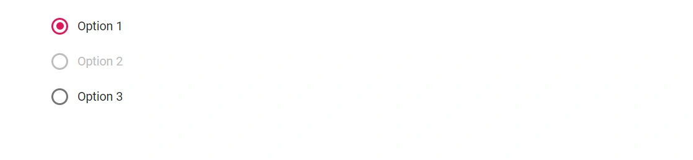

# Styles and Appearances in Blazor RadioButton Component

To modify the RadioButton appearance, override the component’s default CSS. The following table lists common CSS selectors and their purposes within the RadioButton. Ensure custom CSS is loaded after the Syncfusion theme so overrides take effect. A custom theme for all controls can also be created using the [Theme Studio](https://blazor.syncfusion.com/themestudio/?theme=material).

| CSS Class | Purpose of Class |
| ----- | ----- |
| .e-radio-wrapper | To customize the radio button wrapper. |
| .e-radio + label:hover::before | To customize the radiobutton on hover. |
| .e-radio:checked + label::after, e-radio:checked + label::before | To customize the checked radiobutton. |
| .e-radio:checked:focus + label::before, .e-radio:checked + label:hover::before | To customize the checked radiobutton on hover. |



## Customize Blazor RadioButton Appearance

Customize the appearance of the RadioButton component by applying custom CSS rules and assigning a CSS class to the [CssClass](https://help.syncfusion.com/cr/blazor/Syncfusion.Blazor.Buttons.SfInputBase-1.html#Syncfusion_Blazor_Buttons_SfInputBase_1_CssClass) property.

The background and border color of the radio button can be customized using custom classes to create primary, success, info, warning, and danger variants.

```cshtml
@using Syncfusion.Blazor.Buttons

<SfRadioButton Label="Primary" Name="custom" CssClass="e-primary" Value="Primary" @bind-Checked="stringChecked"></SfRadioButton><br />
<SfRadioButton Label="Success" Name="custom" CssClass="e-success" Value="Success" @bind-Checked="stringChecked"></SfRadioButton><br />
<SfRadioButton Label="Info" Name="custom" CssClass="e-info" Value="Info" @bind-Checked="stringChecked"></SfRadioButton><br />
<SfRadioButton Label="Warning" Name="custom" CssClass="e-warning" Value="Warning" @bind-Checked="stringChecked"></SfRadioButton><br />
<SfRadioButton Label="Danger" Name="custom" CssClass="e-danger" Value="Danger" @bind-Checked="stringChecked"></SfRadioButton>

@code {
    private string stringChecked = "Danger";
}

<style>
    .e-radio-wrapper.e-success .e-radio:checked + label::after { /* csslint allow: adjoining-classes */
        background-color: #689f38;
        color: #689f38;
    }

    .e-radio-wrapper.e-success .e-radio:checked:focus + label::after,
    .e-radio-wrapper.e-success .e-radio:checked + label:hover::after { /* csslint allow: adjoining-classes */
        background-color: #449d44;
    }

   .e-radio-wrapper.e-success .e-radio:checked + ::before {
        border-color: #689f38;
        background-color: #fff;
    }

    .e-radio-wrapper.e-success .e-radio:checked:focus + ::before,
    .e-radio-wrapper.e-success .e-radio:checked + label:hover::before { /* csslint allow: adjoining-classes */
        border-color: #449d44;
    }

    .e-radio-wrapper.e-success .e-radio + label:hover::before {
        border-color: #b1afaf;
    }

    .e-radio-wrapper.e-info .e-radio:checked + label::after { /* csslint allow: adjoining-classes */
        background-color: #2196f3;
        color: #2196f3;
    }

    .e-radio-wrapper.e-info .e-radio:checked:focus + label::after,
    .e-radio-wrapper.e-info .e-radio:checked + label:hover::after { /* csslint allow: adjoining-classes */
        background-color: #0b7dda;
    }

    .e-radio-wrapper.e-info .e-radio:checked + label::before {
        border-color: #2196f3;
        background-color: #fff;
    }

    .e-radio-wrapper.e-info .e-radio:checked:focus + label::before,
    .e-radio-wrapper.e-info .e-radio:checked + label:hover::before {
        border-color: #0b7dda;
    }

    .e-radio-wrapper.e-info .e-radio + label:hover::before {
        border-color: #b1afaf;
    }

    .e-radio-wrapper.e-warning .e-radio:checked + label::after { /* csslint allow: adjoining-classes */
        background-color: #ef6c00;
        color: #ef6c00;
    }

    .e-radio-wrapper.e-warning .e-radio:checked:focus + label::after,
    .e-radio-wrapper.e-warning .e-radio:checked + label:hover::after { /* csslint allow: adjoining-classes */
        background-color: #cc5c00;
    }

    .e-radio-wrapper.e-warning .e-radio:checked + label::before {
        border-color: #ef6c00;
        background-color: #fff;
    }

    .e-radio-wrapper.e-warning .e-radio:checked:focus + label::before,
    .e-radio-wrapper.e-warning .e-radio:checked + label:hover::before {
        border-color: #cc5c00;
    }

    .e-radio-wrapper.e-warning .e-radio + label:hover::before {
        border-color: #b1afaf;
    }

    .e-radio-wrapper.e-danger .e-radio:checked + label::after { /* csslint allow: adjoining-classes */
        background-color: #d84315;
        color: #d84315;
    }

    .e-radio-wrapper.e-danger .e-radio:checked:focus + label::after,
    .e-radio-wrapper.e-danger .e-radio:checked + label:hover::after { /* csslint allow: adjoining-classes */
        background-color: #ba330a;
    }

    .e-radio-wrapper.e-danger .e-radio:checked + label::before {
        border-color: #d84315;
        background-color: #fff;
    }

    .e-radio-wrapper.e-danger .e-radio:checked:focus + label::before,
    .e-radio-wrapper.e-danger .e-radio:checked + label:hover::before {
        border-color: #ba330a;
    }

    .e-radio-wrapper.e-danger .e-radio + label:hover::before {
        border-color: #b1afaf
    }
</style>

```




## Right-To-Left in Blazor RadioButton Component

The RadioButton component supports right-to-left (RTL) layout, Enable RTL by setting the [EnableRtl](https://help.syncfusion.com/cr/blazor/Syncfusion.Blazor.Buttons.SfInputBase-1.html#Syncfusion_Blazor_Buttons_SfInputBase_1_EnableRtl) as `true`.

The following example illustrates enabling right-to-left support in the RadioButton component. RTL can also be configured globally for all Syncfusion components during service registration.

```cshtml
@using Syncfusion.Blazor.Buttons

<SfRadioButton Label="Default" EnableRtl="true" Value="Default" @bind-Checked="stringChecked"></SfRadioButton>

@code {
    private string stringChecked = "Default";
}

```


## Set the disabled state in Blazor RadioButton Component

The RadioButton component can be enabled/disabled by setting [Disabled](https://help.syncfusion.com/cr/blazor/Syncfusion.Blazor.Buttons.SfInputBase-1.html#Syncfusion_Blazor_Buttons_SfInputBase_1_Disabled) property. To disable Radio Button component, the `Disabled` property can be set as `true`.

```cshtml
@using Syncfusion.Blazor.Buttons

<SfRadioButton Label="Option 1" Name="default" Value="Checked" @bind-Checked="stringChecked"></SfRadioButton><br />
<SfRadioButton Label="Option 2" Name="default" Value="Disable" @bind-Checked="stringChecked" Disabled="true"></SfRadioButton><br />
<SfRadioButton Label="Option 3" Name="default" Value="None" @bind-Checked="stringChecked"></SfRadioButton>

@code {
    private string stringChecked = "Checked";
}

```



## Radio Button Model Binding in Blazor RadioButton Component

To get started quickly with model binding in the Blazor RadioButton component, watch the following video:



This section demonstrates strongly typed view support with the RadioButton component. A strongly typed view binds to a model class, allowing access to its properties and rendering the component based on that data. In this example, the component is placed inside an EditForm and uses DataAnnotationsValidator for validation. The Name property groups the radio buttons so only one option can be selected, and @bind-Checked binds the model property to the selected Value.

In this sample, selecting Female triggers a validation error message below the radio button group because the Range attribute is configured to allow only the value "male". This demonstrates how validation rules on the model control the allowed selection and display validation feedback.

```cshtml

@using Syncfusion.Blazor.Buttons
@using System.ComponentModel.DataAnnotations

<EditForm Model="Annotate">
    <DataAnnotationsValidator></DataAnnotationsValidator>
    <div class="form-group">
        <SfRadioButton Label="Male" Name="Gender" Value="male" @bind-Checked="@Annotate.Gender"></SfRadioButton>
        <SfRadioButton Label="Female" Name="Gender" Value="female" @bind-Checked="@Annotate.Gender"></SfRadioButton>
        <ValidationMessage For="@(() => Annotate.Gender)" />
    </div>
</EditForm>

@code {

    public Annotation Annotate = new Annotation();

    public class Annotation
    {
        [Range(typeof(string), "male", "male", ErrorMessage = "Male gender is required.")]
        public string Gender { get; set; } = "male";
    }
}

```

