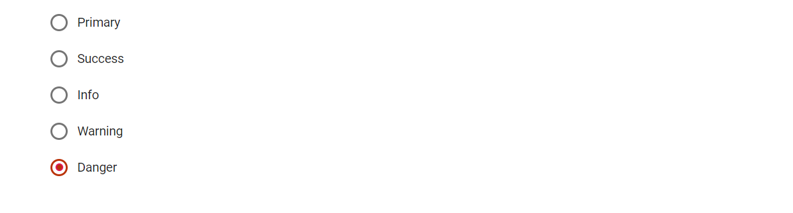

# Customize Blazor RadioButton Appearance

The appearance of the Radio Button component can be customized by using the CSS rules. Define own CSS rules according to your requirement and assign the class name to the [CssClass](https://help.syncfusion.com/cr/blazor/Syncfusion.Blazor.Buttons.SfInputBase-1.html#Syncfusion_Blazor_Buttons_SfInputBase_1_CssClass) property.

The background and border color of the Radio Button is customized through the custom classes to create the primary, success, info, warning, and danger type of Radio Button.

```cshtml
@using Syncfusion.Blazor.Buttons

<SfRadioButton Label="Primary" Name="custom" CssClass="e-primary" Value="Primary" @bind-Checked="stringChecked"></SfRadioButton><br />
<SfRadioButton Label="Success" Name="custom" CssClass="e-success" Value="Success" @bind-Checked="stringChecked"></SfRadioButton><br />
<SfRadioButton Label="Info" Name="custom" CssClass="e-info" Value="Info" @bind-Checked="stringChecked"></SfRadioButton><br />
<SfRadioButton Label="Warning" Name="custom" CssClass="e-warning" Value="Warning" @bind-Checked="stringChecked"></SfRadioButton><br />
<SfRadioButton Label="Danger" Name="custom" CssClass="e-danger" Value="Danger" @bind-Checked="stringChecked"></SfRadioButton>

@code {
    private string stringChecked = "Danger";
}

<style>
    .e-radio-wrapper.e-success .e-radio:checked + label::after { /* csslint allow: adjoining-classes */
        background-color: #689f38;
        color: #689f38;
    }

    .e-radio-wrapper.e-success .e-radio:checked:focus + label::after,
    .e-radio-wrapper.e-success .e-radio:checked + label:hover::after { /* csslint allow: adjoining-classes */
        background-color: #449d44;
    }

   .e-radio-wrapper.e-success .e-radio:checked + ::before {
        border-color: #689f38;
        background-color: #fff;
    }

    .e-radio-wrapper.e-success .e-radio:checked:focus + ::before,
    .e-radio-wrapper.e-success .e-radio:checked + label:hover::before { /* csslint allow: adjoining-classes */
        border-color: #449d44;
    }

    .e-radio-wrapper.e-success .e-radio + label:hover::before {
        border-color: #b1afaf;
    }

    .e-radio-wrapper.e-info .e-radio:checked + label::after { /* csslint allow: adjoining-classes */
        background-color: #2196f3;
        color: #2196f3;
    }

    .e-radio-wrapper.e-info .e-radio:checked:focus + label::after,
    .e-radio-wrapper.e-info .e-radio:checked + label:hover::after { /* csslint allow: adjoining-classes */
        background-color: #0b7dda;
    }

    .e-radio-wrapper.e-info .e-radio:checked + label::before {
        border-color: #2196f3;
        background-color: #fff;
    }

    .e-radio-wrapper.e-info .e-radio:checked:focus + label::before,
    .e-radio-wrapper.e-info .e-radio:checked + label:hover::before {
        border-color: #0b7dda;
    }

    .e-radio-wrapper.e-info .e-radio + label:hover::before {
        border-color: #b1afaf;
    }

    .e-radio-wrapper.e-warning .e-radio:checked + label::after { /* csslint allow: adjoining-classes */
        background-color: #ef6c00;
        color: #ef6c00;
    }

    .e-radio-wrapper.e-warning .e-radio:checked:focus + label::after,
    .e-radio-wrapper.e-warning .e-radio:checked + label:hover::after { /* csslint allow: adjoining-classes */
        background-color: #cc5c00;
    }

    .e-radio-wrapper.e-warning .e-radio:checked + label::before {
        border-color: #ef6c00;
        background-color: #fff;
    }

    .e-radio-wrapper.e-warning .e-radio:checked:focus + label::before,
    .e-radio-wrapper.e-warning .e-radio:checked + label:hover::before {
        border-color: #cc5c00;
    }

    .e-radio-wrapper.e-warning .e-radio + label:hover::before {
        border-color: #b1afaf;
    }

    .e-radio-wrapper.e-danger .e-radio:checked + label::after { /* csslint allow: adjoining-classes */
        background-color: #d84315;
        color: #d84315;
    }

    .e-radio-wrapper.e-danger .e-radio:checked:focus + label::after,
    .e-radio-wrapper.e-danger .e-radio:checked + label:hover::after { /* csslint allow: adjoining-classes */
        background-color: #ba330a;
    }

    .e-radio-wrapper.e-danger .e-radio:checked + label::before {
        border-color: #d84315;
        background-color: #fff;
    }

    .e-radio-wrapper.e-danger .e-radio:checked:focus + label::before,
    .e-radio-wrapper.e-danger .e-radio:checked + label:hover::before {
        border-color: #ba330a;
    }

    .e-radio-wrapper.e-danger .e-radio + label:hover::before {
        border-color: #b1afaf
    }
</style>

```

