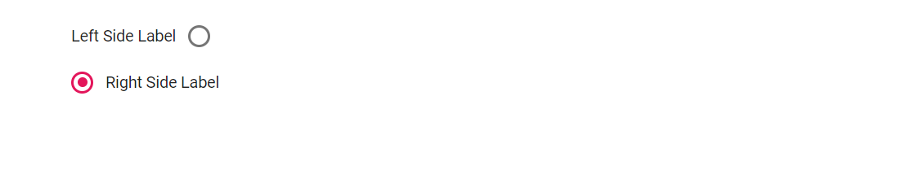

# Label and Size in Blazor RadioButton Component

This section explains how to configure labels and sizes for the RadioButton component.

## Label

Define the RadioButton caption using the [Label](https://help.syncfusion.com/cr/blazor/Syncfusion.Blazor.Buttons.SfRadioButton-1.html#Syncfusion_Blazor_Buttons_SfRadioButton_1_Label) property to automatically render an associated label element, improving accessibility and click/tap targets. Control where the label appears with the [LabelPosition](https://help.syncfusion.com/cr/blazor/Syncfusion.Blazor.Buttons.SfRadioButton-1.html#Syncfusion_Blazor_Buttons_SfRadioButton_1_LabelPosition) property (before or after the radio button). When multiple radio buttons share the same Name value, they form a group that allows only one selection.

```cshtml
@using Syncfusion.Blazor.Buttons

<SfRadioButton Label="Left Side Label" Name="position" LabelPosition="LabelPosition.Before" Value="Left"  @bind-Checked="stringChecked"></SfRadioButton><br />
<SfRadioButton Label="Right Side Label" Name="position" LabelPosition="LabelPosition.After" Value="Right" @bind-Checked="stringChecked"></SfRadioButton>

@code {
    private string stringChecked ="Right";
}

```



## Size

RadioButton supports two sizes: default and small. To render the small size, set the [CssClass](https://help.syncfusion.com/cr/blazor/Syncfusion.Blazor.Buttons.SfInputBase-1.html#Syncfusion_Blazor_Buttons_SfInputBase_1_CssClass) property to`e-small`.

```cshtml
@using Syncfusion.Blazor.Buttons

<SfRadioButton Label="Small" Name="size" CssClass="e-small" Value="Small" @bind-Checked="stringChecked"></SfRadioButton><br />
<SfRadioButton Label="Default" Name="size" Value="Default" @bind-Checked="stringChecked"></SfRadioButton>

@code {
    private string stringChecked ="Default";
}

```


## See Also

* [How to customize the Radio Button appearance](./how-to/customize-radiobutton-appearance)