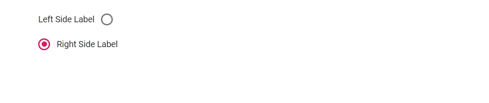
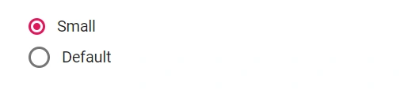

# Label and Size in Blazor Radio Button

This section explains how to configure labels and sizes for the Blazor Radio Button component.

## Label

Define the Blazor Radio Button caption using the [Label](https://help.syncfusion.com/cr/blazor/Syncfusion.Blazor.Buttons.SfRadioButton-1.html#Syncfusion_Blazor_Buttons_SfRadioButton_1_Label) property to automatically render an associated `<label>` element, improving accessibility and click/tap targets. Control where the label appears with the [LabelPosition](https://help.syncfusion.com/cr/blazor/Syncfusion.Blazor.Buttons.SfRadioButton-1.html#Syncfusion_Blazor_Buttons_SfRadioButton_1_LabelPosition) property. The following `LabelPosition` enum values are supported:

| Enum Value | Description |
| --- | --- |
| `LabelPosition.Before` | Renders the label to the **left** of the Blazor Radio Button component (right-to-left layouts render on the opposite side). |
| `LabelPosition.After` | Renders the label to the **right** of the Blazor Radio Button component (right-to-left layouts render on the opposite side). |

```cshtml
@using Syncfusion.Blazor.Buttons

<SfRadioButton Label="Left Side Label" Name="position" LabelPosition="LabelPosition.Before" Value="Left" @bind-Checked="stringChecked"></SfRadioButton><br />
<SfRadioButton Label="Right Side Label" Name="position" LabelPosition="LabelPosition.After" Value="Right" @bind-Checked="stringChecked"></SfRadioButton>

@code {
    private string stringChecked = "Right";
}
```



## Size

The Blazor Radio Button supports two sizes: default and small. To render the small size, set the [CssClass](https://help.syncfusion.com/cr/blazor/Syncfusion.Blazor.Buttons.SfInputBase-1.html#Syncfusion_Blazor_Buttons_SfInputBase_1_CssClass) property to `e-small`.

```cshtml
@using Syncfusion.Blazor.Buttons

<SfRadioButton Label="Small" Name="size" CssClass="e-small" Value="Small" @bind-Checked="stringChecked"></SfRadioButton><br />
<SfRadioButton Label="Default" Name="size" Value="Default" @bind-Checked="stringChecked"></SfRadioButton>

@code {
    private string stringChecked = "Default";
}
```



## See Also

* [Customization in Blazor Radio Button Component](./customization)
* [Accessibility in Blazor Radio Button Component](./accessibility)
* [Blazor Radio Button API reference](https://help.syncfusion.com/cr/blazor/Syncfusion.Blazor.Buttons.SfRadioButton-1.html)
