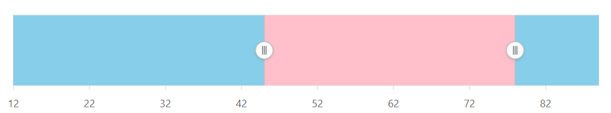
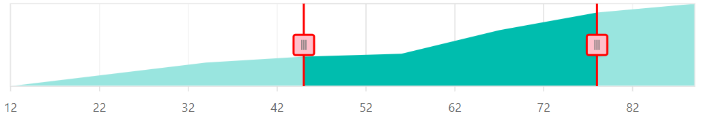
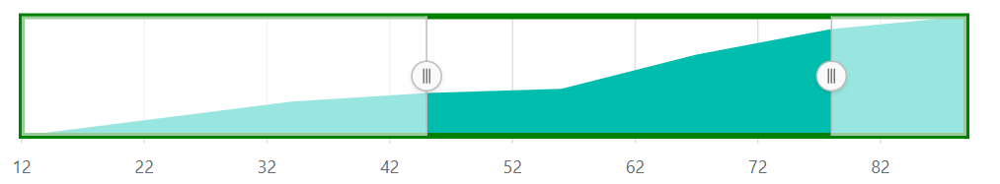

# Customization in Blazor Range Selector Component

## Navigator Appearance

Customize the Range Selector using [RangeNavigatorStyleSettings](https://help.syncfusion.com/cr/blazor/Syncfusion.Blazor.Charts.RangeNavigatorStyleSettings.html). Use [SelectedRegionColor](https://help.syncfusion.com/cr/blazor/Syncfusion.Blazor.Charts.RangeNavigatorStyleSettings.html#Syncfusion_Blazor_Charts_RangeNavigatorStyleSettings_SelectedRegionColor) to set the color for the selected region and [UnselectedRegionColor](https://help.syncfusion.com/cr/blazor/Syncfusion.Blazor.Charts.RangeNavigatorStyleSettings.html#Syncfusion_Blazor_Charts_RangeNavigatorStyleSettings_UnselectedRegionColor) for the unselected region.

```cshtml

@using Syncfusion.Blazor.Charts

<SfRangeNavigator Value="@Value">
    <RangeNavigatorRangeTooltipSettings Enable="true"></RangeNavigatorRangeTooltipSettings>
    <RangeNavigatorStyleSettings UnselectedRegionColor="skyblue" SelectedRegionColor="pink"></RangeNavigatorStyleSettings>
    <RangeNavigatorSeriesCollection>
        <RangeNavigatorSeries DataSource="@StockInfo" XName="Date" Type="RangeNavigatorType.Area" YName="Close">
        </RangeNavigatorSeries>
    </RangeNavigatorSeriesCollection>
</SfRangeNavigator>

@code {
    public class StockDetails
    {
        public double Date { get; set; }
        public double Close { get; set; }
    }

    public List<StockDetails> StockInfo = new List<StockDetails> {
        new StockDetails { Date = 12, Close = 28 },
        new StockDetails { Date = 34, Close = 44 },
        new StockDetails { Date = 45, Close = 48 },
        new StockDetails { Date = 56, Close = 50 },
        new StockDetails { Date = 67, Close = 66 },
        new StockDetails { Date = 78, Close = 78 },
        new StockDetails { Date = 89, Close = 84 }
    };

    public int[] Value = new int[] { 45, 78 };
}

```



## Thumb

Customize the thumb's border, fill color, size, and type using [RangeNavigatorThumbSettings](https://help.syncfusion.com/cr/blazor/Syncfusion.Blazor.Charts.RangeNavigatorThumbSettings.html), [RangeNavigatorThumbBorder](https://help.syncfusion.com/cr/blazor/Syncfusion.Blazor.Charts.RangeNavigatorThumbBorder.html), [Fill](https://help.syncfusion.com/cr/blazor/Syncfusion.Blazor.Charts.RangeNavigatorThumbSettings.html#Syncfusion_Blazor_Charts_RangeNavigatorThumbSettings_Fill), [Height](https://help.syncfusion.com/cr/blazor/Syncfusion.Blazor.Charts.RangeNavigatorThumbSettings.html#Syncfusion_Blazor_Charts_RangeNavigatorThumbSettings_Height), [Width](https://help.syncfusion.com/cr/blazor/Syncfusion.Blazor.Charts.RangeNavigatorThumbSettings.html#Syncfusion_Blazor_Charts_RangeNavigatorThumbSettings_Width), and [Type](https://help.syncfusion.com/cr/blazor/Syncfusion.Blazor.Charts.RangeNavigatorThumbSettings.html#Syncfusion_Blazor_Charts_RangeNavigatorThumbSettings_Type). Thumbs can be **Circle** or **Rectangle**.

```cshtml

@using Syncfusion.Blazor.Charts

<SfRangeNavigator Value="@Value">
    <RangeNavigatorStyleSettings>
        <RangeNavigatorThumbSettings Type="ThumbType.Rectangle" Fill="pink">
            <RangeNavigatorThumbBorder Width="2" Color="red"></RangeNavigatorThumbBorder>
        </RangeNavigatorThumbSettings>
    </RangeNavigatorStyleSettings>
    <RangeNavigatorRangeTooltipSettings Enable="true"></RangeNavigatorRangeTooltipSettings>
    <RangeNavigatorSeriesCollection>
        <RangeNavigatorSeries DataSource="@StockInfo" XName="Date" Type="RangeNavigatorType.Area" YName="Close">
        </RangeNavigatorSeries>
    </RangeNavigatorSeriesCollection>
</SfRangeNavigator>

@code {
    public class StockDetails
    {
        public double Date { get; set; }
        public double Close { get; set; }
    }

    public List<StockDetails> StockInfo = new List<StockDetails> {
        new StockDetails { Date = 12, Close = 28 },
        new StockDetails { Date = 34, Close = 44 },
        new StockDetails { Date = 45, Close = 48 },
        new StockDetails { Date = 56, Close = 50 },
        new StockDetails { Date = 67, Close = 66 },
        new StockDetails { Date = 78, Close = 78 },
        new StockDetails { Date = 89, Close = 84 }
    };

    public int[] Value = new int[] { 45, 78 };
}

```



## Border

Customize the Range Selector border using [RangeNavigatorBorder](https://help.syncfusion.com/cr/blazor/Syncfusion.Blazor.Charts.RangeNavigatorBorder.html). Set the [Width](https://help.syncfusion.com/cr/blazor/Syncfusion.Blazor.Charts.BorderModel.html#Syncfusion_Blazor_Charts_BorderModel_Width) and [Color](https://help.syncfusion.com/cr/blazor/Syncfusion.Blazor.Charts.BorderModel.html#Syncfusion_Blazor_Charts_BorderModel_Color) properties.

```cshtml

@using Syncfusion.Blazor.Charts

<SfRangeNavigator Value="@Value">
    <RangeNavigatorBorder Width="4" Color="Green"></RangeNavigatorBorder>
    <RangeNavigatorRangeTooltipSettings Enable="true"></RangeNavigatorRangeTooltipSettings>
    <RangeNavigatorSeriesCollection>
        <RangeNavigatorSeries DataSource="@StockInfo" XName="Date" Type="RangeNavigatorType.Area" YName="Close">
        </RangeNavigatorSeries>
    </RangeNavigatorSeriesCollection>
</SfRangeNavigator>

@code {
    public class StockDetails
    {
        public double Date { get; set; }
        public double Close { get; set; }
    }

    public List<StockDetails> StockInfo = new List<StockDetails> {
        new StockDetails { Date = 12, Close = 28 },
        new StockDetails { Date = 34, Close = 44 },
        new StockDetails { Date = 45, Close = 48 },
        new StockDetails { Date = 56, Close = 50 },
        new StockDetails { Date = 67, Close = 66 },
        new StockDetails { Date = 78, Close = 78 },
        new StockDetails { Date = 89, Close = 84 }
    };

    public int[] Value = new int[] { 45, 78 };
}

```



## Snapping

Enable the [AllowSnapping](https://help.syncfusion.com/cr/blazor/Syncfusion.Blazor.Charts.SfRangeNavigator.html#Syncfusion_Blazor_Charts_SfRangeNavigator_AllowSnapping) property to snap the slider to the nearest interval.

```cshtml

@using Syncfusion.Blazor.Charts

<SfRangeNavigator Value="@Value" AllowSnapping="true">
    <RangeNavigatorRangeTooltipSettings Enable="true"></RangeNavigatorRangeTooltipSettings>
    <RangeNavigatorSeriesCollection>
        <RangeNavigatorSeries DataSource="@StockInfo" XName="Date" Type="RangeNavigatorType.Area" YName="Close">
        </RangeNavigatorSeries>
    </RangeNavigatorSeriesCollection>
</SfRangeNavigator>

@code {
    public class StockDetails
    {
        public double Date { get; set; }
        public double Close { get; set; }
    }

    public List<StockDetails> StockInfo = new List<StockDetails> {
        new StockDetails { Date = 12, Close = 28 },
        new StockDetails { Date = 34, Close = 44 },
        new StockDetails { Date = 45, Close = 48 },
        new StockDetails { Date = 56, Close = 50 },
        new StockDetails { Date = 67, Close = 66 },
        new StockDetails { Date = 78, Close = 78 },
        new StockDetails { Date = 89, Close = 84 }
    };

    public int[] Value = new int[] { 45, 78 };
}

```

## Animation

Animation is enabled by default. Control the speed using the [AnimationDuration](https://help.syncfusion.com/cr/blazor/Syncfusion.Blazor.Charts.SfRangeNavigator.html#Syncfusion_Blazor_Charts_SfRangeNavigator_AnimationDuration) property. The default is **500** milliseconds.

```cshtml

@using Syncfusion.Blazor.Charts

<SfRangeNavigator Value="@Value" AnimationDuration="3000">
    <RangeNavigatorRangeTooltipSettings Enable="true"></RangeNavigatorRangeTooltipSettings>
    <RangeNavigatorSeriesCollection>
        <RangeNavigatorSeries DataSource="@StockInfo" XName="Date" Type="RangeNavigatorType.Area" YName="Close">
        </RangeNavigatorSeries>
    </RangeNavigatorSeriesCollection>
</SfRangeNavigator>

@code {
    public class StockDetails
    {
        public double Date { get; set; }
        public double Close { get; set; }
    }

    public List<StockDetails> StockInfo = new List<StockDetails> {
        new StockDetails { Date = 12, Close = 28 },
        new StockDetails { Date = 34, Close = 44 },
        new StockDetails { Date = 45, Close = 48 },
        new StockDetails { Date = 56, Close = 50 },
        new StockDetails { Date = 67, Close = 66 },
        new StockDetails { Date = 78, Close = 78 },
        new StockDetails { Date = 89, Close = 84 }
    };

    public int[] Value = new int[] { 45, 78 };
}

```

## See Also

* [Grid and Tick Lines](./grid-tick)
* [Labels](./labels)
