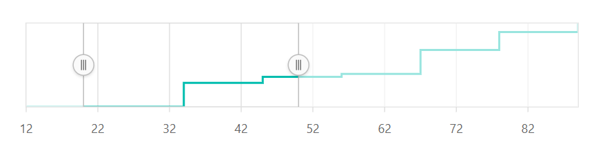
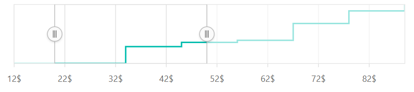
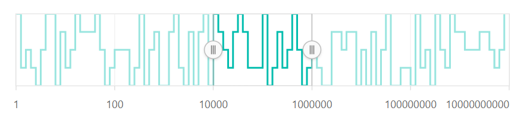
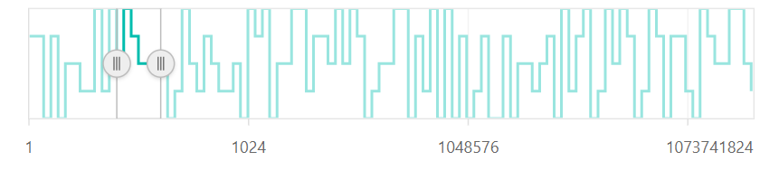
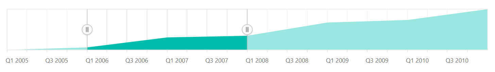
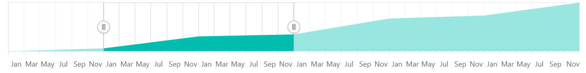

<!-- markdownlint-disable MD036 -->

# Type of Data in Blazor Range Selector Component

## Numeric

The numeric scale is used to represent the numeric values of data in a Range Selector. By default, the [ValueType](https://help.syncfusion.com/cr/blazor/Syncfusion.Blazor.Charts.SfRangeNavigator.html#Syncfusion_Blazor_Charts_SfRangeNavigator_ValueType) of a Range Selector is **Double**.

```cshtml

@using Syncfusion.Blazor.Charts

<SfRangeNavigator Value="@Value" ValueType=RangeValueType.Double>
    <RangeNavigatorSeriesCollection>
        <RangeNavigatorSeries DataSource="@StockInfo" XName="Day" Type="RangeNavigatorType.StepLine" YName="Close">
        </RangeNavigatorSeries>
    </RangeNavigatorSeriesCollection>
</SfRangeNavigator>

@code{

    public class StockDetails
    {
        public double Day { get; set; }
        public double Close { get; set; }
    }

    public List<StockDetails> StockInfo = new List<StockDetails>
    {
        new StockDetails {  Day = 12, Close = 28 },
        new StockDetails {  Day = 34, Close = 44 },
        new StockDetails {  Day = 45, Close = 48 },
        new StockDetails {  Day = 56, Close = 50 },
        new StockDetails {  Day = 67, Close = 66 },
        new StockDetails {  Day = 78, Close = 78 },
        new StockDetails {  Day = 89, Close = 84 }
    };
    
    public int[] Value = new int[] { 20, 50 };
}

```



### Range

The minimum and the maximum of the scale will be calculated automatically based on the provided data. It can be customized by using the [Minimum](https://help.syncfusion.com/cr/blazor/Syncfusion.Blazor.Charts.SfRangeNavigator.html#Syncfusion_Blazor_Charts_SfRangeNavigator_Minimum), [Maximum](https://help.syncfusion.com/cr/blazor/Syncfusion.Blazor.Charts.SfRangeNavigator.html#Syncfusion_Blazor_Charts_SfRangeNavigator_Maximum), and [Interval](https://help.syncfusion.com/cr/blazor/Syncfusion.Blazor.Charts.SfRangeNavigator.html#Syncfusion_Blazor_Charts_SfRangeNavigator_Interval) properties.

```cshtml

@using Syncfusion.Blazor.Charts

<SfRangeNavigator Interval="10" Value="@Value" ValueType=RangeValueType.Double>
    <RangeNavigatorSeriesCollection>
        <RangeNavigatorSeries DataSource="@StockInfo" XName="Date" Type="RangeNavigatorType.StepLine" YName="Close">
        </RangeNavigatorSeries>
    </RangeNavigatorSeriesCollection>
</SfRangeNavigator>

@code {

    public class StockDetails
    {
        public double Date { get; set; }
        public double Close { get; set; }
    }

    public int[] Value = new int[] { 60, 100 };

    public List<StockDetails> StockInfo = new List<StockDetails>
    {
      new StockDetails { Date = 10, Close = 35 },
      new StockDetails { Date = 20, Close = 28 },
      new StockDetails { Date = 30, Close = 34 },
      new StockDetails { Date = 40, Close = 32 },
      new StockDetails { Date = 50, Close = 40 },
      new StockDetails { Date = 60, Close = 30 },
      new StockDetails { Date = 70, Close = 4 },
      new StockDetails { Date = 80, Close = 22 },
      new StockDetails { Date = 90, Close = 30 },
      new StockDetails { Date = 100, Close =  43 },
      new StockDetails { Date = 110, Close =  60 },
      new StockDetails { Date = 120, Close =  33 },
      new StockDetails { Date = 130, Close =  40 },
      new StockDetails { Date = 140, Close =  29 },
      new StockDetails { Date = 150, Close =  10 },
      new StockDetails { Date = 160, Close =  16 },
  };
}

```


### Label Format

The numeric labels can be formatted using the [LabelFormat](https://help.syncfusion.com/cr/blazor/Syncfusion.Blazor.Charts.SfRangeNavigator.html#Syncfusion_Blazor_Charts_SfRangeNavigator_LabelFormat) property and it supports all the globalized formats.

```cshtml

@using Syncfusion.Blazor.Charts

<SfRangeNavigator Value="@Value" ValueType=RangeValueType.Double LabelFormat="n1">
    <RangeNavigatorSeriesCollection>
        <RangeNavigatorSeries DataSource="@StockInfo" XName="Day" Type="RangeNavigatorType.StepLine" YName="Close">
        </RangeNavigatorSeries>
    </RangeNavigatorSeriesCollection>
</SfRangeNavigator>

@code{

    public class StockDetails
    {
        public double Day { get; set; }
        public double Close { get; set; }
    }

    public List<StockDetails> StockInfo = new List<StockDetails>
    {
        new StockDetails {  Day = 12, Close = 28 },
        new StockDetails {  Day = 34, Close = 44 },
        new StockDetails {  Day = 45, Close = 48 },
        new StockDetails {  Day = 56, Close = 50 },
        new StockDetails {  Day = 67, Close = 66 },
        new StockDetails {  Day = 78, Close = 78 },
        new StockDetails {  Day = 89, Close = 84 }
    };
    
    public int[] Value = new int[] { 20, 50 };
}

```


The following table shows the results of applying some commonly used label formats to numeric values.

<!-- markdownlint-disable MD033 -->
<table>
<tr>
<td><b>Label Value</b></td>
<td><b>Label Format property value</b></td>
<td><b>Result </b></td>
<td><b>Description </b></td>
</tr>
<tr>
<td>1000</td>
<td>n1</td>
<td>1000.0</td>
<td>The number is rounded to 1 decimal place.</td>
</tr>
<tr>
<td>1000</td>
<td>n2</td>
<td>1000.00</td>
<td>The number is rounded to 2 decimal places.</td>
</tr>
<tr>
<td>1000</td>
<td>n3</td>
<td>1000.000</td>
<td>The number is rounded to 3 decimal places.</td>
</tr>
<tr>
<td>0.01</td>
<td>p1</td>
<td>1.0%</td>
<td>The number is converted to percentage with 1 decimal place.</td>
</tr>
<tr>
<td>0.01</td>
<td>p2</td>
<td>1.00%</td>
<td>The number is converted to percentage with 2 decimal places.</td>
</tr>
<tr>
<td>0.01</td>
<td>p3</td>
<td>1.000%</td>
<td>The number is converted to percentage with 3 decimal places.</td>
</tr>
<tr>
<td>1000</td>
<td>c1</td>
<td>$1,000.0</td>
<td>The currency symbol is appended to number and the number is rounded to 1 decimal place.</td>
</tr>
<tr>
<td>1000</td>
<td>c2</td>
<td>$1,000.00</td>
<td>The currency symbol is appended to number and the number is rounded to 2 decimal places.</td>
</tr>
</table>

### Custom Label Format

The Range Selector also supports the Custom Label formats using the placeholders such as **{value}$**, in which the value represents the axis label, e.g. 20$.

```cshtml

@using Syncfusion.Blazor.Charts

<SfRangeNavigator Value="@Value" ValueType=RangeValueType.Double LabelFormat="{value}$">
    <RangeNavigatorSeriesCollection>
        <RangeNavigatorSeries DataSource="@StockInfo" XName="Day" Type="RangeNavigatorType.StepLine" YName="Close">
        </RangeNavigatorSeries>
    </RangeNavigatorSeriesCollection>
</SfRangeNavigator>

@code{

    public class StockDetails
    {
        public double Day { get; set; }
        public double Close { get; set; }
    }

    public List<StockDetails> StockInfo = new List<StockDetails>
    {
        new StockDetails {  Day = 12, Close = 28 },
        new StockDetails {  Day = 34, Close = 44 },
        new StockDetails {  Day = 45, Close = 48 },
        new StockDetails {  Day = 56, Close = 50 },
        new StockDetails {  Day = 67, Close = 66 },
        new StockDetails {  Day = 78, Close = 78 },
        new StockDetails {  Day = 89, Close = 84 }
    };
    public int[] Value = new int[] { 20, 50 };
}

```



## Logarithmic

<!-- markdownlint-disable MD033 -->

The Logarithmic supports the logarithmic scale, and it is used to visualize the data when the Range Selector has numerical values in both the lower (e.g.: 10-6) and the higher (e.g.: 106) orders of the magnitude.

```cshtml

@using Syncfusion.Blazor.Charts

<SfRangeNavigator Value="@Value" Interval="2" ValueType="RangeValueType.Logarithmic">
    <RangeNavigatorSeriesCollection>
        <RangeNavigatorSeries DataSource="@StockInfo" XName="Day" Type="RangeNavigatorType.StepLine" YName="Close" Width="2">
        </RangeNavigatorSeries>
    </RangeNavigatorSeriesCollection>
</SfRangeNavigator>

@code {

    public class StockDetails
    {
        public double Day { get; set; }
        public double Close { get; set; }
    }
    
    public int[] Value = new int[] { 4, 6 };

    private Random random = new Random();

    public List<StockDetails> StockInfo;

    protected override async Task OnInitializedAsync()
    {
        StockInfo = this.GetData();
    }

    public List<StockDetails> GetData()
    {
        List<StockDetails> data = new List<StockDetails>();
        for (int i = 0; i < 100; i++)
        {
            data.Add(new StockDetails
            {
                Day = Math.Pow(10, i * 0.1),
                Close = (random.Next(5, 10) * (80 - 30 + 1)) + 30,
            });
        }
        return data;
    }
}

```



### Range

The minimum and the maximum of the Range Selector will be calculated automatically based on the provided data. It can be customized by using the [Minimum](https://help.syncfusion.com/cr/blazor/Syncfusion.Blazor.Charts.SfRangeNavigator.html#Syncfusion_Blazor_Charts_SfRangeNavigator_Minimum), the [Maximum](https://help.syncfusion.com/cr/blazor/Syncfusion.Blazor.Charts.SfRangeNavigator.html#Syncfusion_Blazor_Charts_SfRangeNavigator_Maximum), and the [Interval](https://help.syncfusion.com/cr/blazor/Syncfusion.Blazor.Charts.SfRangeNavigator.html#Syncfusion_Blazor_Charts_SfRangeNavigator_Interval) properties.

```cshtml

@using Syncfusion.Blazor.Charts

<SfRangeNavigator Value="@Value" Interval="1" ValueType="RangeValueType.Logarithmic">
    <RangeNavigatorSeriesCollection>
        <RangeNavigatorSeries DataSource="@StockInfo" XName="Day" Type="RangeNavigatorType.StepLine" YName="Close" Width="2">
        </RangeNavigatorSeries>
    </RangeNavigatorSeriesCollection>
</SfRangeNavigator>

@code {

    public class StockDetails
    {
        public double Day { get; set; }
        public double Close { get; set; }
    }

    public int[] Value = new int[] { 4, 6 };

    private Random random = new Random();

    public List<StockDetails> StockInfo;

    protected override async Task OnInitializedAsync()
    {
        StockInfo = this.GetData();
    }

    public List<StockDetails> GetData()
    {
        List<StockDetails> data = new List<StockDetails>();
        for (int i = 0; i < 100; i++)
        {
            data.Add(new StockDetails
            {
                Day = Math.Pow(10, i * 0.1),
                Close = (random.Next(5, 10) * (80 - 30 + 1)) + 30,
            });
        }
        return data;
    }
}

```


### Logarithmic Base

The Logarithmic Base can be customized using the [LogBase](https://help.syncfusion.com/cr/blazor/Syncfusion.Blazor.Charts.SfRangeNavigator.html#Syncfusion_Blazor_Charts_SfRangeNavigator_LogBase) property. The default value of this property is **10**.

```cshtml

@using Syncfusion.Blazor.Charts

<SfRangeNavigator Value="@Value" LogBase="2" ValueType="RangeValueType.Logarithmic">
    <RangeNavigatorSeriesCollection>
        <RangeNavigatorSeries DataSource="@StockInfo" XName="Day" Type="RangeNavigatorType.StepLine" YName="Close" Width="2">
        </RangeNavigatorSeries>
    </RangeNavigatorSeriesCollection>
</SfRangeNavigator>

@code {

    public class StockDetails
    {
        public double Day { get; set; }
        public double Close { get; set; }
    }
    
    public int[] Value = new int[] { 4, 6 };

    private Random random = new Random();

    public List<StockDetails> StockInfo;

    protected override async Task OnInitializedAsync()
    {
        StockInfo = this.GetData();
    }

    public List<StockDetails> GetData()
    {
        List<StockDetails> data = new List<StockDetails>();
        for (int i = 0; i < 100; i++)
        {
            data.Add(new StockDetails
            {
                Day = Math.Pow(10, i * 0.1),
                Close = (random.Next(5, 10) * (80 - 30 + 1)) + 30,
            });
        }
        return data;
    }
}

```



## DateTime

The Range Selector supports the DateTime scale and displays the DateTime values as labels in the specified format.

```cshtml

@using Syncfusion.Blazor.Charts

<SfRangeNavigator Value="@Value" ValueType="RangeValueType.DateTime">
    <RangeNavigatorSeriesCollection>
        <RangeNavigatorSeries DataSource="@StockInfo" XName="Date" Type="RangeNavigatorType.Area" YName="Y">
        </RangeNavigatorSeries>
    </RangeNavigatorSeriesCollection>
</SfRangeNavigator>

@code{

    public class StockDetails
    {
        public DateTime Date { get; set; }
        public double Y { get; set; }
    }

    public DateTime[] Value = new DateTime[] { new DateTime(2006, 01, 01), new DateTime(2008, 01, 01) };

    public List<StockDetails> StockInfo = new List<StockDetails>
    {
        new StockDetails { Date = new DateTime(2005, 01, 01), Y = 21 },
        new StockDetails { Date = new DateTime(2006, 01, 01), Y = 24 },
        new StockDetails { Date = new DateTime(2007, 01, 01), Y = 36 },
        new StockDetails { Date = new DateTime(2008, 01, 01), Y = 38 },
        new StockDetails { Date = new DateTime(2009, 01, 01), Y = 54 },
        new StockDetails { Date = new DateTime(2010, 01, 01), Y = 57 },
        new StockDetails { Date = new DateTime(2011, 01, 01), Y = 70 }
    };
}

```



### Interval Customization

The DateTime intervals can be customized using the [Interval](https://help.syncfusion.com/cr/blazor/Syncfusion.Blazor.Charts.SfRangeNavigator.html#Syncfusion_Blazor_Charts_SfRangeNavigator_Interval) and the [IntervalType](https://help.syncfusion.com/cr/blazor/Syncfusion.Blazor.Charts.SfRangeNavigator.html#Syncfusion_Blazor_Charts_SfRangeNavigator_IntervalType) properties of the Range Selector. For example, if the [Interval](https://help.syncfusion.com/cr/blazor/Syncfusion.Blazor.Charts.SfRangeNavigator.html#Syncfusion_Blazor_Charts_SfRangeNavigator_Interval) is set to 2 and the [IntervalType](https://help.syncfusion.com/cr/blazor/Syncfusion.Blazor.Charts.SfRangeNavigator.html#Syncfusion_Blazor_Charts_SfRangeNavigator_IntervalType) is set to years, the interval will be considered to be 2 years.

DateTime supports the following interval types:
* Auto
* Years
* Quarter
* Months
* Weeks
* Days
* Hours
* Minutes

```cshtml

@using Syncfusion.Blazor.Charts

<SfRangeNavigator Value="@Value" ValueType="RangeValueType.DateTime" IntervalType="RangeIntervalType.Months" Interval="2">
    <RangeNavigatorSeriesCollection>
        <RangeNavigatorSeries DataSource="@StockInfo" XName="Date" Type="RangeNavigatorType.Area" YName="Y">
        </RangeNavigatorSeries>
    </RangeNavigatorSeriesCollection>
</SfRangeNavigator>

@code{

    public class StockDetails
    {
        public DateTime Date { get; set; }
        public double Y { get; set; }
    }

    public List<StockDetails> StockInfo = new List<StockDetails>
    {
        new StockDetails { Date = new DateTime(2005, 01, 01), Y = 21 },
        new StockDetails { Date = new DateTime(2006, 01, 01), Y = 24 },
        new StockDetails { Date = new DateTime(2007, 01, 01), Y = 36 },
        new StockDetails { Date = new DateTime(2008, 01, 01), Y = 38 },
        new StockDetails { Date = new DateTime(2009, 01, 01), Y = 54 },
        new StockDetails { Date = new DateTime(2010, 01, 01), Y = 57 },
        new StockDetails { Date = new DateTime(2011, 01, 01), Y = 70 }
    };

    public DateTime[] Value = new DateTime[] { new DateTime(2006, 01, 01), new DateTime(2008, 01, 01) };
}

```



### Label Format

The [LabelFormat](https://help.syncfusion.com/cr/blazor/Syncfusion.Blazor.Charts.SfRangeNavigator.html#Syncfusion_Blazor_Charts_SfRangeNavigator_LabelFormat) property is used to format and parse the date to all globalize format.

```cshtml

@using Syncfusion.Blazor.Charts

<SfRangeNavigator Value="@Value" ValueType="RangeValueType.DateTime" LabelFormat="y/M/d">
    <RangeNavigatorSeriesCollection>
        <RangeNavigatorSeries DataSource="@StockInfo" XName="Date" Type="RangeNavigatorType.Area" YName="Y">
        </RangeNavigatorSeries>
    </RangeNavigatorSeriesCollection>
</SfRangeNavigator>

@code{

    public class StockDetails
    {
        public DateTime Date { get; set; }
        public double Y { get; set; }
    }

    public List<StockDetails> StockInfo = new List<StockDetails>
    {
        new StockDetails { Date = new DateTime(2005, 01, 01), Y = 21 },
        new StockDetails { Date = new DateTime(2006, 01, 01), Y = 24 },
        new StockDetails { Date = new DateTime(2007, 01, 01), Y = 36 },
        new StockDetails { Date = new DateTime(2008, 01, 01), Y = 38 },
        new StockDetails { Date = new DateTime(2009, 01, 01), Y = 54 },
        new StockDetails { Date = new DateTime(2010, 01, 01), Y = 57 },
        new StockDetails { Date = new DateTime(2011, 01, 01), Y = 70 }
    };
    public DateTime[] Value = new DateTime[] { new DateTime(2006, 01, 01), new DateTime(2008, 01, 01) };
}

```


The following table shows the results of applying some common DateTime formats to the [LabelFormat](https://help.syncfusion.com/cr/blazor/Syncfusion.Blazor.Charts.SfRangeNavigator.html#Syncfusion_Blazor_Charts_SfRangeNavigator_LabelFormat) property.

<!-- markdownlint-disable MD033 -->
<table>
<tr>
<td><b>Label Value</b></td>
<td><b>Label Format Property Value</b></td>
<td><b>Result </b></td>
<td><b>Description </b></td>
</tr>
<tr>
<td>new Date(2000, 03, 10)</td>
<td>EEEE</td>
<td>Monday</td>
<td>The date is displayed in the day format.</td>
</tr>
<tr>
<td>new Date(2000, 03, 10)</td>
<td>yMd</td>
<td>04/10/2000</td>
<td>The date is displayed in the month/date/year format.</td>
</tr>
<tr>
<td>new Date(2000, 03, 10)</td>
<td> MMM </td>
<td>Apr</td>
<td>The shorthand month for the date is displayed.</td>
</tr>
<tr>
<td>new Date(2000, 03, 10)</td>
<td>hm</td>
<td>12:00 AM</td>
<td>The time of the date value is displayed as label.</td>
</tr>
<tr>
<td>new Date(2000, 03, 10)</td>
<td>hms</td>
<td>12:00:00 AM</td>
<td>The label is displayed in hours:minutes:seconds format.</td>
</tr>
</table>