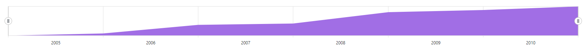

# Blazor Range Selector Component in Server Side App using Visual Studio

This section briefly explains how to include a Range Navigator component in the Blazor server-side application. Refer to the [Getting Started with Syncfusion Blazor for server-side in Visual Studio 2019](https://blazor.syncfusion.com/documentation/getting-started/blazor-server-side-visual-studio-2019/) page for introduction and configuring common specifications.

## Importing Syncfusion Blazor Range Navigator component in the application

1. Install **Syncfusion.Blazor** NuGet package to the application by using the **NuGet Package Manager**.

2. Add the client-side resources through [CDN](https://blazor.syncfusion.com/documentation/appearance/themes#cdn-reference) or from [NuGet](https://blazor.syncfusion.com/documentation/appearance/themes#static-web-assets) package in the **HEAD** element of the **~/Pages/_Host.cshtml** page.

    ```html
    <head>
        <link href="_content/Syncfusion.Blazor.Themes/bootstrap4.css" rel="stylesheet" />
        <!---CDN--->
        @*<link href="https://cdn.syncfusion.com/blazor/{{ site.blazorversion }}/styles/bootstrap4.css" rel="stylesheet" />*@
    </head>
    ```

    > For Internet Explorer 11, kindly refer the polyfills. Refer the [documentation](https://blazor.syncfusion.com/documentation/common/how-to/render-blazor-server-app-in-ie/) for more information.

    ```html
    <head>
        <link href="https://cdn.syncfusion.com/blazor/{{ site.blazorversion }}/styles/bootstrap4.css" rel="stylesheet" />
        <script src="https://github.com/Daddoon/Blazor.Polyfill/releases/download/3.0.1/blazor.polyfill.min.js"></script>
    </head>
    ```

## Adding component package to the application

Open the **~/_Imports.razor** file and include the **Syncfusion.Blazor.Charts** namespace.

```cshtml
@using Syncfusion.Blazor.Charts
```

## Adding SyncfusionBlazor service in Startup.cs

Open the **Startup.cs** file and add services required by the Syncfusion components using **services.AddSyncfusionBlazor()** method. Add this method in the **ConfigureServices** function as follows.

```csharp
using Syncfusion.Blazor;

namespace BlazorApplication
{
    public class Startup
    {
        ....
        ....
        public void ConfigureServices(IServiceCollection services)
        {
            ....
            ....
            services.AddSyncfusionBlazor();
        }
    }
}
```

> To enable custom client-side source loading from CRG or CDN, please refer to the section about [custom resources in Blazor application](https://blazor.syncfusion.com/documentation/common/custom-resource-generator/#how-to-use-custom-resources-in-the-blazor-application).

## Adding Range Navigator component

To initialize the Range Navigator component, add the below code to the **Index.razor** view page under **~/Pages** folder. In a new application, if **Index.razor** page has any default content template, then those content can be completely removed and following code can be added.

```cshtml
@page "/"

<SfRangeNavigator>

</SfRangeNavigator>
```

## Populate Range Navigator with Data

To bind the data for the Range Navigator component, assign a `IEnumerable` object to the [DataSource](https://help.syncfusion.com/cr/blazor/Syncfusion.Blazor.Charts.RangeNavigatorSeries.html#Syncfusion_Blazor_Charts_RangeNavigatorSeries_DataSource) property. It can also be provided as an instance of the [DataManager](https://help.syncfusion.com/cr/blazor/Syncfusion.Blazor.DataManager.html).

```cshtml
@code {
    public class StockPrice
    {
        public DateTime Date { get; set; }
        public double Close { get; set; }
    }
    
    public List<StockPrice> StockDetails = new List<StockPrice>
    {
        new StockPrice { Date = new DateTime(2005, 01, 01), Close = 21 },
        new StockPrice { Date = new DateTime(2006, 01, 01), Close = 24 },
        new StockPrice { Date = new DateTime(2007, 01, 01), Close = 36 },
        new StockPrice { Date = new DateTime(2008, 01, 01), Close = 38 },
        new StockPrice { Date = new DateTime(2009, 01, 01), Close = 54 },
        new StockPrice { Date = new DateTime(2010, 01, 01), Close = 57 },
        new StockPrice { Date = new DateTime(2011, 01, 01), Close = 62 }
    };
}
```

Now map `Date` and `Close` fields from the datasource to [XName](https://help.syncfusion.com/cr/blazor/Syncfusion.Blazor.Charts.RangeNavigatorSeries.html#Syncfusion_Blazor_Charts_RangeNavigatorSeries_XName) and [YName](https://help.syncfusion.com/cr/blazor/Syncfusion.Blazor.Charts.RangeNavigatorSeries.html#Syncfusion_Blazor_Charts_RangeNavigatorSeries_YName) properties of the [RangeNavigatorSeries](https://help.syncfusion.com/cr/blazor/Syncfusion.Blazor.Charts.RangeNavigatorSeries.html) and then set the `StockDetails` to [DataSource](https://help.syncfusion.com/cr/blazor/Syncfusion.Blazor.Charts.RangeNavigatorSeries.html#Syncfusion_Blazor_Charts_RangeNavigatorSeries_DataSource) property.

```cshtml
<SfRangeNavigator ValueType="RangeValueType.DateTime" IntervalType="RangeIntervalType.Years" LabelFormat="yyyy">
    <RangeNavigatorSeriesCollection>
        <RangeNavigatorSeries DataSource="@StockDetails" XName="Date" Type="RangeNavigatorType.Area" YName="Close"></RangeNavigatorSeries>
    </RangeNavigatorSeriesCollection>
</SfRangeNavigator>
```

On successful compilation of the application, the Syncfusion Blazor Range Navigator component will render in the web browser as shown below.



## See also

* [Getting Started with Syncfusion Blazor for Client-Side in .NET Core CLI](https://blazor.syncfusion.com/documentation/getting-started/blazor-webassembly-dotnet-cli/)
* [Getting Started with Syncfusion Blazor for Server-Side in Visual Studio 2019 Preview](https://blazor.syncfusion.com/documentation/getting-started/blazor-server-side-visual-studio-2019/?no-cache=1)
* [Getting Started with Syncfusion Blazor for Server-Side in .NET Core CLI](https://blazor.syncfusion.com/documentation/getting-started/blazor-server-side-dotnet-cli/)