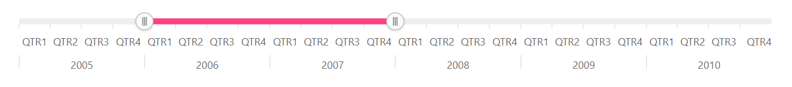
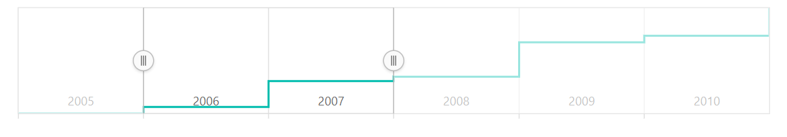
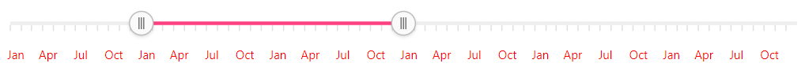

# Labels in the Blazor Range Selector (SfRangeNavigator)

## Multi-level labels

The multi-level labels for the Range Selector can be enabled by setting the [`EnableGrouping`](https://help.syncfusion.com/cr/blazor/Syncfusion.Blazor.Charts.SfRangeNavigator.html#Syncfusion_Blazor_Charts_SfRangeNavigator_EnableGrouping) property to **true**. This is restricted to the DateTime axis alone.





## Grouping

The multi-level labels can be grouped using the [`GroupBy`](https://help.syncfusion.com/cr/blazor/Syncfusion.Blazor.Charts.SfRangeNavigator.html#Syncfusion_Blazor_Charts_SfRangeNavigator_GroupBy) property with the following interval types:

* Auto
* Years
* Quarter
* Months
* Weeks
* Days
* Hours
* Minutes
* Seconds





## Smart labels

The [`LabelIntersectAction`](https://help.syncfusion.com/cr/blazor/Syncfusion.Blazor.Charts.SfRangeNavigator.html#Syncfusion_Blazor_Charts_SfRangeNavigator_LabelIntersectAction) property is used to avoid overlapping of labels. The following code sample shows the setting of [`LabelIntersectAction`](https://help.syncfusion.com/cr/blazor/Syncfusion.Blazor.Charts.SfRangeNavigator.html#Syncfusion_Blazor_Charts_SfRangeNavigator_LabelIntersectAction) property to **Hide**.





## Position

By default, the labels can be placed outside the Range Selector. It can also be placed inside the Range Selector
using the [`LabelPosition`](https://help.syncfusion.com/cr/blazor/Syncfusion.Blazor.Charts.SfRangeNavigator.html#Syncfusion_Blazor_Charts_SfRangeNavigator_LabelPosition) property.





## Labels Customization

The font size, color, family, etc. can be customized using the [`RangeNavigatorLabelStyle`](https://help.syncfusion.com/cr/blazor/Syncfusion.Blazor.Charts.RangeNavigatorLabelStyle.html) setting.





