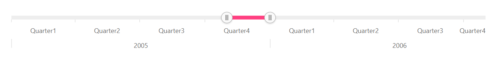
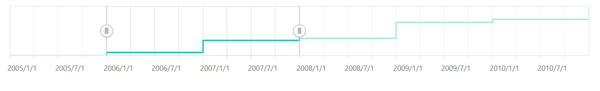

# Labels in Blazor Range Selector Component

## Multi-level labels

The multi-level labels for the Range Selector can be enabled by setting the [EnableGrouping](https://help.syncfusion.com/cr/blazor/Syncfusion.Blazor.Charts.SfRangeNavigator.html#Syncfusion_Blazor_Charts_SfRangeNavigator_EnableGrouping) property to **true**. This is restricted to the DateTime axis alone.

```cshtml

@using Syncfusion.Blazor.Charts

<SfRangeNavigator DataSource="@StockInfo" XName="X" YName="Y"      LabelPosition="AxisPosition.Outside"
                  EnableGrouping="true" IntervalType="RangeIntervalType.Quarter" Value="@Value" ValueType="RangeValueType.DateTime">
    <RangeNavigatorRangeTooltipSettings Enable="true"></RangeNavigatorRangeTooltipSettings>
</SfRangeNavigator>

@code {
    public class StockDetails
    {
        public DateTime X { get; set; }
        public double Y { get; set; }
    }

    public DateTime[] Value = new DateTime[] { new DateTime(2005, 11, 01), new DateTime(2006, 01, 01) };

    public List<StockDetails> StockInfo = new List<StockDetails> {
        new StockDetails { X = new DateTime(2005, 01, 01), Y = 21 },
        new StockDetails { X = new DateTime(2005, 03, 01), Y = 24 },
        new StockDetails { X = new DateTime(2005, 05, 01), Y = 36 },
        new StockDetails { X = new DateTime(2006, 07, 01), Y = 38 },
        new StockDetails { X = new DateTime(2006, 08, 01), Y = 54 },
        new StockDetails { X = new DateTime(2006, 09, 01), Y = 57 },
        new StockDetails { X = new DateTime(2006, 11, 01), Y = 70 }
    };
}

```



## Grouping

The multi-level labels can be grouped using the [GroupBy](https://help.syncfusion.com/cr/blazor/Syncfusion.Blazor.Charts.SfRangeNavigator.html#Syncfusion_Blazor_Charts_SfRangeNavigator_GroupBy) property with the following interval types:

* Auto
* Years
* Quarter
* Months
* Weeks
* Days
* Hours
* Minutes
* Seconds

```cshtml

@using Syncfusion.Blazor.Charts

<SfRangeNavigator DataSource="@StockInfo" XName="X" YName="Y" LabelPosition="AxisPosition.Outside"
                  EnableGrouping="true" GroupBy="RangeIntervalType.Years" IntervalType="RangeIntervalType.Quarter"
                  Value="@Value" ValueType="RangeValueType.DateTime">
    <RangeNavigatorRangeTooltipSettings Enable="true"></RangeNavigatorRangeTooltipSettings>
</SfRangeNavigator>

@code {

    public class StockDetails
    {
        public DateTime X { get; set; }
        public double Y { get; set; }
    }

    public DateTime[] Value = new DateTime[] { new DateTime(2005, 11, 01), new DateTime(2006, 01, 01) };

    public List<StockDetails> StockInfo = new List<StockDetails> {
        new StockDetails { X = new DateTime(2005, 01, 01), Y = 21 },
        new StockDetails { X = new DateTime(2005, 03, 01), Y = 24 },
        new StockDetails { X = new DateTime(2005, 05, 01), Y = 36 },
        new StockDetails { X = new DateTime(2006, 07, 01), Y = 38 },
        new StockDetails { X = new DateTime(2006, 08, 01), Y = 54 },
        new StockDetails { X = new DateTime(2006, 09, 01), Y = 57 },
        new StockDetails { X = new DateTime(2006, 11, 01), Y = 70 }
    };
}

```


## Smart labels

The [LabelIntersectAction](https://help.syncfusion.com/cr/blazor/Syncfusion.Blazor.Charts.SfRangeNavigator.html#Syncfusion_Blazor_Charts_SfRangeNavigator_LabelIntersectAction) property is used to avoid overlapping of labels. The following code sample shows the setting of [LabelIntersectAction](https://help.syncfusion.com/cr/blazor/Syncfusion.Blazor.Charts.SfRangeNavigator.html#Syncfusion_Blazor_Charts_SfRangeNavigator_LabelIntersectAction) property to **Hide**.

```cshtml

@using Syncfusion.Blazor.Charts

<SfRangeNavigator Value="@Value" ValueType="RangeValueType.DateTime" LabelFormat="yyyy/M/d" LabelIntersectAction="RangeLabelIntersectAction.Hide">
    <RangeNavigatorRangeTooltipSettings Enable="true"></RangeNavigatorRangeTooltipSettings>
    <RangeNavigatorSeriesCollection>
        <RangeNavigatorSeries DataSource="@DataSource" XName="X" Type="RangeNavigatorType.StepLine"
                              YName="Y" Width="2"></RangeNavigatorSeries>
    </RangeNavigatorSeriesCollection>
</SfRangeNavigator>

@code {

    public class SampleData
    {
        public DateTime X { get; set; }
        public double Y { get; set; }
    }

    public DateTime[] Value = new DateTime[] { new DateTime(2006, 01, 01), new DateTime(2008, 01, 01) };

    public List<SampleData> DataSource = new List<SampleData> {
        new SampleData { X = new DateTime(2005, 01, 01), Y = 21 },
        new SampleData { X = new DateTime(2006, 01, 01), Y = 24 },
        new SampleData { X = new DateTime(2007, 01, 01), Y = 36 },
        new SampleData { X = new DateTime(2008, 01, 01), Y = 38 },
        new SampleData { X = new DateTime(2009, 01, 01), Y = 54 },
        new SampleData { X = new DateTime(2010, 01, 01), Y = 57 },
        new SampleData { X = new DateTime(2011, 01, 01), Y = 70 }
    };
}

```



## Position

By default, the labels can be placed outside the Range Selector. It can also be placed inside the Range Selector using the [LabelPosition](https://help.syncfusion.com/cr/blazor/Syncfusion.Blazor.Charts.SfRangeNavigator.html#Syncfusion_Blazor_Charts_SfRangeNavigator_LabelPosition) property.

```cshtml

@using Syncfusion.Blazor.Charts

<SfRangeNavigator Value="@Value" ValueType="RangeValueType.DateTime" LabelPosition="AxisPosition.Inside">
    <RangeNavigatorSeriesCollection>
        <RangeNavigatorSeries DataSource="@StockInfo" XName="X" Type="RangeNavigatorType.StepLine" YName="Y">
        </RangeNavigatorSeries>
    </RangeNavigatorSeriesCollection>
</SfRangeNavigator>

@code {

    public class StockDetails
    {
        public DateTime X { get; set; }
        public double Y { get; set; }
    }
    
    public DateTime[] Value = new DateTime[] { new DateTime(2006, 01, 01), new DateTime(2008, 01, 01) };

    public List<StockDetails> StockInfo = new List<StockDetails> {
        new StockDetails { X = new DateTime(2005, 01, 01), Y = 21 },
        new StockDetails { X = new DateTime(2006, 01, 01), Y = 24 },
        new StockDetails { X = new DateTime(2007, 01, 01), Y = 36 },
        new StockDetails { X = new DateTime(2008, 01, 01), Y = 38 },
        new StockDetails { X = new DateTime(2009, 01, 01), Y = 54 },
        new StockDetails { X = new DateTime(2010, 01, 01), Y = 57 },
        new StockDetails { X = new DateTime(2011, 01, 01), Y = 70 }
    };
}

```


## Labels Customization

The font size, color, family, etc. can be customized using the [RangeNavigatorLabelStyle](https://help.syncfusion.com/cr/blazor/Syncfusion.Blazor.Charts.RangeNavigatorLabelStyle.html) setting.

```cshtml

@using Syncfusion.Blazor.Charts

<SfRangeNavigator DataSource="@StockInfo" XName="X" YName="Y" Value="@Value" LabelFormat="MMM"
                  IntervalType="RangeIntervalType.Months" ValueType="RangeValueType.DateTime">
    <RangeNavigatorLabelStyle Color="red" Size="10"></RangeNavigatorLabelStyle>
</SfRangeNavigator>

@code {

    public class StockDetails
    {
        public DateTime X { get; set; }
        public double Y { get; set; }
    }

    public DateTime[] Value = new DateTime[] { new DateTime(2005, 11, 01), new DateTime(2006, 01, 01) };

    public List<StockDetails> StockInfo = new List<StockDetails> {
        new StockDetails { X = new DateTime(2005, 01, 01), Y = 21 },
        new StockDetails { X = new DateTime(2005, 03, 01), Y = 24 },
        new StockDetails { X = new DateTime(2005, 05, 01), Y = 36 },
        new StockDetails { X = new DateTime(2006, 07, 01), Y = 38 },
        new StockDetails { X = new DateTime(2006, 08, 01), Y = 54 },
        new StockDetails { X = new DateTime(2006, 09, 01), Y = 57 },
        new StockDetails { X = new DateTime(2006, 11, 01), Y = 70 }
    };
}

```

