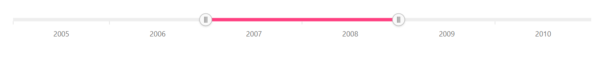

# Lightweight in Blazor Range Selector Component

By default, when the [DataSource](https://help.syncfusion.com/cr/blazor/Syncfusion.Blazor.Charts.SfRangeNavigator.html#Syncfusion_Blazor_Charts_SfRangeNavigator_DataSource) for [RangeNavigatorSeries](https://help.syncfusion.com/cr/blazor/Syncfusion.Blazor.Charts.RangeNavigatorSeries.html) is empty, a lightweight Range Selector is displayed without a chart.

```cshtml

@using Syncfusion.Blazor.Charts

<SfRangeNavigator Value="@Value" ValueType="RangeValueType.DateTime" DataSource="@DataSource" XName="X"
                  YName="Y" IntervalType="@RangeIntervalType.Years" LabelIntersectAction="RangeLabelIntersectAction.Hide">
    <RangeNavigatorRangeTooltipSettings Enable="true"></RangeNavigatorRangeTooltipSettings>
</SfRangeNavigator>

@code {
    public class SampleData
    {
        public DateTime X { get; set; }
        public double Y { get; set; }
    }

    public DateTime[] Value = new DateTime[] { new DateTime(2007, 01, 01), new DateTime(2009, 01, 01) };

    public List<SampleData> DataSource = new List<SampleData>
    {
        new SampleData { X = new DateTime(2005, 01, 01), Y = 21 },
        new SampleData { X = new DateTime(2006, 01, 01), Y = 24 },
        new SampleData { X = new DateTime(2007, 01, 01), Y = 36 },
        new SampleData { X = new DateTime(2008, 01, 01), Y = 38 },
        new SampleData { X = new DateTime(2009, 01, 01), Y = 54 },
        new SampleData { X = new DateTime(2010, 01, 01), Y = 57 },
        new SampleData { X = new DateTime(2011, 01, 01), Y = 70 }
    };
}

```



## See Also

* [Period Selector](./period-selector/)
