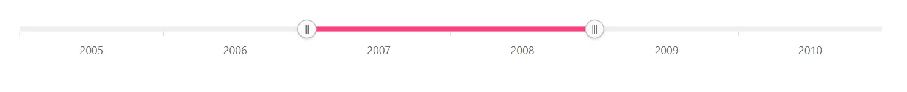

# Blazor Range Selector Lightweight

A lightweight Range Selector renders only the slider track, without the underlying chart. This is used when the trend chart is not required or when the series data is not available.

The lightweight Range Selector is rendered when the data is bound directly to the [SfRangeNavigator](https://help.syncfusion.com/cr/blazor/Syncfusion.Blazor.Charts.SfRangeNavigator.html) through its [DataSource](https://help.syncfusion.com/cr/blazor/Syncfusion.Blazor.Charts.SfRangeNavigator.html#Syncfusion_Blazor_Charts_SfRangeNavigator_DataSource), [XName](https://help.syncfusion.com/cr/blazor/Syncfusion.Blazor.Charts.SfRangeNavigator.html#Syncfusion_Blazor_Charts_SfRangeNavigator_XName), and [YName](https://help.syncfusion.com/cr/blazor/Syncfusion.Blazor.Charts.SfRangeNavigator.html#Syncfusion_Blazor_Charts_SfRangeNavigator_YName) properties, without defining a [RangeNavigatorSeries](https://help.syncfusion.com/cr/blazor/Syncfusion.Blazor.Charts.RangeNavigatorSeries.html). The [ValueType](https://help.syncfusion.com/cr/blazor/Syncfusion.Blazor.Charts.SfRangeNavigator.html#Syncfusion_Blazor_Charts_SfRangeNavigator_ValueType), [IntervalType](https://help.syncfusion.com/cr/blazor/Syncfusion.Blazor.Charts.SfRangeNavigator.html#Syncfusion_Blazor_Charts_SfRangeNavigator_IntervalType), and [LabelIntersectAction](https://help.syncfusion.com/cr/blazor/Syncfusion.Blazor.Charts.SfRangeNavigator.html#Syncfusion_Blazor_Charts_SfRangeNavigator_LabelIntersectAction) properties can still be used to configure the axis.

```cshtml

@using Syncfusion.Blazor.Charts

<SfRangeNavigator Value="@Value" ValueType="RangeValueType.DateTime" DataSource="@DataSource" XName="X"
                  YName="Y" IntervalType="RangeIntervalType.Years" LabelIntersectAction="RangeLabelIntersectAction.Hide">
    <RangeNavigatorRangeTooltipSettings Enable="true"></RangeNavigatorRangeTooltipSettings>
</SfRangeNavigator>

@code {

    public class SampleData
    {
        public DateTime X { get; set; }
        public double Y { get; set; }
    }

    public DateTime[] Value = new DateTime[] { new DateTime(2007, 01, 01), new DateTime(2009, 01, 01) };

    public List<SampleData> DataSource = new List<SampleData>
    {
        new SampleData { X = new DateTime(2005, 01, 01), Y = 21 },
        new SampleData { X = new DateTime(2006, 01, 01), Y = 24 },
        new SampleData { X = new DateTime(2007, 01, 01), Y = 36 },
        new SampleData { X = new DateTime(2008, 01, 01), Y = 38 },
        new SampleData { X = new DateTime(2009, 01, 01), Y = 54 },
        new SampleData { X = new DateTime(2010, 01, 01), Y = 57 },
        new SampleData { X = new DateTime(2011, 01, 01), Y = 70 }
    };
}

```



## See Also

* [Period Selector](./period-selector)
* [Type of Data](./data)