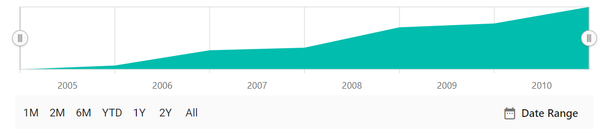

# Period Selector in Blazor Range Selector Component

The period selector enables users to choose a time range using predefined periods.

## Periods

Configure an array of objects to specify predefined time intervals. The [Interval](https://help.syncfusion.com/cr/blazor/Syncfusion.Blazor.Charts.RangeNavigatorPeriod.html#Syncfusion_Blazor_Charts_RangeNavigatorPeriod_Interval) property sets the count value for each button, [Selected](https://help.syncfusion.com/cr/blazor/Syncfusion.Blazor.Charts.RangeNavigatorPeriod.html#Syncfusion_Blazor_Charts_RangeNavigatorPeriod_Selected) allows initial selection, and [Text](https://help.syncfusion.com/cr/blazor/Syncfusion.Blazor.Charts.RangeNavigatorPeriod.html#Syncfusion_Blazor_Charts_RangeNavigatorPeriod_Text) sets the button label. The [IntervalType](https://help.syncfusion.com/cr/blazor/Syncfusion.Blazor.Charts.RangeNavigatorPeriod.html#Syncfusion_Blazor_Charts_RangeNavigatorPeriod_IntervalType) property customizes the interval type, supporting:

* Auto
* Years
* Quarter
* Months
* Weeks
* Days
* Hours
* Minutes
* Seconds

```cshtml

@using Syncfusion.Blazor.Charts

<SfRangeNavigator ValueType="RangeValueType.DateTime">
    <RangeNavigatorPeriodSelectorSettings>
        <RangeNavigatorPeriods>
            <RangeNavigatorPeriod Interval="1" IntervalType="RangeIntervalType.Months" Text="1M"></RangeNavigatorPeriod>
            <RangeNavigatorPeriod Interval="2" IntervalType="RangeIntervalType.Months" Text="2M"></RangeNavigatorPeriod>
            <RangeNavigatorPeriod Interval="6" IntervalType="RangeIntervalType.Months" Text="6M"></RangeNavigatorPeriod>
            <RangeNavigatorPeriod Text="YTD"></RangeNavigatorPeriod>
            <RangeNavigatorPeriod Interval="1" IntervalType="RangeIntervalType.Years" Text="1Y"></RangeNavigatorPeriod>
            <RangeNavigatorPeriod Interval="2" IntervalType="RangeIntervalType.Years" Text="2Y"></RangeNavigatorPeriod>
            <RangeNavigatorPeriod Text="All"></RangeNavigatorPeriod>
        </RangeNavigatorPeriods>
    </RangeNavigatorPeriodSelectorSettings>
    <RangeNavigatorSeriesCollection>
        <RangeNavigatorSeries DataSource="@StockInfo" XName="Date" Type="RangeNavigatorType.Area" YName="Close"></RangeNavigatorSeries>
    </RangeNavigatorSeriesCollection>
</SfRangeNavigator>

@code {
    public class StockDetails
    {
        public DateTime Date { get; set; }
        public double Close { get; set; }
    }

    public DateTime[] Value = new DateTime[] { new DateTime(2009, 01, 01), new DateTime(2010, 01, 01) };

    public List<StockDetails> StockInfo = new List<StockDetails>
    {
        new StockDetails { Date = new DateTime(2005, 01, 01), Close = 21 },
        new StockDetails { Date = new DateTime(2006, 01, 01), Close = 24 },
        new StockDetails { Date = new DateTime(2007, 01, 01), Close = 36 },
        new StockDetails { Date = new DateTime(2008, 01, 01), Close = 38 },
        new StockDetails { Date = new DateTime(2009, 01, 01), Close = 54 },
        new StockDetails { Date = new DateTime(2010, 01, 01), Close = 57 },
        new StockDetails { Date = new DateTime(2011, 01, 01), Close = 70 }
    };
}

```



## Position

Use the [Position](https://help.syncfusion.com/cr/blazor/Syncfusion.Blazor.Charts.RangeNavigatorPeriodSelectorSettings.html#Syncfusion_Blazor_Charts_RangeNavigatorPeriodSelectorSettings_Position) property to place the period selector at the **Top** or **Bottom** of the Range Selector.

```cshtml

@using Syncfusion.Blazor.Charts

<SfRangeNavigator ValueType="RangeValueType.DateTime">
    <RangeNavigatorPeriodSelectorSettings Position="PeriodSelectorPosition.Top">
        <RangeNavigatorPeriods>
            <RangeNavigatorPeriod Interval="1" IntervalType="RangeIntervalType.Months" Text="1M"></RangeNavigatorPeriod>
            <RangeNavigatorPeriod Interval="2" IntervalType="RangeIntervalType.Months" Text="2M"></RangeNavigatorPeriod>
            <RangeNavigatorPeriod Interval="6" IntervalType="RangeIntervalType.Months" Text="6M"></RangeNavigatorPeriod>
            <RangeNavigatorPeriod Text="YTD"></RangeNavigatorPeriod>
            <RangeNavigatorPeriod Interval="1" IntervalType="RangeIntervalType.Years" Text="1Y"></RangeNavigatorPeriod>
            <RangeNavigatorPeriod Interval="2" IntervalType="RangeIntervalType.Years" Text="2Y"></RangeNavigatorPeriod>
            <RangeNavigatorPeriod Text="All"></RangeNavigatorPeriod>
        </RangeNavigatorPeriods>
    </RangeNavigatorPeriodSelectorSettings>
    <RangeNavigatorSeriesCollection>
        <RangeNavigatorSeries DataSource="@StockInfo" XName="Date" Type="RangeNavigatorType.Area" YName="Close"></RangeNavigatorSeries>
    </RangeNavigatorSeriesCollection>
</SfRangeNavigator>

@code {
    public class StockDetails
    {
        public DateTime Date { get; set; }
        public double Close { get; set; }
    }

    public DateTime[] Value = new DateTime[] { new DateTime(2009, 01, 01), new DateTime(2010, 01, 01) };

    public List<StockDetails> StockInfo = new List<StockDetails>
    {
        new StockDetails { Date = new DateTime(2005, 01, 01), Close = 21 },
        new StockDetails { Date = new DateTime(2006, 01, 01), Close = 24 },
        new StockDetails { Date = new DateTime(2007, 01, 01), Close = 36 },
        new StockDetails { Date = new DateTime(2008, 01, 01), Close = 38 },
        new StockDetails { Date = new DateTime(2009, 01, 01), Close = 54 },
        new StockDetails { Date = new DateTime(2010, 01, 01), Close = 57 },
        new StockDetails { Date = new DateTime(2011, 01, 01), Close = 70 }
    };
}

```


## Height

Set the [Height](https://help.syncfusion.com/cr/blazor/Syncfusion.Blazor.Charts.RangeNavigatorPeriodSelectorSettings.html#Syncfusion_Blazor_Charts_RangeNavigatorPeriodSelectorSettings_Height) property to specify the height of the period selector. The default is **43px**.

```cshtml

@using Syncfusion.Blazor.Charts

<SfRangeNavigator ValueType="RangeValueType.DateTime">
    <RangeNavigatorPeriodSelectorSettings Height="65">
        <RangeNavigatorPeriods>
            <RangeNavigatorPeriod Interval="1" IntervalType="RangeIntervalType.Months" Text="1M"></RangeNavigatorPeriod>
            <RangeNavigatorPeriod Interval="2" IntervalType="RangeIntervalType.Months" Text="2M"></RangeNavigatorPeriod>
            <RangeNavigatorPeriod Interval="6" IntervalType="RangeIntervalType.Months" Text="6M"></RangeNavigatorPeriod>
            <RangeNavigatorPeriod Text="YTD"></RangeNavigatorPeriod>
            <RangeNavigatorPeriod Interval="1" IntervalType="RangeIntervalType.Years" Text="1Y"></RangeNavigatorPeriod>
            <RangeNavigatorPeriod Interval="2" IntervalType="RangeIntervalType.Years" Text="2Y"></RangeNavigatorPeriod>
            <RangeNavigatorPeriod Text="All"></RangeNavigatorPeriod>
        </RangeNavigatorPeriods>
    </RangeNavigatorPeriodSelectorSettings>
    <RangeNavigatorSeriesCollection>
        <RangeNavigatorSeries DataSource="@StockInfo" XName="Date" Type="RangeNavigatorType.Area" YName="Close"></RangeNavigatorSeries>
    </RangeNavigatorSeriesCollection>
</SfRangeNavigator>

@code {
    public class StockDetails
    {
        public DateTime Date { get; set; }
        public double Close { get; set; }
    }

    public DateTime[] Value = new DateTime[] { new DateTime(2009, 01, 01), new DateTime(2010, 01, 01) };

    public List<StockDetails> StockInfo = new List<StockDetails>
    {
        new StockDetails { Date = new DateTime(2005, 01, 01), Close = 21 },
        new StockDetails { Date = new DateTime(2006, 01, 01), Close = 24 },
        new StockDetails { Date = new DateTime(2007, 01, 01), Close = 36 },
        new StockDetails { Date = new DateTime(2008, 01, 01), Close = 38 },
        new StockDetails { Date = new DateTime(2009, 01, 01), Close = 54 },
        new StockDetails { Date = new DateTime(2010, 01, 01), Close = 57 },
        new StockDetails { Date = new DateTime(2011, 01, 01), Close = 70 }
    };
}

```


## Visibility

The [DisableRangeSelector](https://help.syncfusion.com/cr/blazor/Syncfusion.Blazor.Charts.SfRangeNavigator.html#Syncfusion_Blazor_Charts_SfRangeNavigator_DisableRangeSelector) property displays only the period selector, hiding the Range Selector.

```cshtml

@using Syncfusion.Blazor.Charts

<SfRangeNavigator DisableRangeSelector="true" ValueType="RangeValueType.DateTime">
    <RangeNavigatorPeriodSelectorSettings>
        <RangeNavigatorPeriods>
            <RangeNavigatorPeriod Interval="1" IntervalType="RangeIntervalType.Months" Text="1M"></RangeNavigatorPeriod>
            <RangeNavigatorPeriod Interval="2" IntervalType="RangeIntervalType.Months" Text="2M"></RangeNavigatorPeriod>
            <RangeNavigatorPeriod Interval="6" IntervalType="RangeIntervalType.Months" Text="6M"></RangeNavigatorPeriod>
            <RangeNavigatorPeriod Text="YTD"></RangeNavigatorPeriod>
            <RangeNavigatorPeriod Interval="1" IntervalType="RangeIntervalType.Years" Text="1Y"></RangeNavigatorPeriod>
            <RangeNavigatorPeriod Interval="2" IntervalType="RangeIntervalType.Years" Text="2Y"></RangeNavigatorPeriod>
            <RangeNavigatorPeriod Text="All"></RangeNavigatorPeriod>
        </RangeNavigatorPeriods>
    </RangeNavigatorPeriodSelectorSettings>
    <RangeNavigatorSeriesCollection>
        <RangeNavigatorSeries DataSource="@StockInfo" XName="Date" Type="RangeNavigatorType.Area" YName="Close"></RangeNavigatorSeries>
    </RangeNavigatorSeriesCollection>
</SfRangeNavigator>

@code {
    public class StockDetails
    {
        public DateTime Date { get; set; }
        public double Close { get; set; }
    }

    public DateTime[] Value = new DateTime[] { new DateTime(2009, 01, 01), new DateTime(2010, 01, 01) };

    public List<StockDetails> StockInfo = new List<StockDetails>
    {
        new StockDetails { Date = new DateTime(2005, 01, 01), Close = 21 },
        new StockDetails { Date = new DateTime(2006, 01, 01), Close = 24 },
        new StockDetails { Date = new DateTime(2007, 01, 01), Close = 36 },
        new StockDetails { Date = new DateTime(2008, 01, 01), Close = 38 },
        new StockDetails { Date = new DateTime(2009, 01, 01), Close = 54 },
        new StockDetails { Date = new DateTime(2010, 01, 01), Close = 57 },
        new StockDetails { Date = new DateTime(2011, 01, 01), Close = 70 }
    };
}

```

## See Also

* [Disable Range Selector](./light-weight)
