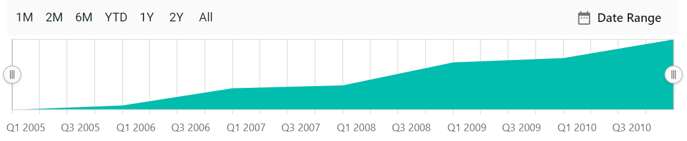

# Period selector in the Blazor Range Selector (SfRangeNavigator)

The period selector allows to choose a time range with specific periods.

## Periods

An array of objects that allows the users to specify pre-defined time intervals. The [`Interval`](https://help.syncfusion.com/cr/blazor/Syncfusion.Blazor.Charts.RangeNavigatorPeriod.html#Syncfusion_Blazor_Charts_RangeNavigatorPeriod_Interval) property specifies the count value of the button, the [`Selected`](https://help.syncfusion.com/cr/blazor/Syncfusion.Blazor.Charts.RangeNavigatorPeriod.html#Syncfusion_Blazor_Charts_RangeNavigatorPeriod_Selected) property allows the users to select the period button initially, and the [`Text`](https://help.syncfusion.com/cr/blazor/Syncfusion.Blazor.Charts.RangeNavigatorPeriod.html#Syncfusion_Blazor_Charts_RangeNavigatorPeriod_Text) property specifies the text to be displayed on the button. The [`IntervalType`](https://help.syncfusion.com/cr/blazor/Syncfusion.Blazor.Charts.RangeNavigatorPeriod.html#Syncfusion_Blazor_Charts_RangeNavigatorPeriod_IntervalType) property allows the users to customize the interval type, and it supports the following types:

* Auto
* Years
* Quarter
* Months
* Weeks
* Days
* Hours
* Minutes
* Seconds





## Position

The [`Position`](https://help.syncfusion.com/cr/blazor/Syncfusion.Blazor.Charts.RangeNavigatorPeriodSelectorSettings.html#Syncfusion_Blazor_Charts_RangeNavigatorPeriodSelectorSettings_Position) property allows the users to position the period selector at the **Top** or **Bottom**.





## Height

The [`Height`](https://help.syncfusion.com/cr/blazor/Syncfusion.Blazor.Charts.RangeNavigatorPeriodSelectorSettings.html#Syncfusion_Blazor_Charts_RangeNavigatorPeriodSelectorSettings_Height) property allows the users to specify the height of the period selector. The default value of the height property is **43px**.





## Visibility

The [`DisableRangeSelector`](https://help.syncfusion.com/cr/blazor/Syncfusion.Blazor.Charts.SfRangeNavigator.html#Syncfusion_Blazor_Charts_SfRangeNavigator_DisableRangeSelector) property allows the users to display only the period selector and not the Range Selector.





## See Also

* [Disable Range Selector](./light-weight/)