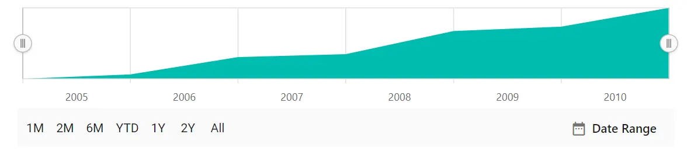
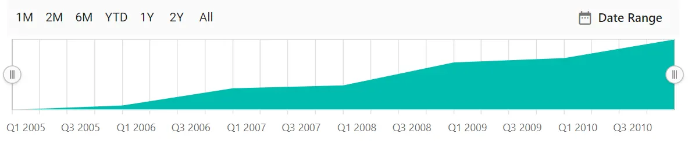
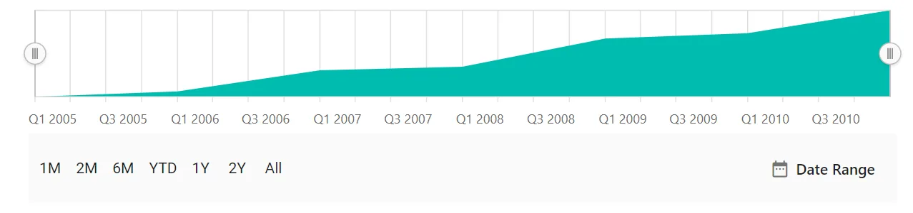

# Blazor Range Selector Period Selector

The period selector lets users choose a time range using predefined periods. It is configured through the [RangeNavigatorPeriodSelectorSettings](https://help.syncfusion.com/cr/blazor/Syncfusion.Blazor.Charts.RangeNavigatorPeriodSelectorSettings.html) component.

## Periods

The [RangeNavigatorPeriods](https://help.syncfusion.com/cr/blazor/Syncfusion.Blazor.Charts.RangeNavigatorPeriods.html) collection holds one [RangeNavigatorPeriod](https://help.syncfusion.com/cr/blazor/Syncfusion.Blazor.Charts.RangeNavigatorPeriod.html) for each predefined time interval. The [Interval](https://help.syncfusion.com/cr/blazor/Syncfusion.Blazor.Charts.RangeNavigatorPeriod.html#Syncfusion_Blazor_Charts_RangeNavigatorPeriod_Interval) property specifies the number of intervals represented by the button, the [Selected](https://help.syncfusion.com/cr/blazor/Syncfusion.Blazor.Charts.RangeNavigatorPeriod.html#Syncfusion_Blazor_Charts_RangeNavigatorPeriod_Selected) property selects the period button initially, and the [Text](https://help.syncfusion.com/cr/blazor/Syncfusion.Blazor.Charts.RangeNavigatorPeriod.html#Syncfusion_Blazor_Charts_RangeNavigatorPeriod_Text) property specifies the text displayed on the button. A period with the text `YTD` selects the range from the start of the current year, and a period with the text `All` selects the entire range. The [IntervalType](https://help.syncfusion.com/cr/blazor/Syncfusion.Blazor.Charts.RangeNavigatorPeriod.html#Syncfusion_Blazor_Charts_RangeNavigatorPeriod_IntervalType) property customizes the interval type and supports the following values:

* Auto
* Years
* Quarter
* Months
* Weeks
* Days
* Hours
* Minutes
* Seconds

```cshtml

@using Syncfusion.Blazor.Charts

<SfRangeNavigator Value="@Value" ValueType="RangeValueType.DateTime">
    <RangeNavigatorPeriodSelectorSettings>
        <RangeNavigatorPeriods>
            <RangeNavigatorPeriod Interval="1" IntervalType="RangeIntervalType.Months" Text="1M"></RangeNavigatorPeriod>
            <RangeNavigatorPeriod Interval="2" IntervalType="RangeIntervalType.Months" Text="2M"></RangeNavigatorPeriod>
            <RangeNavigatorPeriod Interval="6" IntervalType="RangeIntervalType.Months" Text="6M"></RangeNavigatorPeriod>
            <RangeNavigatorPeriod Text="YTD"></RangeNavigatorPeriod>
            <RangeNavigatorPeriod Interval="1" IntervalType="RangeIntervalType.Years" Text="1Y"></RangeNavigatorPeriod>
            <RangeNavigatorPeriod Interval="2" IntervalType="RangeIntervalType.Years" Text="2Y"></RangeNavigatorPeriod>
            <RangeNavigatorPeriod Text="All"></RangeNavigatorPeriod>
        </RangeNavigatorPeriods>
    </RangeNavigatorPeriodSelectorSettings>
    <RangeNavigatorSeriesCollection>
        <RangeNavigatorSeries DataSource="@StockInfo" XName="Date" Type="RangeNavigatorType.Area" YName="Close"></RangeNavigatorSeries>
    </RangeNavigatorSeriesCollection>
</SfRangeNavigator>

@code {

    public class StockDetails
    {
        public DateTime Date { get; set; }
        public double Close { get; set; }
    }

    public DateTime[] Value = new DateTime[] { new DateTime(2009, 01, 01), new DateTime(2010, 01, 01) };

    public List<StockDetails> StockInfo = new List<StockDetails>
    {
        new StockDetails { Date = new DateTime(2005, 01, 01), Close = 21 },
        new StockDetails { Date = new DateTime(2006, 01, 01), Close = 24 },
        new StockDetails { Date = new DateTime(2007, 01, 01), Close = 36 },
        new StockDetails { Date = new DateTime(2008, 01, 01), Close = 38 },
        new StockDetails { Date = new DateTime(2009, 01, 01), Close = 54 },
        new StockDetails { Date = new DateTime(2010, 01, 01), Close = 57 },
        new StockDetails { Date = new DateTime(2011, 01, 01), Close = 70 }
    };
}

```



## Position

The [Position](https://help.syncfusion.com/cr/blazor/Syncfusion.Blazor.Charts.RangeNavigatorPeriodSelectorSettings.html#Syncfusion_Blazor_Charts_RangeNavigatorPeriodSelectorSettings_Position) property positions the period selector at the [Top or Bottom](https://help.syncfusion.com/cr/blazor/Syncfusion.Blazor.Charts.PeriodSelectorPosition.html) of the Range Selector.

```cshtml

@using Syncfusion.Blazor.Charts

<SfRangeNavigator Value="@Value" ValueType="RangeValueType.DateTime">
    <RangeNavigatorPeriodSelectorSettings Position="PeriodSelectorPosition.Top">
        <RangeNavigatorPeriods>
            <RangeNavigatorPeriod Interval="1" IntervalType="RangeIntervalType.Months" Text="1M"></RangeNavigatorPeriod>
            <RangeNavigatorPeriod Interval="2" IntervalType="RangeIntervalType.Months" Text="2M"></RangeNavigatorPeriod>
            <RangeNavigatorPeriod Interval="6" IntervalType="RangeIntervalType.Months" Text="6M"></RangeNavigatorPeriod>
            <RangeNavigatorPeriod Text="YTD"></RangeNavigatorPeriod>
            <RangeNavigatorPeriod Interval="1" IntervalType="RangeIntervalType.Years" Text="1Y"></RangeNavigatorPeriod>
            <RangeNavigatorPeriod Interval="2" IntervalType="RangeIntervalType.Years" Text="2Y"></RangeNavigatorPeriod>
            <RangeNavigatorPeriod Text="All"></RangeNavigatorPeriod>
        </RangeNavigatorPeriods>
    </RangeNavigatorPeriodSelectorSettings>
    <RangeNavigatorSeriesCollection>
        <RangeNavigatorSeries DataSource="@StockInfo" XName="Date" Type="RangeNavigatorType.Area" YName="Close"></RangeNavigatorSeries>
    </RangeNavigatorSeriesCollection>
</SfRangeNavigator>

@code {

    public class StockDetails
    {
        public DateTime Date { get; set; }
        public double Close { get; set; }
    }

    public DateTime[] Value = new DateTime[] { new DateTime(2009, 01, 01), new DateTime(2010, 01, 01) };

    public List<StockDetails> StockInfo = new List<StockDetails>
    {
        new StockDetails { Date = new DateTime(2005, 01, 01), Close = 21 },
        new StockDetails { Date = new DateTime(2006, 01, 01), Close = 24 },
        new StockDetails { Date = new DateTime(2007, 01, 01), Close = 36 },
        new StockDetails { Date = new DateTime(2008, 01, 01), Close = 38 },
        new StockDetails { Date = new DateTime(2009, 01, 01), Close = 54 },
        new StockDetails { Date = new DateTime(2010, 01, 01), Close = 57 },
        new StockDetails { Date = new DateTime(2011, 01, 01), Close = 70 }
    };
}

```



## Height

The [Height](https://help.syncfusion.com/cr/blazor/Syncfusion.Blazor.Charts.RangeNavigatorPeriodSelectorSettings.html#Syncfusion_Blazor_Charts_RangeNavigatorPeriodSelectorSettings_Height) property specifies the height of the period selector in pixels. It is of type `double`, and the default value is **43**.

```cshtml

@using Syncfusion.Blazor.Charts

<SfRangeNavigator Value="@Value" ValueType="RangeValueType.DateTime">
    <RangeNavigatorPeriodSelectorSettings Height="65">
        <RangeNavigatorPeriods>
            <RangeNavigatorPeriod Interval="1" IntervalType="RangeIntervalType.Months" Text="1M"></RangeNavigatorPeriod>
            <RangeNavigatorPeriod Interval="2" IntervalType="RangeIntervalType.Months" Text="2M"></RangeNavigatorPeriod>
            <RangeNavigatorPeriod Interval="6" IntervalType="RangeIntervalType.Months" Text="6M"></RangeNavigatorPeriod>
            <RangeNavigatorPeriod Text="YTD"></RangeNavigatorPeriod>
            <RangeNavigatorPeriod Interval="1" IntervalType="RangeIntervalType.Years" Text="1Y"></RangeNavigatorPeriod>
            <RangeNavigatorPeriod Interval="2" IntervalType="RangeIntervalType.Years" Text="2Y"></RangeNavigatorPeriod>
            <RangeNavigatorPeriod Text="All"></RangeNavigatorPeriod>
        </RangeNavigatorPeriods>
    </RangeNavigatorPeriodSelectorSettings>
    <RangeNavigatorSeriesCollection>
        <RangeNavigatorSeries DataSource="@StockInfo" XName="Date" Type="RangeNavigatorType.Area" YName="Close"></RangeNavigatorSeries>
    </RangeNavigatorSeriesCollection>
</SfRangeNavigator>

@code {

    public class StockDetails
    {
        public DateTime Date { get; set; }
        public double Close { get; set; }
    }

    public DateTime[] Value = new DateTime[] { new DateTime(2009, 01, 01), new DateTime(2010, 01, 01) };

    public List<StockDetails> StockInfo = new List<StockDetails>
    {
        new StockDetails { Date = new DateTime(2005, 01, 01), Close = 21 },
        new StockDetails { Date = new DateTime(2006, 01, 01), Close = 24 },
        new StockDetails { Date = new DateTime(2007, 01, 01), Close = 36 },
        new StockDetails { Date = new DateTime(2008, 01, 01), Close = 38 },
        new StockDetails { Date = new DateTime(2009, 01, 01), Close = 54 },
        new StockDetails { Date = new DateTime(2010, 01, 01), Close = 57 },
        new StockDetails { Date = new DateTime(2011, 01, 01), Close = 70 }
    };
}

```



## Disable the range selector

Set the [DisableRangeSelector](https://help.syncfusion.com/cr/blazor/Syncfusion.Blazor.Charts.SfRangeNavigator.html#Syncfusion_Blazor_Charts_SfRangeNavigator_DisableRangeSelector) property to **true** to display only the period selector and hide the range selector track.

```cshtml

@using Syncfusion.Blazor.Charts

<SfRangeNavigator Value="@Value" DisableRangeSelector="true" ValueType="RangeValueType.DateTime">
    <RangeNavigatorPeriodSelectorSettings>
        <RangeNavigatorPeriods>
            <RangeNavigatorPeriod Interval="1" IntervalType="RangeIntervalType.Months" Text="1M"></RangeNavigatorPeriod>
            <RangeNavigatorPeriod Interval="2" IntervalType="RangeIntervalType.Months" Text="2M"></RangeNavigatorPeriod>
            <RangeNavigatorPeriod Interval="6" IntervalType="RangeIntervalType.Months" Text="6M"></RangeNavigatorPeriod>
            <RangeNavigatorPeriod Text="YTD"></RangeNavigatorPeriod>
            <RangeNavigatorPeriod Interval="1" IntervalType="RangeIntervalType.Years" Text="1Y"></RangeNavigatorPeriod>
            <RangeNavigatorPeriod Interval="2" IntervalType="RangeIntervalType.Years" Text="2Y"></RangeNavigatorPeriod>
            <RangeNavigatorPeriod Text="All"></RangeNavigatorPeriod>
        </RangeNavigatorPeriods>
    </RangeNavigatorPeriodSelectorSettings>
    <RangeNavigatorSeriesCollection>
        <RangeNavigatorSeries DataSource="@StockInfo" XName="Date" Type="RangeNavigatorType.Area" YName="Close"></RangeNavigatorSeries>
    </RangeNavigatorSeriesCollection>
</SfRangeNavigator>

@code {

    public class StockDetails
    {
        public DateTime Date { get; set; }
        public double Close { get; set; }
    }

    public DateTime[] Value = new DateTime[] { new DateTime(2009, 01, 01), new DateTime(2010, 01, 01) };

    public List<StockDetails> StockInfo = new List<StockDetails>
    {
        new StockDetails { Date = new DateTime(2005, 01, 01), Close = 21 },
        new StockDetails { Date = new DateTime(2006, 01, 01), Close = 24 },
        new StockDetails { Date = new DateTime(2007, 01, 01), Close = 36 },
        new StockDetails { Date = new DateTime(2008, 01, 01), Close = 38 },
        new StockDetails { Date = new DateTime(2009, 01, 01), Close = 54 },
        new StockDetails { Date = new DateTime(2010, 01, 01), Close = 57 },
        new StockDetails { Date = new DateTime(2011, 01, 01), Close = 70 }
    };
}

```

## See also

* [Lightweight](./light-weight)
* [Events](./events)