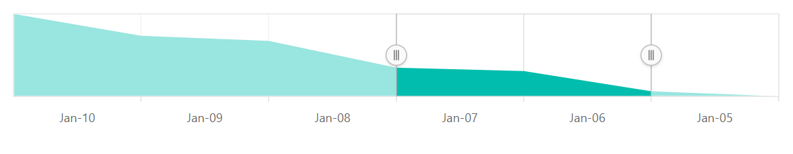

# RTL in the Blazor Range Selector (SfRangeNavigator)

The Range Selector supports right-to-left (RTL), which can be enabled with the [`EnableRtl`](https://help.syncfusion.com/cr/blazor/Syncfusion.Blazor.Charts.SfRangeNavigator.html#Syncfusion_Blazor_Charts_SfRangeNavigator_EnableRtl) property.





