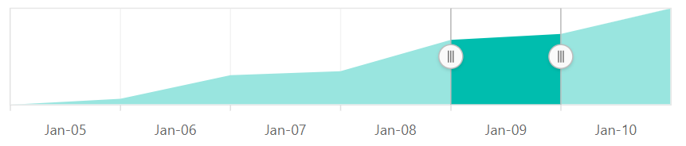

---
title: " Selecting range in Blazor Range Selector component | Syncfusion "

component: "Range Selector"

description: "Learn here all about selecting range in Syncfusion Blazor Range Selector (SfRangeNavigator) component and more."
---

# Selecting range in the Blazor Range Selector (SfRangeNavigator)

The Range Selector's left and right thumbs are used to indicate the selected range in the large collection of data. A range can be selected in the following ways:

* By dragging the thumbs.
* By tapping on the labels.
* By setting the start and the end through the [`Value`](https://help.syncfusion.com/cr/blazor/Syncfusion.Blazor.Charts.SfRangeNavigator.html#Syncfusion_Blazor_Charts_SfRangeNavigator_Value) property.

<!-- markdownlint-disable MD036 -->

## Value Binding

This section describes how to bind the value to the Range Selector component in the following ways:

* One-way binding
* Two-way binding

**One-way binding**

As shown in the following example, the [`Value`](https://help.syncfusion.com/cr/blazor/Syncfusion.Blazor.Charts.SfRangeNavigator.html#Syncfusion_Blazor_Charts_SfRangeNavigator_Value) property can be used directly as an object or from code-behind for the Range Selector.





**Two-way binding**

The **@bind-Value** code-behind attribute in the Range Selector can be used to achieve two-way binding. The following example shows how to achieve two-way binding for the Range Selector.





