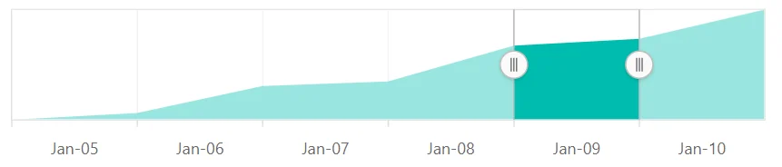

# Selecting a Range in Blazor Range Selector

The Range Selector's left and right thumbs indicate the selected range within a large collection of data. A range can be selected in the following ways:

* By dragging the thumbs.
* By clicking a label.
* By setting the start and the end through the [Value](https://help.syncfusion.com/cr/blazor/Syncfusion.Blazor.Charts.SfRangeNavigator.html#Syncfusion_Blazor_Charts_SfRangeNavigator_Value) property.

<!-- markdownlint-disable MD036 -->

## Value Binding

This section describes how to bind the value to the Range Selector component in the following ways:

* One-way binding
* Two-way binding

### One-way binding

In one-way binding, the [Value](https://help.syncfusion.com/cr/blazor/Syncfusion.Blazor.Charts.SfRangeNavigator.html#Syncfusion_Blazor_Charts_SfRangeNavigator_Value) property is assigned from a field, as shown in the following example. Changes made through the UI are not written back to the field.

```cshtml

@using Syncfusion.Blazor.Charts

<SfRangeNavigator Value="@Value" ValueType="RangeValueType.DateTime"
                  LabelFormat="MMM-yy" IntervalType="RangeIntervalType.Years" Interval="1">
    <RangeNavigatorRangeTooltipSettings Enable="true"></RangeNavigatorRangeTooltipSettings>
    <RangeNavigatorSeriesCollection>
        <RangeNavigatorSeries DataSource="@StockInfo" XName="Date" Type="RangeNavigatorType.Area" YName="Close">
        </RangeNavigatorSeries>
    </RangeNavigatorSeriesCollection>
</SfRangeNavigator>

@code {

    public class StockDetails
    {
        public DateTime Date { get; set; }
        public double Close { get; set; }
    }

    public DateTime[] Value = new DateTime[] { new DateTime(2009, 01, 01), new DateTime(2010, 01, 01) };

    public List<StockDetails> StockInfo = new List<StockDetails>
    {
        new StockDetails { Date = new DateTime(2005, 01, 01), Close = 21 },
        new StockDetails { Date = new DateTime(2006, 01, 01), Close = 24 },
        new StockDetails { Date = new DateTime(2007, 01, 01), Close = 36 },
        new StockDetails { Date = new DateTime(2008, 01, 01), Close = 38 },
        new StockDetails { Date = new DateTime(2009, 01, 01), Close = 54 },
        new StockDetails { Date = new DateTime(2010, 01, 01), Close = 57 },
        new StockDetails { Date = new DateTime(2011, 01, 01), Close = 70 }
    };
}

```



### Two-way binding

The **@bind-Value** directive attribute is used to achieve two-way binding, so that a range selected through the UI is written back to the bound field. The bound field must be declared as `object` to match the type of the `Value` parameter. The following example shows how to achieve two-way binding for the Range Selector.

```cshtml

@using Syncfusion.Blazor.Charts

<SfRangeNavigator @bind-Value="Value" ValueType="RangeValueType.DateTime"
                  LabelFormat="MMM-yy" IntervalType="RangeIntervalType.Years" Interval="1">
    <RangeNavigatorRangeTooltipSettings Enable="true"></RangeNavigatorRangeTooltipSettings>
    <RangeNavigatorSeriesCollection>
        <RangeNavigatorSeries DataSource="@StockInfo" XName="Date" Type="RangeNavigatorType.Area" YName="Close">
        </RangeNavigatorSeries>
    </RangeNavigatorSeriesCollection>
</SfRangeNavigator>

@code {

    public class StockDetails
    {
        public DateTime Date { get; set; }
        public double Close { get; set; }
    }

    public object Value = new DateTime[] { new DateTime(2009, 01, 01), new DateTime(2010, 01, 01) };

    public List<StockDetails> StockInfo = new List<StockDetails>
    {
        new StockDetails { Date = new DateTime(2005, 01, 01), Close = 21 },
        new StockDetails { Date = new DateTime(2006, 01, 01), Close = 24 },
        new StockDetails { Date = new DateTime(2007, 01, 01), Close = 36 },
        new StockDetails { Date = new DateTime(2008, 01, 01), Close = 38 },
        new StockDetails { Date = new DateTime(2009, 01, 01), Close = 54 },
        new StockDetails { Date = new DateTime(2010, 01, 01), Close = 57 },
        new StockDetails { Date = new DateTime(2011, 01, 01), Close = 70 }
    };
}

```


## See also

* [Events](./events)
* [Type of Data](./data)
